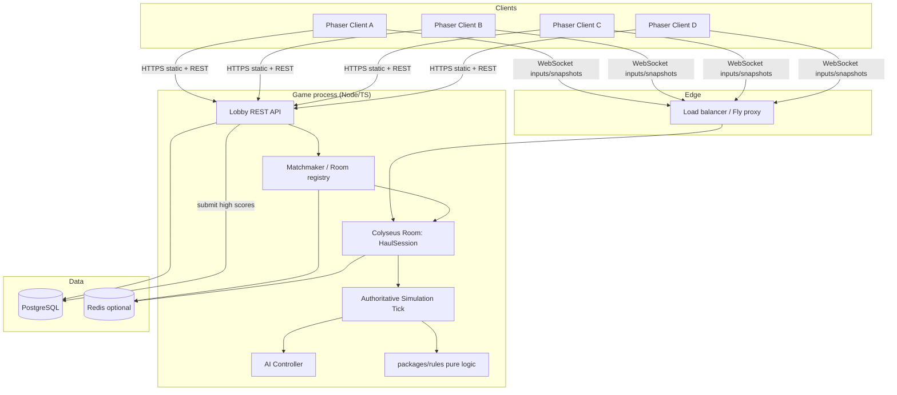
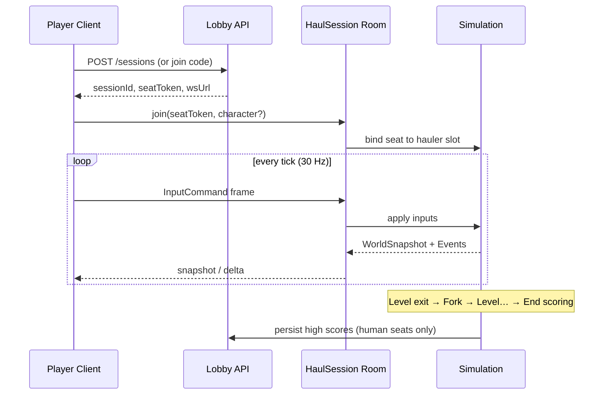
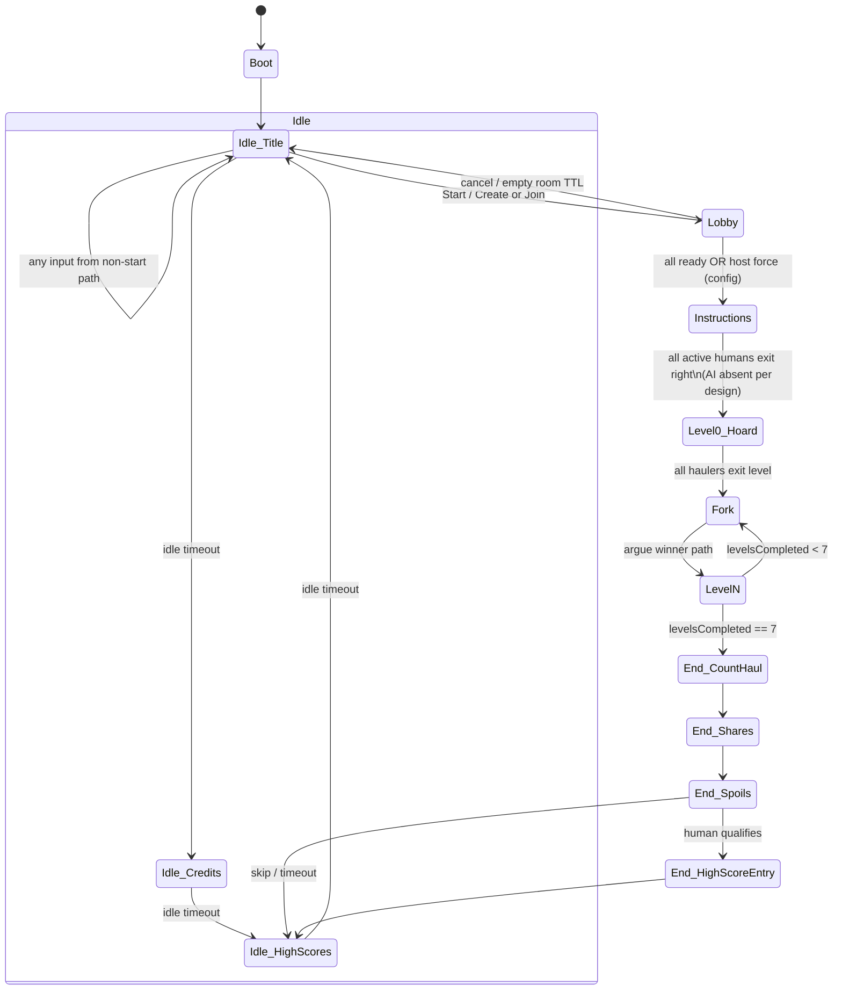

# Dungeon Haul — System Architecture

> **Phase:** Documentation only (no application code).  
> **Sources:** `docs/source/TOJam 8_ Dungeon Haul Design Document.pdf` (canonical),  
> `docs/source/AI Agent Game Build Plan.pdf` (prior orchestration candidate; non-binding).  
> **Product constraint:** **Online multiplayer is first-class** (not local-only couch co-op).

---

## 1. Executive summary

**Dungeon Haul** is a chaotic four-hauler sidescrolling platformer. Players (Gnome, Sprite, Halfling, Dwarf) loot a dungeon, race traps, sabotage each other, and split the haul via arcane **Share Modifiers**.

### Design constraints (from design doc)

| Constraint | Detail |
|---|---|
| Players | Exactly **4 concurrent haulers** during Game State; drop-in/drop-out with **AI fill** for inactive slots |
| Genre | 2D sidescroller: run, jump, duck/pickup, trip/push, drop treasure, throw treasure |
| Flow | Idle (Title → Credits → High Scores) → Instructions → Level 0 Hoard → Fork ↔ Level loop (7 levels) → End (count haul → shares → spoils) → High Scores |
| Treasure weight | After **3** carried items, cumulative speed/jump penalty; weight affects knockback, switches, crumbling blocks |
| Traps | Stun + spill treasure (Sonic-ring style); pits may destroy treasure |
| Scoring | `take = TotalTreasure × (PlayerShares / TotalShares)`; **minimum 1 share** per player |
| Levels | Pixel-map (1 px = 1 block); biomes Gold/Outside/Dungeon/Lava/Ice/Cavern/Mist; parallax layers |
| AI | Average human positions, pick treasure (cap load ≤ max human load), press switches |
| Legacy | Original Flixel/`FlxState` Flash assets — **modernize away from Flash** |

### Online multiplayer product goal

Remote players share one session over the network with:

- Authoritative, fair simulation (treasure steal, trip/push, fork vote, end scoring)
- Drop-in mid-session and reconnection
- AI fill for empty or disconnected slots (always 4 active haulers)
- Latency-tolerant platforming feel via client prediction + reconciliation

---

## 2. Recommended technology stack

### 2.1 Decision summary

| Layer | Choice | Notes |
|---|---|---|
| Client engine | **Phaser 3 + TypeScript** | Scenes map to design states; WebGL + Arcade Physics for presentation |
| Shared rules | **Pure TypeScript package** (`packages/rules`) | Share modifiers, treasure value, weight — unit-testable, no engine deps |
| Protocol | **TypeScript schemas** (`packages/protocol`) | Versioned message types shared by client & server |
| Simulation | **Authoritative Node.js/TS game server** | Fixed-tick physics/sim; not peer-to-peer |
| Room framework | **Colyseus** (Node) | Rooms, reconnection tokens, schema sync hooks, matchmaking hooks |
| Lobby / REST | **Hono** (or Fastify) on same Node process or sidecar | Create/join codes, high-score API, health |
| Realtime transport | **WebSockets** (Colyseus default) | Binary-friendly; optional msgpack later |
| Persistence | **PostgreSQL** | High scores, optional session audit; SQLite ok for local dev |
| Cache / presence | **Redis** (optional MVP; recommended for multi-instance) | Room discovery, rate limits |
| Client build | **Vite** | Fast TS bundling for Phaser |
| Monorepo | **pnpm workspaces** (or npm workspaces) | `client`, `server`, `packages/*` |
| Containers | **Docker multi-stage** | Reproducible server + static client |
| Hosting (prod) | **Fly.io** (primary) | Sticky WebSocket rooms, long-lived processes |
| Hosting (alt) | Cloud Run with min instances | Acceptable for API/static; weaker for ephemeral game rooms |
| CI | GitHub Actions | lint, unit tests, contract tests, docker build |
| Observability | Structured logs + basic metrics | Room count, tick lag, disconnect rate |

### 2.2 Alternatives considered

| Option | Pros | Cons | Verdict |
|---|---|---|---|
| **Phaser 3 + FastAPI (Python) + uv** (Build Plan) | Familiar from prior plan; strong Python pure-logic testing | Dual language splits rules; harder client prediction parity; Python WS room scaling is DIY | Candidate for **rules-only** services, not game loop |
| Godot 4 + multiplayer | Built-in netcode, strong 2D | Weaker browser/drop-in story; less web deploy friction-free | Reject for web-first online |
| Unity Netcode | Mature | Overkill for pixel sidescroller; heavy build pipeline | Reject |
| Peer-to-peer WebRTC | No server cost | Host leave, cheat, mid-join, fairness all hard | Reject for competitive loot/steal |
| PixiJS + custom engine | Max control | Rebuilds scenes/physics/input; schedule risk | Reject for MVP |
| Nakama / PlayFab full backend | Matchmaking, leaderboards out of box | Heavier ops; still need custom sim for platformer | Stretch later |
| Cloud Run only | Cheap scale-to-zero | Cold start + WS affinity pain for rooms | Use for static/API only |

### 2.3 Rationale (online multiplayer first-class)

1. **One language for rules + net protocol** eliminates “client scored differently from server” bugs in share modifiers and treasure value.
2. **Authoritative server** owns treasure ownership, collisions, trap triggers, fork tallies, and end scores — critical when players trip each other and steal spilled loot.
3. **Phaser 3** remains the right *presentation* engine (scenes, sprites, parallax, input) while the **server owns gameplay truth**.
4. **Colyseus** accelerates room lifecycle (create/join, reconnection, seat assignment) without forcing a full commercial backend.
5. **Fly.io** fits sticky game rooms better than pure serverless.

Full decision records: [ADR-001](decisions/ADR-001-tech-stack.md), [ADR-002](decisions/ADR-002-multiplayer-netcode.md).

---

## 3. High-level system diagram



### Session lifecycle (online)



---

## 4. Component list and boundaries

Named components (see also [COMPONENTS.md](COMPONENTS.md)):

| ID | Component | Boundary |
|---|---|---|
| C-01 | **Client Shell & Scenes** | Phaser scenes, attract loop, transitions; no authoritative scoring |
| C-02 | **Presentation & Camera** | Sprites, parallax layers, letterboxed viewport, VFX |
| C-03 | **Input Mapper** | Keyboard/gamepad → `InputCommand`; local co-op mapping stretch |
| C-04 | **Netcode Client** | WS session, prediction, reconciliation, interpolation |
| C-05 | **Lobby & Session Service** | Create/join codes, seat tokens, character claim |
| C-06 | **Authoritative Simulation** | Physics, collisions, traps, treasure ownership, level flow |
| C-07 | **Rules Engine** | Pure: shares, treasure value/sets, weight formulas, stat awards |
| C-08 | **AI Hauler Controller** | Fills inactive seats; consumes sim view only |
| C-09 | **Level Content Loader** | Pixel-map parse → level graph; content pack format |
| C-10 | **Fork Vote Subsystem** | Path select + button-mash argue tallies |
| C-11 | **End Screen Director** | Cinematic sequencing driven by final `ScoreReport` |
| C-12 | **High Score & Persistence** | DB schema, submit/list, anti-spam |
| C-13 | **Audio Director** | Music/SFX; unlock on first input; event-driven |
| C-14 | **Telemetry & Health** | Health checks, tick lag, disconnect metrics |

**Non-goals of architecture phase:** art production pipelines, generative asset tooling (Build Plan Phases 5/10 are deferred to art/ops tracks).

---

## 5. Interfaces between components

Contracts live under [docs/interfaces/](interfaces/OVERVIEW.md). Summary:

| From → To | Contract | Ownership of state |
|---|---|---|
| Input Mapper → Netcode Client | `InputCommand` per frame | Client ephemeral |
| Netcode Client → Room | `C2S_*` messages | Wire |
| Room → Simulation | Seat inputs, join/leave | Server |
| Simulation → Rules | `PlayerStats`, inventories, events | Server truth |
| Rules → Simulation / End | `ShareAward[]`, `TakeBreakdown` | Pure functions |
| Simulation → Clients | `S2C_Snapshot`, `S2C_Event` | Server → render |
| Lobby → Clients | REST session + seat tokens | Lobby DB |
| Simulation → High Scores | `ScoreSubmit` | DB rows |
| Level Loader → Simulation | `LevelDefinition` | Content files |
| AI → Simulation | Synthetic `InputCommand` | Server |

**Independence rule:** A component may only depend on published interfaces in `packages/protocol` and pure APIs in `packages/rules`. No Phaser imports in server/rules; no Node APIs in client presentation.

---

## 6. Networking model

### 6.1 Topology

- **Authoritative server**, client-server (not peer-hosted).
- One **HaulSession room** = one playthrough (up to 4 human seats + AI fillers).
- Clients are **dumb presenters** for gameplay truth; they may predict local movement only.

### 6.2 Tick rate and timing

| Parameter | MVP | Stretch |
|---|---|---|
| Sim tick | **30 Hz** | 60 Hz if headroom |
| Input send | 30 Hz (or on change + heartbeat) | Same |
| Snapshot | Full every tick for 4 players (small state) | Delta compression |
| Max input buffer | 2–3 ticks | Lag compensation window |
| Physics | Fixed timestep on server | Deterministic seeds for tests |

### 6.3 Reconciliation

1. Client sends `InputCommand` with `seq` and `clientTime`.
2. Client predicts local hauler using same movement rules (shared pure kinematics helpers where possible).
3. Server applies inputs in tick order, broadcasts `WorldSnapshot` with `lastProcessedSeq`.
4. Client rewinds/replays unacked inputs on mismatch (position, velocity, carry stack head).
5. Remote haulers: **interpolation** between snapshots (no prediction required for MVP).

### 6.4 Drop-in / drop-out / AI fill

Design requires **always 4 active haulers** in Game State.

| Event | Server behavior |
|---|---|
| Human joins empty seat | Bind seat; if slot was AI, soft-takeover (keep position/inventory) |
| Human idle (timeout) | Online adaptation of design: **20s no input → AI takeover**; **5s no input + camera-edge pressure → AI takeover** (same spirit as design doc) |
| Human disconnect | Grace period (e.g. 30s) holding seat; AI pilots; reconnection token restores seat |
| Human leaves permanently | Slot stays AI for remainder of run |
| Mid-join after run start | Allowed into free/AI seat; spawn at safe point (checkpoint / near AI-average position) |
| All humans leave | Room may end after short TTL or continue with AI-only (config) |

### 6.5 Host leave

There is **no host**. Server process owns the room. If the process dies, room is lost (MVP). Stretch: room migration / Redis-backed snapshots.

### 6.6 Reconnection

- On join, issue `reconnectToken` bound to `sessionId + seatId`.
- Client stores token in `sessionStorage`.
- On reconnect within grace: restore seat, inventory, stats; resync full snapshot.
- After grace: seat is free/AI; token invalid.

### 6.7 Mid-join

- Lobby allows join-by-code while room phase ∈ {Lobby, Instructions, Level, Fork}.
- End screen: join as spectator only (stretch) or reject (MVP).

### 6.8 MVP vs stretch netcode

| Feature | MVP | Stretch |
|---|---|---|
| 2–4 remote humans + AI fill | ✅ | |
| Private room codes | ✅ | Public matchmaking |
| Reconnect grace | ✅ | Seamless migration |
| Client prediction (local) | ✅ basic | Full rollback |
| Cheat resistance | Trust server state | Input validation hardening, anti-speedhack |
| Spectator | ❌ | ✅ |
| Local couch + online hybrid | ❌ | ✅ same machine multi-seat |
| Cross-region matchmaking | ❌ | ✅ |

---

## 7. State machine — screens / game flow

Maps design doc §1.1 + online lobby.



### Screen notes (design fidelity)

| Screen | Key behaviors |
|---|---|
| Title | Splash, character walk-in; start → Lobby (online) / Instructions (solo dev mode) |
| Credits | Team credits; idle → High Scores; button → Title |
| High Scores | Top 25 + last run strip; scroll animation; button → Title |
| Lobby *(new for online)* | Room code, seat claim, character select, ready-up |
| Instructions | Fixed camera; **no AI**; drop-in humans from top-left; all active exit → Hoard |
| Level 0 Hoard | Treasure room; exit right when all haulers leave |
| Fork | Not free-run; select path + A/B mash “argue”; majority presses win |
| Level N | Full platforming; traps, switches, parallax |
| End | Count haul → share titles → spoils → optional name entry (60s, humans only) |

**Assumption:** Online replaces “press any button on Title starts local 4-player” with **Lobby**. Solo/dev can still auto-seat one human + 3 AI.

---

## 8. Core data models

Conceptual models (TypeScript-shaped; not code). Wire formats in interfaces.

### Player / Hauler

```text
HaulerSlot {
  seatId: 0..3
  character: Gnome | Sprite | Halfling | Dwarf
  control: Human | AI
  humanId?: string          // account or ephemeral client id
  position: { x, y }
  velocity: { x, y }
  facing: Left | Right
  animState: Idle | Run | Jump | Duck | Throw | Drop | PushTrip | Hurt | Stunned | Falling
  carryStack: TreasureInstance[]   // order = drop/throw order (first = top)
  weight: number
  stunnedUntilTick?: number
  pickupLockoutUntilTick?: number  // after spill, Sonic-style
  stats: PlayerStats
}
```

### PlayerStats (share-modifier inputs)

Track across entire session (design §2.3):

- `exitsFirstCount`, `exitsLastCount`
- `treasureRecoveredValue`, `treasureLostCount`
- `itemsHauledCount`, `setPiecesRecovered`
- `airTimeTicks`, `groundTimeTicks`
- `trapsHit`, `hitsDealt`, `hitsTaken`
- `humanControlTicks`, `aiControlTicks`, `controlSwaps`
- `stunnedOrHurtCount`
- `hoardExitItemCount`, `finalItemCount`
- `onlyChestsRecovered: bool`, `onlyCommonRecovered: bool`
- `speedZeroFromWeight: bool`
- `goatOnPole: bool` (Jammy)
- per-level first-exit flags for Leader of the Pack

### Treasure

```text
TreasureDef {
  id: string
  name: string
  rarity: Common | Rare | Unique | Set
  baseValueGp: number
  setId?: string
  stackableVisual: bool     // coin sacks don't add to stack height per design notes
  unique: bool
}

TreasureInstance {
  instanceId: string
  defId: string
  position?: { x, y }       // world if free
  ownerSeatId?: number      // if carried
  valueOverrideGp?: number  // chest reveals
}
```

Treasure spawn mix (design): **65% Common, 20% Rare, 5% Unique, 10% Set**. Unique/Set never duplicate if still “in play”; lost uniques may reappear later or in chests.

### Level

```text
LevelDefinition {
  id: string
  biome: Gold | Outside | Dungeon | Lava | Ice | Cavern | Mist
  blockSizePx: number
  pixelMap: ImageRef | Grid   // 1 pixel = 1 block
  spawnPoints: Vec2[4]
  exitZone: AABB
  treasureSlots: Vec2[]
  trapBindings: ...
  parallax: { far, near, mid, fore }
}
```

### ShareModifier

```text
ShareModifierDef {
  id: string
  title: string
  kind: Reward | Penalty
  uniqueness: Unique | Common
  deltaShares: number | "perItem" | "perSetPiece"
  predicate: (ctx: ScoreContext) => boolean | number
}

// Payout
// shares[i] = max(1, sum(deltas))
// take[i] = totalTreasureGp * shares[i] / sum(shares)
```

### Session

```text
Session {
  sessionId: string
  joinCode: string
  phase: Lobby | Instructions | Level | Fork | End
  levelsCompleted: number   // 0..7 after hoard path
  levelPath: string[]
  seats: HaulerSlot[4]
  rngSeed: number
  createdAt: timestamp
}
```

### HighScore

```text
HighScoreRow {
  id: string
  name: string              // entered initials/name
  character: CharacterId
  takeGp: number
  sharePercent: number
  totalHaulGp: number
  sessionId: string
  createdAt: timestamp
}
```

### InputCommand

```text
InputCommand {
  seq: number
  seatId: number
  axes: { x: -1|0|1, y: -1|0|1 }
  jump: bool
  action: bool              // B
  start: bool
  // chord interpretation is server-side from axes+action
}
```

---

## 9. Non-functional requirements

| Area | Target |
|---|---|
| Platforms | Modern evergreen browsers (Chrome, Firefox, Safari, Edge); desktop primary, tablet secondary |
| Input latency (local feel) | Prediction keeps perceived move lag ≤ **50 ms** on good networks |
| RTT budget | Comfortable play ≤ **80–100 ms** RTT; playable to ~150 ms with interpolation softness |
| Tick | Server sim **30 Hz** fixed; never spiral with uncapped dt (tab background clients don't drive sim) |
| Determinism | Rules + scoring pure & deterministic given seed + ordered inputs; physics **best-effort deterministic** for tests (fixed tick, no uncontrolled floats in share math) |
| Capacity | MVP: dozens of concurrent rooms / process; horizontal scale via multi-process + Redis |
| Security | Server-authoritative; validate inputs; rate-limit score submit; no trusted client scores |
| Accessibility (stretch) | Remappable keys, colorblind-safe character tints |
| Resolution | Fixed **logical** resolution letterboxed (`FIT` + center); design doc left exact size open — **assume 960×540** logical until art locks it |
| Audio | Resume AudioContext on first user gesture |

---

## 10. Risk register

| ID | Risk | Impact | Mitigation |
|---|---|---|---|
| R1 | Platforming feel over network | High | Client prediction; 30 Hz; lag-friendly stun windows |
| R2 | Treasure ownership races | High | Server-only pickup grants; lockout timers |
| R3 | Share modifier edge cases / ties | Med | Explicit tie-break rules in Rules Engine tests |
| R4 | Colyseus schema vs custom binary | Med | Start JSON snapshots; profile; swap codec later |
| R5 | Cloud hosting WS affinity | High | Prefer Fly.io sticky processes; document Cloud Run limits |
| R6 | Scope: 19 levels + all traps | High | Content MVP: Hoard + 2 levels + stubs; path graph optional |
| R7 | Dual-control local+online confusion | Med | Ship online seats first; local multi-seat stretch |
| R8 | Physics non-determinism across arch | Med | Don't desync-check binary physics across machines; single server authority |
| R9 | Design doc idle-loop inconsistencies | Low | Codify online-first attract + lobby (see assumptions) |
| R10 | AI feels griefy or useless | Med | Tune caps; playtests; never exceed human max load |

---

## 11. Assumptions (proceed without blocking)

1. **Online-first session model** with room codes; local 4-gamepad co-op is a stretch mode reusing the same sim (possibly offline authoritative local server).
2. **Character = seat** (Gnome/Sprite/Halfling/Dwarf) claimed in lobby; uniqueness preferred, not hard-required for MVP.
3. **Logical canvas 960×540**, pixel-art integer scale, letterboxed.
4. **Level progression MVP:** Hoard + linear two-choice forks from a small pool; full 19-node path graph is stretch (design alternative of random unplayed levels is acceptable).
5. **Block size** unspecified in design (“xx pixels”) — assume **32×32** world blocks until art decides.
6. **Title “10s → High Scores”** vs **Title → Credits → High Scores** idle loop: implement **Title → Credits → High Scores** attract chain; any button returns to Title; Start opens Lobby.
7. **Pause:** online pause is **local UI only** (does not freeze server) or vote-pause stretch; MVP = no global pause.
8. **High scores** are global persistent (DB), not only local machine.
9. **AI absent on Instructions** per design; AI active from Hoard onward for empty seats.
10. **Build Plan generative asset pipeline** is out of architecture scope; placeholders allowed.

Open questions for product owner: [ARCHITECT-OPEN-QUESTIONS.md](decisions/ARCHITECT-OPEN-QUESTIONS.md).

---

## 12. Testing approach (outline)

Detail expanded in [IMPLEMENTATION-PLAN.md](IMPLEMENTATION-PLAN.md) and the full suite under [docs/testing/](testing/AUTOMATED-TEST-STRATEGY.md):

| Doc | Purpose |
|---|---|
| [testing/AUTOMATED-TEST-STRATEGY.md](testing/AUTOMATED-TEST-STRATEGY.md) | Vitest, Playwright, CI, determinism, flaky policy |
| [testing/INTEGRATION-TEST-PLAN.md](testing/INTEGRATION-TEST-PLAN.md) | Cross-component scenarios |
| [testing/SYSTEM-TEST-PLAN.md](testing/SYSTEM-TEST-PLAN.md) | E2E, browser matrix, tick budget |
| [testing/HUMAN-PLAYTEST-PLAN.md](testing/HUMAN-PLAYTEST-PLAN.md) | Session scripts & exit criteria |

### Automated

| Layer | What |
|---|---|
| Unit | `packages/rules`: every share modifier, set bonuses, weight curve, take formula, min-1-share |
| Unit | Level pixel-map parser fixtures |
| Unit | AI decision pure functions (target position, load cap) |
| Contract | Protocol encode/decode, version negotiation |
| Integration | Room join → inputs → snapshot; disconnect/reconnect; AI takeover |
| Sim harness | Headless server ticks with recorded input scripts (golden paths) |
| CI | lint + test + docker build on PR |

### Human playtest sessions (high level)

1. **Netcode slice:** 2–4 humans, empty level, movement/jump feel, disconnect mid-run  
2. **Loot chaos:** spill/steal, weight, throw knockback  
3. **Fork argue:** intentional opposite votes, mash fairness  
4. **Full loop:** Instructions → Hoard → 2 levels → End scoring readability  
5. **AI fill:** 1 human + 3 AI completes a short run  
6. **High score entry:** multi-human concurrent entry UX  

---

## 13. Document map

| Doc | Purpose |
|---|---|
| [README.md](README.md) | Docs index & reading order |
| [COMPONENTS.md](COMPONENTS.md) | Ownership clusters SE-1..SE-8 |
| [IMPLEMENTATION-PLAN.md](IMPLEMENTATION-PLAN.md) | Phased build order |
| [interfaces/OVERVIEW.md](interfaces/OVERVIEW.md) | Contract index |
| [decisions/ADR-001-tech-stack.md](decisions/ADR-001-tech-stack.md) | Stack ADR |
| [decisions/ADR-002-multiplayer-netcode.md](decisions/ADR-002-multiplayer-netcode.md) | Netcode ADR |
| [decisions/ARCHITECT-OPEN-QUESTIONS.md](decisions/ARCHITECT-OPEN-QUESTIONS.md) | Product questions |
