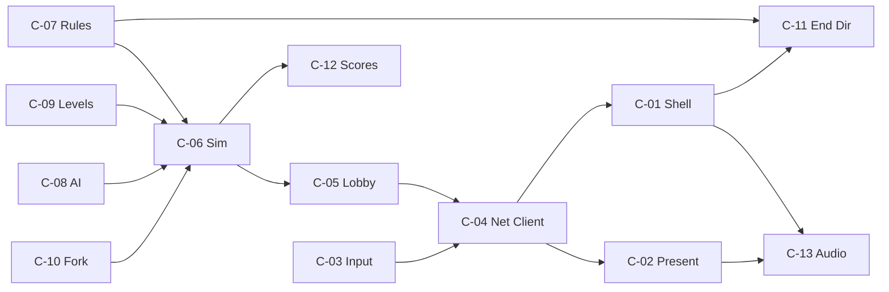

# Dungeon Haul — Components

Named components for parallel development. Each entry lists **responsibilities**, **non-responsibilities**, **dependencies**, and a suggested **engineer ownership cluster** (SE-1..SE-8).

Interface contracts: [interfaces/OVERVIEW.md](interfaces/OVERVIEW.md).  
Architecture context: [ARCHITECTURE.md](ARCHITECTURE.md).

---

## Ownership clusters (suggested)

| Cluster | Focus | Primary components |
|---|---|---|
| **SE-1** | Client shell, scenes, UI flow | C-01, C-11 |
| **SE-2** | Rendering, camera, parallax, VFX | C-02 |
| **SE-3** | Input + netcode client | C-03, C-04 |
| **SE-4** | Lobby, sessions, persistence API | C-05, C-12 |
| **SE-5** | Authoritative simulation core | C-06, C-10 |
| **SE-6** | Rules engine (pure) | C-07 |
| **SE-7** | Levels, content pipeline | C-09 |
| **SE-8** | AI, audio, telemetry | C-08, C-13, C-14 |

Clusters may share engineers; boundaries exist so work can proceed against frozen interfaces.

---

## C-01 — Client Shell & Scenes

**Responsibilities**
- Phaser game bootstrap, scale manager (letterbox FIT + center).
- Scene graph: Boot, Title, Credits, HighScores, Lobby, Instructions, Level, Fork, End.
- Attract idle transitions and “any button → Title” behavior.
- Scene-to-scene transitions (fade, run-off animations hooks).
- Wire UI buttons to Lobby/Netcode (create/join, ready).

**Non-responsibilities**
- Authoritative physics, scoring, treasure ownership.
- Pixel-map parsing rules (consumes loaded level view models).
- Audio policy internals (calls Audio Director).

**Dependencies**
- C-02 Presentation, C-03 Input, C-04 Netcode Client, C-13 Audio  
- `packages/protocol` (phase enums for UI only)

**Ownership:** SE-1

---

## C-02 — Presentation & Camera

**Responsibilities**
- Sprite/animation binding from `animState`.
- Parallax layers: Far (~50%), Near (100%), Mid (interactive), Fore (~125%), Interface overlay.
- Multi-target camera (keep haulers framed); fixed camera on Instructions/Fork as required.
- Trap/treasure/VFX presentation from `S2C_Event`.
- Placeholder art swap-friendly atlas keys.

**Non-responsibilities**
- Collision resolution.
- Camera as anti-cheat (server does not care about client camera).

**Dependencies**
- C-04 snapshots/events; C-09 visual metadata (biome tileset keys)

**Ownership:** SE-2

---

## C-03 — Input Mapper

**Responsibilities**
- Map keyboard + gamepad to normalized `InputCommand`.
- Chord detection hints (B+down drop, B+up throw) — final interpretation server-side.
- Context schemes: Outside/Lobby, Level, Fork, End name entry.
- Local “device → seat” binding for stretch couch mode.

**Non-responsibilities**
- Network send timing (Netcode Client).
- AI inputs.

**Dependencies**
- `packages/protocol` InputCommand  
- Phaser input plugins (client only)

**Ownership:** SE-3

---

## C-04 — Netcode Client

**Responsibilities**
- WebSocket session lifecycle (join, reconnect token storage).
- Send `C2S_Input`, `C2S_Ready`, `C2S_Chat?` (chat optional/out).
- Apply `S2C_Snapshot` / deltas; maintain `lastProcessedSeq`.
- Local player prediction + reconciliation.
- Remote entity interpolation buffers.
- Expose connection state to Shell (connecting, playing, reconnecting, lost).

**Non-responsibilities**
- Rendering.
- Pure score math.
- Lobby HTTP (may call Lobby client helper, but session HTTP is C-05 client API).

**Dependencies**
- C-03 InputCommand stream  
- `packages/protocol`  
- C-05 for initial seatToken/wsUrl

**Ownership:** SE-3

---

## C-05 — Lobby & Session Service

**Responsibilities**
- REST: create session, join by code, list seat status, claim character, ready-up.
- Issue seat + reconnect tokens.
- Room registry integration (spawn/find Colyseus room).
- Idle room TTL / empty lobby cleanup.
- Optional: region selection.

**Non-responsibilities**
- Tick simulation.
- High-score ranking UI.

**Dependencies**
- Colyseus / room host  
- Redis optional  
- PostgreSQL optional for session audit  
- `packages/protocol` session DTOs

**Ownership:** SE-4

---

## C-06 — Authoritative Simulation

**Responsibilities**
- Fixed-tick world update: movement, gravity, collisions, surfaces (ice/sand friction).
- Treasure spawn (seeded RNG + rarity tables), pickup/drop/throw, spill on stun.
- Traps, switches (incl. heavy switch mass), gates, golems/phantom hands (MVP subset OK).
- Always maintain 4 hauler slots; integrate AI inputs.
- Level exit detection → phase transitions (Fork/End).
- Emit snapshots + gameplay events.
- Track `PlayerStats` counters for Rules Engine.

**Non-responsibilities**
- Share title presentation.
- HTTP APIs.
- Drawing.

**Dependencies**
- C-07 Rules (end of run + weight helpers)  
- C-08 AI  
- C-09 LevelDefinition  
- C-10 Fork  
- `packages/protocol`

**Ownership:** SE-5

---

## C-07 — Rules Engine (pure)

**Responsibilities**
- Treasure base values, chest open tables, set completion bonuses.
- Weight → speed/jump multipliers (after 3 items).
- Share modifier catalog (rewards/penalties) evaluation.
- `take = total × shares_i / sum(shares)` with **min 1 share**.
- Tie-break policies (document + test).
- Export pure functions only — **no I/O, no Phaser, no Node fs**.

**Non-responsibilities**
- When to call evaluation (Simulation/End Director).
- Persisting scores.
- Animation order of end screen (consumes `ScoreReport` only).

**Dependencies**
- None (leaf). Fixtures in tests.

**Ownership:** SE-6

---

## C-08 — AI Hauler Controller

**Responsibilities**
- For seats with `control == AI`, produce `InputCommand` each tick.
- Behaviors from design: move toward average human position (±25% tolerance band of furthest-pair distance); pick nearby treasure; cap carry ≤ max human load; upgrade by dropping lesser for greater; press switches.
- No AI on Instructions screen (server simply does not spawn AI there).

**Non-responsibilities**
- Pathfinding perfection / ML.
- Difficulty scaling (stretch).

**Dependencies**
- Read-only sim view API from C-06  
- Must not bypass sim (no teleport cheats)

**Ownership:** SE-8

---

## C-09 — Level Content Loader

**Responsibilities**
- Parse pixel-map format (1 px = 1 block; header pixel tileset/biome; top near-bg; body mid; bottom fore; spacers).
- Color → block/trap/treasure-slot mapping tables.
- Emit `LevelDefinition` + collision grids.
- Content pack layout under `content/levels/`.
- Validate maps in CI (bounds, spawn/exit present).

**Non-responsibilities**
- Runtime trap AI (Simulation).
- Drawing parallax (Presentation uses metadata).

**Dependencies**
- `packages/protocol` or shared content types  
- Image decode on server (pngjs etc.) and optionally client preview tools

**Ownership:** SE-7

---

## C-10 — Fork Vote Subsystem

**Responsibilities**
- Present two biome-themed exits (data).
- Accept path selection + argue button pulses.
- Tally presses server-side over vote window; resolve winner; choose next `levelId`.
- Handle AI argue policy (mild random / follow majority stretch).

**Non-responsibilities**
- Full free-roam physics on fork screen.

**Dependencies**
- C-06 phase machine  
- C-09 level graph / pool

**Ownership:** SE-5 (with SE-1 UI)

---

## C-11 — End Screen Director

**Responsibilities**
- Client cinematic sequencing from authoritative `ScoreReport`:
  1. Count haul (slowest→fastest toss, set popouts)
  2. Share titles (unique gold → common white → common blue penalty → unique red)
  3. Spoils rummage + final take
  4. High-score name entry prompt
- Skip/confirm inputs per design (Start skips, 60s entry).

**Non-responsibilities**
- Computing awards (Rules already did).
- Writing DB (calls C-12 client).

**Dependencies**
- C-07 report shape  
- C-01 scenes  
- C-13 audio stingers

**Ownership:** SE-1

---

## C-12 — High Score & Persistence

**Responsibilities**
- Schema: top scores, last run strip, “New!” tagging window.
- REST submit (server-authenticated via session completion token).
- List top 25 + last score set.
- Reject AI-only entries; validate take matches server report.
- Migrations.

**Non-responsibilities**
- Attract screen animation (C-01/C-02).

**Dependencies**
- PostgreSQL  
- C-05 session completion token  
- C-07 `ScoreReport` hash/signature

**Ownership:** SE-4

---

## C-13 — Audio Director

**Responsibilities**
- Music stems per screen/biome (design §4.1).
- Character SFX + generic object/trap/UI sounds (§4.2–4.4).
- Unlock/resume on first gesture.
- React to `S2C_Event` and UI events; channel limits.

**Non-responsibilities**
- Asset generation.
- Network.

**Dependencies**
- C-01/C-02 event hooks  
- Asset manifest (later `docs/art/`)

**Ownership:** SE-8

---

## C-14 — Telemetry & Health

**Responsibilities**
- `GET /health` (process up, optional DB ping).
- Metrics: active rooms, players, tick budget overrun, disconnects, AI takeovers.
- Structured logs with `sessionId`.

**Non-responsibilities**
- Full APM product (stretch).

**Dependencies**
- Server process hooks

**Ownership:** SE-8 (light) / SE-4

---

## Dependency overview

---

## Parallelism guide

Safe concurrent tracks after protocol freeze:

1. **SE-6 Rules** + golden tests (no engine)  
2. **SE-7 Levels** parser + sample Hoard map  
3. **SE-5 Sim** headless with fake inputs  
4. **SE-4 Lobby/Scores** with mock room  
5. **SE-3 Net client** against sim stub  
6. **SE-1/2** scenes with mock snapshots  
7. **SE-8** AI against sim view; audio on events  

Integration milestone: one room, one level, two browsers, treasure pickup/steal.
