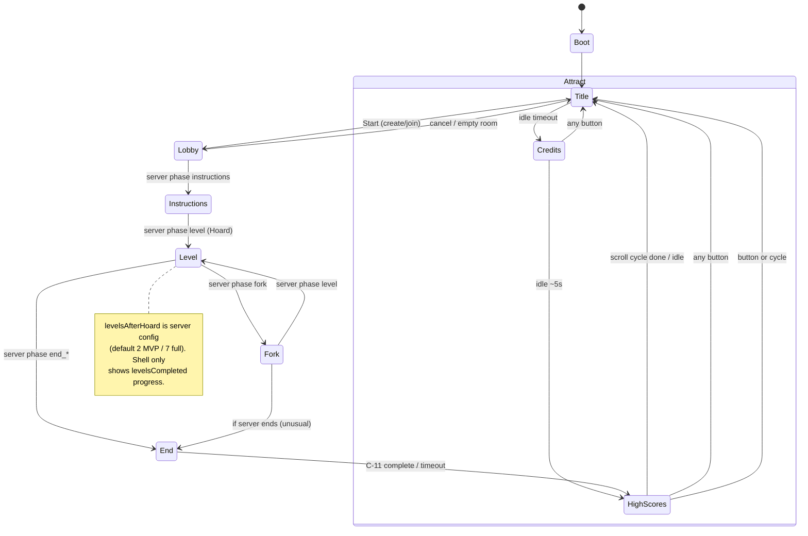

# C-01 — Client Shell & Scenes — Design

| Field | Value |
|---|---|
| Component ID | **C-01** |
| Slug | `client-shell` |
| Ownership | **SE-1** |
| Stack | Phaser 3 + TypeScript + Vite (client only) |
| Contracts | [interfaces/OVERVIEW.md](../../interfaces/OVERVIEW.md), [lobby-and-scores.md](../../interfaces/lobby-and-scores.md), [netcode-messages.md](../../interfaces/netcode-messages.md), [input-commands.md](../../interfaces/input-commands.md) |
| Architecture | [ARCHITECTURE.md](../../ARCHITECTURE.md) §7 state machine; [COMPONENTS.md](../../COMPONENTS.md) C-01 |
| Frozen decisions | Q1 evergreen desktop; Q2 private room codes; Q3 online seats first; Q5 **960×540**; Q7 ephemeral names; Q8 `levelsAfterHoard`; Q9 soft-unique chars; Q10 **no global pause** |

---

## 1. Purpose

Own the **Phaser game bootstrap**, **logical viewport** (960×540 letterboxed), and the **client scene graph** that maps the design-doc game loop to online multiplayer:

**Idle attract** (Title → Credits → High Scores) → **Lobby** (create/join private room codes) → **Instructions → Level/Fork loop → End** → back to High Scores.

The shell is the **orchestration and navigation layer**: it switches scenes, routes UI actions to Lobby REST and Netcode Client, surfaces connection state, and hands the End scene to **C-11 End Screen Director**. It never owns gameplay truth.

---

## 2. Responsibilities

1. **Bootstrap** — create Phaser `Game` with Vite entry; register scenes; load boot assets/manifest stubs.
2. **Scale manager** — fixed **logical 960×540**, `Scale.FIT` + center, integer scale preferred, letterbox bars outside logical rect.
3. **Scene graph** — Boot, Title, Credits, HighScores, Lobby, Instructions, Level, Fork, End (and thin overlays: Connecting, Error, LocalMenu).
4. **Attract / idle loop** — Title idle → Credits → HighScores → Title; idle timeouts per design (Credits **5s**, HighScores auto-return after scroll cycle; Title uses Credits/HighScores chain, not Title→HighScores skip).
5. **Idle “any button → Title”** — on Credits/HighScores (and other non-play idle surfaces), any face/start returns to Title; on Title, **Start** (or primary confirm) opens Lobby flow (online-first).
6. **Lobby UI wiring** — create session / join by code / display join code / seat strip / character claim / ready / cancel → Lobby REST + Netcode Client join.
7. **Phase-driven scene transitions** — react to Netcode `S2C_PhaseChange` / snapshot `phase` to enter Instructions, Level, Fork, End segments; do not invent server phase.
8. **Transition hooks** — fade-to-black, Title character run-off, End fade-in; emit hooks for C-02 presentation and C-13 audio.
9. **Connection UX** — show connecting / reconnecting / lost / protocol error from C-04 state; offer retry or return to Title.
10. **Dev/solo mode hooks** — optional auto-create room + single human + AI fill (config flag); not a second product path.
11. **Local menu only (Q10)** — optional local overlay (volume, leave session); **must not** send a global pause or freeze the server sim.
12. **Config surface** — read client config for API base URL, WS URL default, `levelsAfterHoard` is **server-owned**; shell only displays progress (`levelsCompleted` from snapshot) and does not reconfigure server mid-run.

---

## 3. Non-responsibilities

| Out of scope | Owner |
|---|---|
| Authoritative physics, treasure ownership, trap resolution | C-06 |
| Share math / take calculation | C-07 (display only via `ScoreReport`) |
| End cinematic sequencing (tosses, titles, spoils, name entry UX logic) | **C-11** (shell provides End scene host) |
| Sprite/anim binding, parallax, multi-target camera | C-02 |
| Keyboard/gamepad → `InputCommand` mapping | C-03 |
| WS prediction, reconciliation, token storage internals | C-04 |
| REST implementation of sessions/scores | C-05 / C-12 |
| Pixel-map parse | C-09 |
| Audio channel policy / asset decode | C-13 (shell only fires scene/UI cues) |
| Public matchmaking, accounts | Frozen out (Q2, Q7) |
| Local multi-gamepad multi-seat | Stretch (Q3) |

---

## 4. Public interface

Shell exposes **client-internal** APIs (not wire protocol). Wire contracts remain those in `docs/interfaces/*`. Types should live in `packages/protocol` where shared; shell-local types stay in client.

### 4.1 Bootstrap

```text
createGame(config: ClientShellConfig): Phaser.Game

ClientShellConfig {
  parent: string | HTMLElement
  apiBaseUrl: string              // e.g. https://host/api/v1
  // logical size FIXED 960×540 — not configurable for MVP art lock
  debug?: {
    soloAutoJoin?: boolean
    skipAttract?: boolean
    showFps?: boolean
  }
}
```

### 4.2 Scene registry (keys)

| Scene key | Role |
|---|---|
| `Boot` | Asset preload, config, → Title |
| `Title` | Splash, walk-in, Start → Lobby |
| `Credits` | Team credits; idle → HighScores; any → Title |
| `HighScores` | Top 25 + last run; scroll; any → Title; after end-flow entry default |
| `Lobby` | Create/Join private code UI; seats; claim; ready |
| `Instructions` | Host for presentation + input while `phase=instructions` |
| `Level` | Host for gameplay presentation while `phase=level` |
| `Fork` | Host for fork UI while `phase=fork` |
| `End` | Host for **C-11** director while `phase=end_*` |
| `Connecting` | Modal/overlay during WS handshake / reconnect |
| `ErrorOverlay` | Protocol/auth/full/closed messages |

### 4.3 Navigation API (internal)

```text
ShellNavigator {
  goTitle(reason?: "user" | "idle" | "session_end" | "error"): void
  goCredits(): void
  goHighScores(opts?: { fromEndFlow?: boolean }): void
  goLobby(mode: "create" | "join" | "resume"): void
  enterSessionPlay(phase: SessionPhase): void   // Instructions | Level | Fork | End*
  showConnecting(message?: string): void
  showError(error: ShellError): void
  leaveSessionToTitle(): void                   // C2S_Leave + clear tokens UI-side
}

ShellError {
  code: "PROTOCOL" | "AUTH" | "FULL" | "PHASE" | "NETWORK" | "INTERNAL" | "HTTP"
  message: string
  recoverable: boolean
}
```

### 4.4 Lobby actions (consumes C-05 REST)

Matches [lobby-and-scores.md](../../interfaces/lobby-and-scores.md):

```text
LobbyController {
  createSession(displayName?: string): Promise<CreateSessionResult>
  joinSession(joinCode: string, displayName?: string): Promise<JoinSessionResult>
  refreshLobby(sessionId: string): Promise<SessionPublicView>
  // character claim: prefer C2S_ClaimCharacter via net after WS up; REST optional
  setReady(ready: boolean): void               // → C2S_Ready
  claimCharacter(character: CharacterId): void // → C2S_ClaimCharacter (soft-unique)
  cancelLobby(): void
}
```

**Private room codes only (Q2).** No public matchmaking UI.

**Soft-unique characters (Q9):** UI prefers distinct characters (disable or warn on taken) but **allows clash** if server accepts. See [INTERFACE-DELTA.md](../INTERFACE-DELTA.md) if REST still documents hard `409`.

### 4.5 Session / phase binding (consumes C-04)

```text
// Shell subscribes; does not own connection
NetcodeSessionView {
  connectionState: "idle" | "connecting" | "connected" | "reconnecting" | "lost"
  phase: SessionPhase
  seats: SeatPublic[] | SeatStatus[]
  levelsCompleted: number
  levelId?: string
  joinCode?: string
  localSeatId?: number
  lastError?: S2C_Error
}

// Phase → scene mapping (authoritative phase from server)
"lobby"        → Lobby (if not already)
"instructions" → Instructions
"level"        → Level
"fork"         → Fork
"end_count" | "end_shares" | "end_spoils" | "end_entry" → End (C-11 advances sub-stage)
"closed"       → disconnect UX → HighScores or Title
```

### 4.6 Events emitted (to C-02 / C-13 / C-11)

```text
ShellEvent =
  | { type: "scene_enter"; scene: SceneKey; from?: SceneKey }
  | { type: "scene_exit"; scene: SceneKey }
  | { type: "attract_tick"; screen: "title" | "credits" | "highscores" }
  | { type: "ui_confirm" | "ui_cancel" | "ui_any" }
  | { type: "transition"; kind: "fade_out" | "fade_in" | "run_off"; ms: number }
  | { type: "local_menu"; open: boolean }
  | { type: "end_host_ready"; scoreReport?: ScoreReport }  // End scene ready for C-11
```

### 4.7 High scores list (consumes C-12 REST)

```text
HighScoresController {
  fetch(): Promise<HighScoreListResponse>  // GET /api/v1/highscores?limit=25
}
```

Shell **displays** list/scroll; does not submit scores (C-11 → C-12 client).

### 4.8 Input context handoff

Shell tells C-03 which scheme is active:

```text
InputContext =
  | "attract" | "title" | "lobby" | "instructions" | "level" | "fork"
  | "end_cinematic" | "end_name_entry" | "local_menu"
```

MVP: Start on level opens **local menu only** (Q10); does not freeze sim.

---

## 5. Internal modules

Suggested layout under `client/` (implementation phase; docs only now):

```text
client/src/shell/
  bootstrap.ts           # createGame, scale, scene register
  config.ts              # ClientShellConfig defaults
  navigator.ts           # ShellNavigator scene transitions
  attract/
    attractController.ts # idle timers, any-button → Title
  scenes/
    BootScene.ts
    TitleScene.ts
    CreditsScene.ts
    HighScoresScene.ts
    LobbyScene.ts
    InstructionsScene.ts # thin host: mounts C-02 world view
    LevelScene.ts
    ForkScene.ts
    EndScene.ts          # mounts C-11 director
    overlays/
      ConnectingOverlay.ts
      ErrorOverlay.ts
      LocalMenuOverlay.ts
  lobby/
    lobbyController.ts   # REST create/join + UI state
    seatStripView.ts
    characterPickerView.ts
    joinCodeView.ts
  session/
    phaseBinder.ts       # map SessionPhase → scene
    connectionBanner.ts
  highscores/
    highScoresView.ts    # scroll animation timing
    highScoresClient.ts  # GET wrapper
  transitions/
    fade.ts
    titleRunOff.ts
  events/
    shellBus.ts          # typed pub/sub for ShellEvent
```

### Module notes

- **Play scenes** (Instructions/Level/Fork) are **hosts**: they attach C-02 presenters and forward input via C-03/C-04; shell does not implement platforming.
- **EndScene** constructs/owns a C-11 `EndScreenDirector` instance and feeds it `S2C_ScoreReport` + skip/name inputs.
- **AttractController** is pure timing + input-any detection so timers are unit-testable without Phaser where practical.

---

## 6. Scene flow (online-first)



### Attract timing (design + architecture)

| Screen | Idle advance | Interrupt |
|---|---|---|
| Title | Idle → Credits (architecture chain; design’s 10s→HighScores **superseded**) | Start → Lobby |
| Credits | ~5s → HighScores | Any → Title |
| HighScores | Bottom→top scroll cycle then → Title | Any → Title |

### Title presentation hooks (design §1.2)

- Scrolling background constant rate.
- Characters enter from left → center; idle micro-motion.
- Exit transition: run off right, then fade black (when leaving for Lobby or attract advance as appropriate).

### Online vs design-doc Title→Instructions

Canonical architecture: **Start opens Lobby**, not Instructions. Solo/dev may auto-seat and skip Lobby UI via `debug.soloAutoJoin`.

---

## 7. Edge cases

| # | Case | Expected behavior |
|---|---|---|
| E1 | Fifth human joins | REST `FULL` / `S2C_Error FULL` → ErrorOverlay; stay or return Title |
| E2 | Bad join code | `NOT_FOUND` → inline Lobby error; do not leave Lobby scene |
| E3 | WS drop mid-level | C-04 reconnecting → banner; keep Level scene; on lost after grace → Error + leave path |
| E4 | Room `closed` / empty TTL | Navigator → Title or HighScores with message |
| E5 | Protocol version mismatch | `PROTOCOL` error; hard fail with “update client” copy |
| E6 | Mid-join during End | MVP reject/spectator-out; Lobby should show phase and refuse join if API returns `CLOSED`/`PHASE` |
| E7 | Soft-unique character clash | Both seats may show same character art; picker warns “already taken” but allows confirm |
| E8 | Attract input during fade | Debounce: first input wins; cancel pending idle timer |
| E9 | HighScores fetch fail | Show empty/error strip; still allow any-button → Title |
| E10 | Start pressed in Level | Local menu only; sim continues (Q10) |
| E11 | Tab background | Shell does not drive sim; may show “paused locally” visual only if useful — **server unpaused** |
| E12 | Double-click create room | Idempotent UI lock while POST in flight |
| E13 | Reconnect token present on boot | Optional “Rejoin?” on Title/Lobby; C-04 uses stored token |
| E14 | All humans leave | Server may close room; client → Title after error/closed |
| E15 | `levelsAfterHoard` 2 vs 7 | Progress UI uses `levelsCompleted` + server cap if exposed; no client hardcode of 7 |
| E16 | Name entry only humans | Shell does not gate; C-11 uses `eligibleForHighScore` |
| E17 | Credits idle + button same frame | Prefer button → Title over idle advance |
| E18 | Letterbox / non-16:9 window | Game stays 960×540 FIT centered; UI hit targets in logical space only |

---

## 8. Dependencies & mocks (independent dev)

| Dependency | Use | Mock strategy |
|---|---|---|
| **C-04 Netcode Client** | Join WS, phase, seats, snapshots | `FakeNetSession` emitting scripted `SessionPhase` sequence + static haulers |
| **C-05 Lobby REST** | create/join/list | MSW or `FakeLobbyApi` returning fixed join codes / seats |
| **C-12 High scores REST** | GET list | Fixture JSON top-25 + lastRun + recentNewIds |
| **C-03 Input Mapper** | Context schemes | Stub that maps keyboard to `ui_any` / lobby nav / start |
| **C-02 Presentation** | Level/Fork/Instructions draw | Placeholder color rects + seat labels |
| **C-11 End Director** | End scene content | Stub that shows “End OK” + button → HighScores |
| **C-13 Audio** | Scene music stingers | No-op `AudioDirector` |
| **`packages/protocol`** | `SessionPhase`, DTOs | Shared stubs even before full codecs |

**Independence rule:** Shell unit/integration tests must run with fakes only — no live Colyseus required for scene graph CI.

---

## 9. Acceptance criteria

1. **Bootstrap:** Game boots to Title at logical **960×540** letterboxed on common desktop aspect ratios.
2. **Attract:** Unattended loop Title → Credits → HighScores → Title with documented timeouts; any button on Credits/HighScores returns Title.
3. **Lobby create/join:** Create yields visible **private join code**; second browser can join by code (or fake API in tests).
4. **Soft-unique chars:** Two humans can claim same character without hard client block (server policy permitting).
5. **Ready flow:** Ready states reflect in seat strip; when server advances phase, shell enters Instructions without manual scene cheat.
6. **Phase binding:** Scripted phase sequence Lobby→Instructions→Level→Fork→Level→End→HighScores drives correct scene keys.
7. **No global pause:** Start in Level opens local overlay only; no pause message sent that freezes server (none in protocol MVP).
8. **Connection UX:** Connecting and lost states visible; PROTOCOL error non-silent.
9. **HighScores screen:** Renders fixture top list; scroll animation starts at bottom, pauses, scrolls up (design §1.7).
10. **End handoff:** On `S2C_ScoreReport` / end phase, End scene mounts C-11 with report; on director complete → HighScores (`fromEndFlow`).
11. **Leave/cancel:** Lobby cancel and in-run leave return to Title and clear session UI state.
12. **No scoring authority:** Shell never computes takes; only displays server/report data.
13. **Private codes only:** No matchmaking/quick-play UI in MVP.
14. **levelsAfterHoard:** Progress copy does not assume 7 when server completes earlier (MVP default 2).

---

## 10. Testing notes

| Layer | What |
|---|---|
| Unit | Attract timers; phase→scene map; join code normalize (trim/case) |
| Component | Lobby form validation; seat strip render from `SeatStatus[]` |
| Integration (fake net) | Full attract + create + phase walk + end handoff |
| Manual | Two-browser create/join; reconnect banner; letterbox resize |

---

## 11. Open implementation choices (non-blocking)

- Phaser scene plugins vs pure TS controllers for Lobby forms.
- Whether Connecting is a Scene or DOM/Phaser overlay (prefer overlay to avoid tearing down Level).
- Exact Title idle duration before Credits (recommend **10s** to honor design intent while keeping Credits in chain).

These do not change frozen product decisions or published wire contracts.
