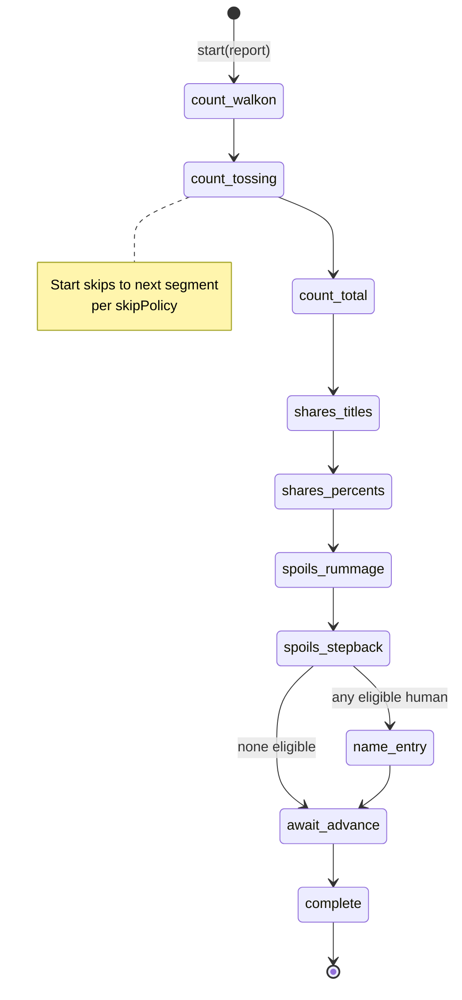

# C-11 — End Screen Director — Design

| Field | Value |
|---|---|
| Component ID | **C-11** |
| Slug | `end-screen` |
| Ownership | **SE-1** (with C-01 host scene) |
| Stack | Phaser 3 + TypeScript (client); consumes pure report types from `packages/protocol` / rules shapes |
| Contracts | [netcode-messages.md](../../interfaces/netcode-messages.md) `ScoreReport`, [share-modifier-api.md](../../interfaces/share-modifier-api.md) display order, [lobby-and-scores.md](../../interfaces/lobby-and-scores.md) submit, [input-commands.md](../../interfaces/input-commands.md) end schemes |
| Architecture | [ARCHITECTURE.md](../../ARCHITECTURE.md) End phases; [COMPONENTS.md](../../COMPONENTS.md) C-11 |
| Frozen decisions | Q5 960×540; Q7 ephemeral high-score names; Q8 run length server-side; Q10 no global pause (Start = skip/confirm only here) |

---

## 1. Purpose

Drive the **post-run cinematic and scoring reveal** on the client using an authoritative **`ScoreReport`** (and related end-cinematic payload — see [INTERFACE-DELTA.md](../INTERFACE-DELTA.md)).

Sequence (design §1.5):

1. **Counting the Haul** — exit order intro → treasure tosses (slowest→fastest) → set popouts → total flash / high-score-list fanfare  
2. **Determining the Shares** — modifier titles per player (color order) → share % reveal order **3rd, 2nd, 4th, 1st** by final take  
3. **Awarding the Spoils** — rummage pile → count-up takes → step-back smallest→largest → high-score **name entry** (60s, humans eligible only)  

Then hand control back to C-01 → High Scores attract entry.

The director is a **presentation state machine**. It never computes shares, takes, or eligibility.

---

## 2. Responsibilities

1. Consume `S2C_ScoreReport` (and end cinematic detail once frozen) and run the three-act sequence.
2. Map server `SessionPhase` `end_count` | `end_shares` | `end_spoils` | `end_entry` to director substates (UI may advance slightly ahead for local skip polish **only if** server allows skip; default: follow server phase + local animation cursor within phase).
3. **Skip handling:** Start skips current animation segment / confirms entry per design end controls; send `C2S_EndSkip` when skipping server-gated segments.
4. **Name entry:** letter UI; 60s timer; charset/length per scores API (1–12 allowlist); submit via `POST /api/v1/highscores` with `completionToken` + `seatId` + `name`; also `C2S_NameEntry` if server tracks concurrent entry.
5. **Display rules** from share-modifier contract:
   - Title order per player: Unique gold → Common white → Common blue penalty → Unique red  
   - Modifier **Δ values not shown**  
   - Long lists scroll  
   - % reveal order by **final takeGp** rank: 3rd, 2nd, 4th, 1st  
6. Fire C-13 audio cues (fanfare, placement stingers, rummage, UI ticks) via events — not implementing audio mixer.
7. Fire C-02 VFX hooks (coin toss arcs, set popout, pile) via events / view models.
8. Multi-human eligibility: queue or concurrent name entry for seats with `eligibleForHighScore && human`; **AI never** enters names.
9. After spoils + entries (or skip/timeout): signal C-01 complete; idle **10s** or any-button advances to High Scores (design).
10. Operate in logical **960×540** space as child of End scene.

---

## 3. Non-responsibilities

| Out of scope | Owner |
|---|---|
| Evaluating share modifiers / `computeTakes` | C-07 |
| Authoring `ScoreReport` | C-06 + C-07 on server |
| Persisting scores / anti-cheat validation | C-12 server |
| Scene graph / attract / lobby | C-01 |
| Parallax or level rendering | C-02 (end may reuse character sprites) |
| Input device mapping | C-03 (director consumes normalized end actions) |
| WS transport | C-04 |
| Global pause | Forbidden (Q10); Start means skip/confirm |

---

## 4. Public interface

### 4.1 Director API (client-internal)

```text
createEndScreenDirector(deps: EndScreenDeps): EndScreenDirector

EndScreenDeps {
  host: Phaser.Scene                 // C-01 EndScene
  audio: AudioCueSink                // C-13 thin
  present: EndPresentSink            // C-02 thin (sprites/VFX)
  scoresApi: HighScoreSubmitClient   // C-12 client
  net: EndNetPort                    // C2S_EndSkip, C2S_NameEntry
  clock: Clock                       // testable timers
}

EndScreenDirector {
  start(input: EndScreenInput): void
  /** normalized actions from C-03 end contexts */
  handleAction(action: EndUserAction): void
  /** optional: server phase nudge */
  onPhase(phase: Extract<SessionPhase, `end_${string}`>): void
  onDispose(): void
  readonly state: EndDirectorState
  onComplete(cb: (result: EndCompleteResult) => void): void
}

EndScreenInput {
  report: ScoreReport
  /** see INTERFACE-DELTA — inventory, order, sets, ranks */
  cinema: EndCinemaData
  highScoreThresholdGp?: number   // optional: top-list total for fanfare compare
  localSeatId: number
  /** seats this client may enter names for (online: usually 1) */
  controllableSeatIds: number[]
}

EndCompleteResult {
  submittedNames: { seatId: number, name: string, row?: HighScoreRow }[]
  skippedEntry: boolean
  reason: "done" | "timeout" | "user_advance" | "session_closed"
}
```

### 4.2 User actions (from input context)

```text
EndUserAction =
  | { type: "skip" }                    // Start during cinematics
  | { type: "letter_up" | "letter_down" }
  | { type: "slot_left" | "slot_right" }
  | { type: "confirm_letter" }          // A / jump
  | { type: "delete_letter" }           // B / action
  | { type: "confirm_entry" }           // Start when full / confirm
  | { type: "advance_after_end" }       // any after complete
```

Matches design Endscreen controls + [input-commands.md](../../interfaces/input-commands.md).

### 4.3 Cinema data (required for faithful playback)

Authoritative scoring is `ScoreReport`. **Presentation-only** fields needed for toss/order (proposed additive contract):

```text
EndCinemaData {
  /** slowest → fastest for toss & title order (design) */
  tossOrderSeatIds: number[]          // length 4
  /** final-level exit order for dungeon exit walk-on (first→last exit) */
  exitOrderSeatIds: number[]
  players: {
    seatId: number
    items: {
      instanceId: string
      defId: string
      displayName: string
      valueGp: number
      setId?: string
    }[]
  }[]
  setCompletions: {
    setId: string
    displayName: string
    bonusGp: number
    /** seats who contributed pieces */
    contributorSeatIds: number[]
    /** which toss (instanceId) triggers popout */
    completingInstanceId: string
  }[]
}
```

If server prefers embedding under `ScoreReport`, keep single message `S2C_ScoreReport` with optional `cinema` field — flag only in INTERFACE-DELTA; do not recompute client-side values.

### 4.4 ScoreReport (display contract — existing)

From [netcode-messages.md](../../interfaces/netcode-messages.md):

```text
ScoreReport {
  rulesetVersion: string
  sessionId: string
  totalTreasureGp: number
  players: {
    seatId: number
    character: CharacterId
    human: bool
    modifiers: { id, title, kind, uniqueness, deltaShares }[]
    shares: number
    sharePercent: number
    takeGp: number
    inventoryValueGp: number
    eligibleForHighScore: bool
  }[]
  completionToken: string
}
```

**Director rules:**
- Sort/filter modifiers for display by uniqueness×kind colors; **ignore deltaShares in UI text** (may still use internally only if needed for debugging — not player-facing).
- Rank players by `takeGp` for % reveal order and spoils step-back (ties: stable by seatId ascending).
- Submit only if `eligibleForHighScore && human` for that seat.

### 4.5 Scores submit client

```text
HighScoreSubmitClient {
  submit(args: {
    completionToken: string
    seatId: number
    name: string
  }): Promise<HighScoreRow>
}
```

Errors: `UNAUTHORIZED`, `CONFLICT`, `VALIDATION` — show inline, allow retry until timer ends.

### 4.6 Audio / present sinks

```text
AudioCueSink {
  play(cue:
    | "end_fade_in"
    | "toss_item"
    | "set_complete"
    | "haul_total"
    | "haul_record_fanfare"
    | "title_show"
    | "percent_place_1" | "percent_place_2" | "percent_place_3" | "percent_place_4"
    | "character_vox"   // with seat/character meta
    | "rummage"
    | "take_tick"
    | "spoils_step_back"
    | "name_entry_tick"
    | "ui_confirm" | "ui_error"
  ): void
}

EndPresentSink {
  playExitWalkon(order: number[]): void
  formCircle(): void
  tossItem(seatId: number, item: CinemaItem): Promise<void>
  showSetPopout(completion: SetCompletionView): Promise<void>
  flashTotal(totalGp: number): void
  showTitlePanel(seatId: number, titles: TitleView[]): Promise<void>
  revealPercent(seatId: number, sharePercent: number, place: 1|2|3|4): Promise<void>
  beginRummage(seatIds: number[]): void
  setTakeCount(seatId: number, gp: number): void
  stepBack(seatId: number, takeGp: number): Promise<void>
  showNameEntry(seatId: number): void
  hideNameEntry(seatId: number): void
}
```

Placeholder implementations allowed until art lands.

### 4.7 Net port

```text
EndNetPort {
  endSkip(): void           // C2S_EndSkip
  nameEntry(name: string): void  // C2S_NameEntry (optional mirror of REST)
}
```

---

## 5. Internal modules

```text
client/src/end/
  director.ts                 # state machine orchestration
  states/
    countHaul.ts
    determineShares.ts
    awardSpoils.ts
    nameEntry.ts
    postComplete.ts
  ordering.ts                 # toss order, take ranks, % reveal sequence
  modifiersDisplay.ts         # color buckets, scroll model, hide deltas
  nameEntryModel.ts           # slots, charset, 60s timer
  setPopoutPlanner.ts         # when completions fire during toss stream
  skipPolicy.ts               # what Start skips in each substate
  views/                      # optional Phaser builders if not all in C-02
    titlePanelView.ts
    percentRevealView.ts
    nameEntryView.ts
    haulPileView.ts
  fixtures/
    sampleScoreReport.ts      # independent dev
    sampleCinema.ts
```

### Director state machine

```text
EndDirectorState =
  | "idle"
  | "count_walkon"
  | "count_tossing"
  | "count_total"
  | "shares_titles"          // per-seat cursor
  | "shares_percents"        // place order cursor
  | "spoils_rummage"
  | "spoils_stepback"
  | "name_entry"
  | "await_advance"          // 10s / any button
  | "complete"
```



---

## 6. Sequence detail (design fidelity)

### 6.1 Counting the Haul

1. Fade in from black (C-01 transition may start).  
2. Characters exit dungeon in **exitOrderSeatIds** (first exit → last); run; camera pan hook; form circle.  
3. Toss loop in **tossOrderSeatIds** (slowest → fastest):  
   - For each seat, for each item in that seat’s list (server order = drop/throw stack order or explicit cinema order):  
     - Animate toss → pile  
     - Show item GP above pile, name below  
     - Update running per-character haul under character  
     - If item completes a set → popout (name, bonus); multi-contributor callout  
4. All tossed → flash `totalTreasureGp`; if total beats `highScoreThresholdGp` (e.g. max totalHaul on board), play record fanfare.

### 6.2 Determining the Shares

1. Same seat order as toss (slowest → fastest).  
2. For each seat: panel behind character; list titles in color order; **no numeric deltas**; scroll if overflow.  
3. After all titles: reveal `sharePercent` in place order **3rd → 2nd → 4th → 1st** by `takeGp` rank; placement SFX + optional character vocalization.

### 6.3 Awarding the Spoils

1. Characters move to pile; all rummage.  
2. Simultaneous count-up of `takeGp` until pile visual depletes (timing ≈ max take animation).  
3. Step back from **smallest take → largest**; large final take text.  
4. Name entry for eligible humans (60s).  
5. After entries: any button or **10s** → complete → C-01 HighScores.

### 6.4 Name entry rules

| Rule | Detail |
|---|---|
| Timer | 60 seconds from entry substate start (shared or per-seat; **MVP: per local controllable eligible seat**, 60s wall) |
| Controls | up/down letter, left/right slot, A confirm letter, B delete, Start confirm/skip |
| Length | 1–12; allowlist charset (match C-12) |
| AI | Never prompted |
| Ineligible human | Skip automatically |
| Multi local seats | Stretch; online MVP one seat per client |
| Submit | REST with `completionToken`; handle CONFLICT (already submitted) as success-equivalent for UX |
| Failure | Show error; remain until timeout then advance |

---

## 7. Edge cases

| # | Case | Expected behavior |
|---|---|---|
| E1 | Empty inventory seat | Toss phase no-ops items; still participates in titles/%/spoils |
| E2 | All takes equal | % order by stable seatId for places; all get stingers with shared place tier if needed |
| E3 | Zero total haul | Skip fanfare; still show 0s; modifiers may still apply (min 1 share) |
| E4 | No eligible high scores | Skip name_entry → await_advance |
| E5 | Local player ineligible, remote eligible | Local client still shows remote entry wait if server phases `end_entry`; MVP may auto-advance local animations and wait on phase |
| E6 | Skip spam | Coalesce; one skip per segment; cannot skip name validation illegally (empty name confirm ignored) |
| E7 | Disconnect mid-end | C-01 connection UX; director pause/dispose; no client invent of report |
| E8 | Late `ScoreReport` | Director stays idle until `start`; C-01 must not open End without report |
| E9 | Modifier list empty | Show empty panel briefly / “—” then continue |
| E10 | Many modifiers | Scroll list; skip may jump to end of that seat’s titles |
| E11 | Set completion multi-contributor | Popout lists all contributor seats |
| E12 | Duplicate character art (soft-unique) | Use seatId + tint/name labels so players remain distinguishable |
| E13 | Submit VALIDATION | Stay in entry; do not burn completion wrongly |
| E14 | Timer hits 0 mid-type | Auto-submit if valid non-empty **or** discard — **MVP: discard incomplete, advance** (document); optional soft-submit if ≥1 char |
| E15 | `levelsAfterHoard` short run | No change; report is complete regardless of path length |
| E16 | Record fanfare threshold missing | Skip fanfare compare; still flash total |
| E17 | Start during name entry | Confirm if full; else skip entry for local seat |
| E18 | Server phase jumps ahead | Director fast-forwards to matching segment without replaying (reconnect) |

---

## 8. Dependencies & mocks (independent dev)

| Dependency | Mock |
|---|---|
| C-01 EndScene host | Headless Phaser scene or JSDOM-free pure director tests with fake `EndPresentSink` |
| C-07 / ScoreReport | Fixture reports: four-way split, min-share penalties, set completion, single eligible human |
| C-12 submit | Fake resolving 201 / CONFLICT / VALIDATION |
| C-04 net | Recording `EndNetPort` |
| C-13 audio | No-op cue sink asserting call order in tests |
| C-02 present | Promise-resolving stubs with instant animations for CI |

**Independent test goal:** Full director run in &lt;1s simulated time with fake clock, asserting segment order and reveal permutation.

---

## 9. Acceptance criteria

1. **Authority:** Director never recomputes takes/shares; only displays `ScoreReport` fields.  
2. **Three acts:** Walk-through of count → shares → spoils with fixtures matches design order.  
3. **Toss order:** Seats processed slowest→fastest per `tossOrderSeatIds`.  
4. **Titles:** Color/category order correct; **deltas hidden**.  
5. **Percent order:** Reveal sequence is 3rd, 2nd, 4th, 1st by `takeGp` (stable ties).  
6. **Spoils:** Step-back ascending by take; final numbers match report.  
7. **Name entry:** 60s; AI excluded; eligible human can submit; API errors handled.  
8. **Skip:** Start advances cinematic segments; sends `C2S_EndSkip` when wired.  
9. **Complete:** Signals C-01; 10s/any-button path after spoils/entry.  
10. **Soft-unique:** Distinct seat labels when characters clash.  
11. **960×540:** All layout in logical space.  
12. **No pause protocol:** Start never freezes sim (end phase already non-interactive for movement).  
13. **Fixtures CI:** Automated segment-order tests without network.  
14. **Fanfare:** Plays only when threshold provided and total exceeds it.

---

## 10. Testing notes

| Layer | Cases |
|---|---|
| Unit | `ordering.ts` places; modifier bucket sort; name charset; skip policy |
| Unit | Set popout planner triggers on completing instance only once |
| Integration | Full fixture run with fake clock |
| Contract | Submit body matches lobby-and-scores |
| Manual | Readable pacing; skip feels fair; 60s pressure |

---

## 11. Relationship to server phases

| Server `SessionPhase` | Director emphasis |
|---|---|
| `end_count` | Walk-on + toss + total |
| `end_shares` | Titles + percents |
| `end_spoils` | Rummage + step-back |
| `end_entry` | Name entry |
| (after) | C-01 leaves End |

MVP may keep server in a single `end_*` umbrella if sim prefers; client director still runs full local sequence from one `ScoreReport`. Prefer fine-grained phases for skip sync across clients later.

**Multi-client sync note:** Each client runs local cinematics from the same report (deterministic). Skip is local for MVP unless server broadcasts skip; optional stretch: server-driven segment index.
