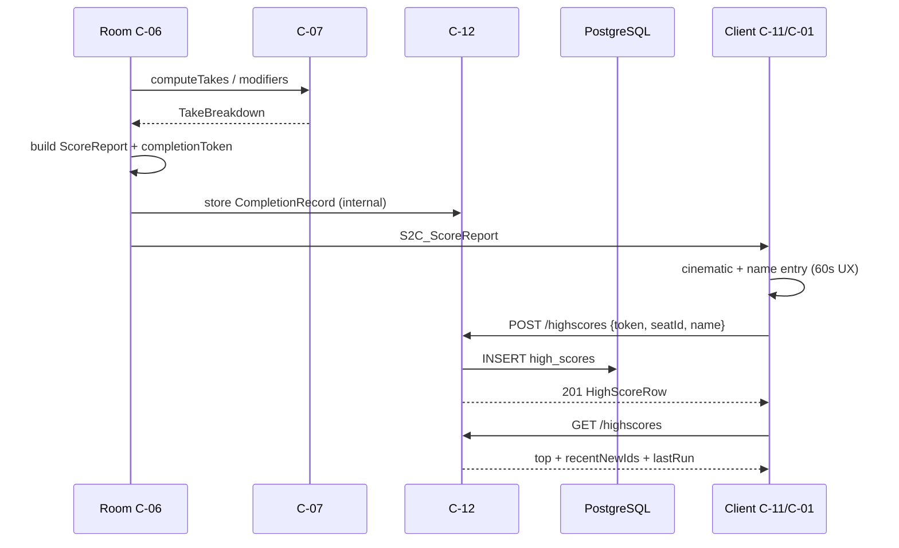

# C-12 — High Score & Persistence — Design

| Field | Value |
|---|---|
| Component | **C-12 High Score & Persistence** |
| Ownership | **SE-4** |
| Status | Design (documentation only) |
| Contract | [lobby-and-scores.md](../../interfaces/lobby-and-scores.md), [netcode-messages.md](../../interfaces/netcode-messages.md) (`ScoreReport`) |
| ADRs | [ADR-001](../../decisions/ADR-001-tech-stack.md) (PostgreSQL), [ADR-002](../../decisions/ADR-002-multiplayer-netcode.md) |
| Frozen decisions | Q7 no accounts (initials only); Q6 Fly.io; top 25 + New! tags |

---

## 1. Purpose

C-12 is the **durable leaderboard and anti-cheat submission surface** for human haul takes. After a completed online run, the authoritative server issues a `completionToken` inside `ScoreReport`. Eligible humans enter **initials/name** (no accounts). C-12 validates the token, persists rows in **PostgreSQL**, and serves **top 25** plus a **last-run strip** and **“New!”** tags for recent entries.

**Product outcome:** Attract/High Scores screens show a trustworthy global top 25; completing a run can insert a human score once per seat; AI scores never appear.

---

## 2. Scope

### In scope (MVP)

| Area | Behavior |
|---|---|
| Schema + migrations | `high_scores` table; indexes for top-N query |
| List | `GET /api/v1/highscores?limit=25` → top, optional lastRun, `recentNewIds` |
| Submit | `POST /api/v1/highscores` with completion token + seat + name |
| Validation | Token, human seat, eligibility, name charset, single submit per seat/token |
| New! tags | Track last three inserted row ids (or time-window) for client badges |
| Last run strip | Cache/store latest completed session’s entry set for attract display |
| Reject AI | `human: false` or ineligible seats cannot submit |
| Rate limits | Submit spam protection |
| Local dev | SQLite or embedded PG acceptable; prod **PostgreSQL** |

### Out of scope

- Attract scroll animation / scene graph (C-01 / C-02)
- Computing takes or share modifiers (C-07 via C-06)
- Name-entry 60s UI timing (C-11 / C-01; C-12 only accepts POST)
- User accounts, avatars, friends boards (Q7)
- Per-character separate boards (single global board MVP)
- Historical full leaderboard pagination beyond top 25 (stretch)
- Editing or deleting scores from client

---

## 3. Frozen product constraints

| Constraint | Design implication |
|---|---|
| No accounts (Q7) | Identity on board = entered **name/initials** string only |
| Private rooms only | Scores still **global** (not per-room boards) |
| Server authority | Client never supplies `takeGp`; server looks up from completion record |
| Humans only | AI fills never submit; `eligibleForHighScore` from `ScoreReport` |
| Top 25 | Default `limit=25`; clamp max (e.g. 25) for MVP |
| New! tags | `recentNewIds` (last three highscore row ids per contract) |
| Fly.io + PG | Managed Postgres (Fly Postgres or external); migrations on deploy |

---

## 4. Architecture placement

```text
C-06 Room (end of run)
  │  evaluates C-07 → ScoreReport
  │  mints completionToken
  │  persists CompletionRecord (server memory or PG)
  ▼
C-12 High Score Service
  │  POST validate + insert
  │  GET list top 25
  ▼
PostgreSQL
  ▲
C-01 HighScores scene / End entry (via HTTPS)
```

**Boundary with C-05:** Lobby issues seat tokens; **completion tokens** are issued only at end-of-run by the room/sim path. C-12 depends on a **completion store** populated by C-06 (or a thin shared persistence module owned by SE-4 used from the room).

```text
CompletionRecord {
  completionTokenHash: string
  sessionId: string
  createdAt: timestamp
  expiresAt: timestamp          // e.g. now + 1 hour for name entry window + slack
  totalTreasureGp: number
  rulesetVersion: string
  seats: {
    seatId: number
    character: CharacterId
    human: bool
    takeGp: number
    sharePercent: number
    eligibleForHighScore: bool
    submitted: bool             // set true after successful POST
  }[]
}
```

`ScoreReport.completionToken` is the raw token shown only to clients in that session; C-12 stores the hash.

---

## 5. REST API behavior

Wire shapes: [lobby-and-scores.md](../../interfaces/lobby-and-scores.md).

### `GET /api/v1/highscores?limit=25`

1. Clamp `limit` to `1..25` (MVP max 25).
2. Query top scores ordered by `take_gp DESC`, tie-break `created_at ASC` (earlier achievement wins tie) then `id`.
3. Load `recentNewIds` = last **3** inserted score row ids (global, by `created_at desc`).
4. Optionally attach `lastRun` if a completed session strip is cached (see §8).
5. Return JSON; no auth.

**Caching:** Optional short TTL cache (e.g. 5s) for GET under load; invalidate on successful POST.

### `POST /api/v1/highscores`

**Request:** `{ completionToken, seatId, name }`

**Server steps:**

1. Rate-limit by IP + by token.
2. Hash token; load `CompletionRecord`; else `UNAUTHORIZED`.
3. Reject if expired → `UNAUTHORIZED` (or `VALIDATION` with clear message).
4. Resolve seat in record; if missing → `VALIDATION`.
5. If `!human` → `UNAUTHORIZED` / reject AI.
6. If `!eligibleForHighScore` → `UNAUTHORIZED` or `VALIDATION`.
7. If `submitted` already → `CONFLICT`.
8. Validate name: **1–12** chars (contract), allowlist charset (see §7).
9. Insert `high_scores` row with authoritative `takeGp`, `sharePercent`, `character`, `totalHaulGp` from completion record — **never from client**.
10. Mark seat `submitted = true` atomically (transaction).
11. Update last-run strip / recent-new list.
12. Return `201` + `HighScoreRow`.

**Idempotency:** Second POST same seat/token → `CONFLICT` (not a second row).

### Errors

| Code | When |
|---|---|
| `UNAUTHORIZED` | Bad/expired token; AI seat; not eligible |
| `CONFLICT` | Already submitted for seat |
| `VALIDATION` | Bad name, bad seatId, malformed body |
| `RATE_LIMITED` | Too many attempts |
| `INTERNAL` | DB failure |

---

## 6. PostgreSQL schema (MVP)

```text
high_scores (
  id              UUID PRIMARY KEY DEFAULT gen_random_uuid(),
  name            VARCHAR(12) NOT NULL,
  character       VARCHAR(16) NOT NULL,   -- Gnome|Sprite|Halfling|Dwarf
  take_gp         INTEGER NOT NULL CHECK (take_gp >= 0),
  share_percent   REAL NOT NULL,         -- display; from ScoreReport
  total_haul_gp   INTEGER NOT NULL,
  session_id      UUID NOT NULL,
  seat_id         SMALLINT NOT NULL CHECK (seat_id BETWEEN 0 AND 3),
  ruleset_version TEXT NOT NULL,
  created_at      TIMESTAMPTZ NOT NULL DEFAULT now(),
  UNIQUE (session_id, seat_id)           -- one row per human seat per run
)

CREATE INDEX high_scores_top_idx
  ON high_scores (take_gp DESC, created_at ASC);
```

### Completion store options

| Option | MVP recommendation |
|---|---|
| **A. In-memory map** on game process | Fast; lost on restart (name entry fails after deploy mid-end — rare) |
| **B. PostgreSQL `score_completions`** | Survives restart; slightly more work |
| **C. Hybrid** | Memory + PG write-through |

**Recommendation:** **B** for P5 ship so End-screen entry survives process bounce; acceptable **A** for early P5 if time-boxed, with documented risk.

```text
score_completions (
  token_hash      BYTEA PRIMARY KEY,
  session_id      UUID NOT NULL,
  payload_json    JSONB NOT NULL,        -- CompletionRecord seats + totals
  expires_at      TIMESTAMPTZ NOT NULL,
  created_at      TIMESTAMPTZ NOT NULL DEFAULT now()
)

CREATE INDEX score_completions_expires_idx ON score_completions (expires_at);
```

Sweeper deletes expired completion rows periodically.

### Last-run strip

Either:

- Derive from most recent `session_id` among `high_scores` plus non-submitted humans from completion payload, or  
- Dedicated `last_run_cache` single-row table / Redis key written when room emits `ScoreReport`.

**MVP:** On `ScoreReport`, room calls C-12 internal `recordLastRun(sessionId, entries[])` storing:

```text
lastRun {
  sessionId
  entries: { name?: string, character, takeGp, sharePercent }[]  // humans; name filled as submits arrive
}
```

GET merges submitted names into strip when available.

---

## 7. Name / initials rules (Q7)

| Rule | Value |
|---|---|
| Length | 1–12 (contract) |
| Charset | `A–Z a–z 0–9 space` + limited `-_.`; strip control chars |
| Trim | Leading/trailing whitespace removed; internal collapse optional |
| Empty | Reject |
| Profanity | Optional mild filter stretch; not required MVP |
| Case | Store as entered; display as entered |

No linkage to lobby `displayName` required (player may use different initials on board).

---

## 8. “New!” tags

Contract: `recentNewIds: string[]` — **last three highscore row ids**.

| Behavior | Detail |
|---|---|
| Source | Global last 3 inserts by `created_at DESC` (not per-viewer) |
| Client | HighScores scene badges rows whose `id ∈ recentNewIds` |
| Duration | Implicit: ages out as newer scores submit (not a 24h timer) |
| Stretch | Time-based New! window (e.g. 24h) if product wants |

No per-client “seen” state (no accounts).

---

## 9. Eligibility

Room/Rules decide `eligibleForHighScore` per seat before token mint. C-12 **trusts the completion record**, not the client.

Suggested eligibility (owned by C-06/C-07 policy, enforced by flag):

- Seat was **human** for a meaningful portion of the run (design: high score humans only).
- Run completed End scoring (not abandoned lobby).
- Optional: minimum levels completed > 0.

C-12 rejects if flag false even if token valid.

**Take amount:** Always from completion record. Client cannot inflate GP.

---

## 10. Integration sequences

### End of run → entry → board



### Attract loop

- C-01 HighScores scene polls or loads once on enter: `GET /api/v1/highscores`.
- Animations pure client; data from C-12 only.

---

## 11. Security

| Threat | Mitigation |
|---|---|
| Forged takeGp | Ignore client; use completion payload |
| Token brute force | High entropy; rate limit; short TTL |
| AI score spam | human + eligible checks |
| Double submit | UNIQUE(session_id, seat_id) + submitted flag |
| XSS in name | Allowlist + client text render (no HTML) |
| SQL injection | Parameterized queries / query builder |
| Enumeration | No list of tokens; GET is public scores only |

**Not in MVP:** Signed JWTs for scores beyond opaque tokens; CAPTCHA; geo blocks.

---

## 12. Hosting & ops (Fly.io)

| Concern | Approach |
|---|---|
| DB | Fly Postgres or external PG; `DATABASE_URL` |
| Migrations | Run on deploy (e.g. `node-pg-migrate` / Drizzle / Prisma migrate) before app traffic |
| Connection pool | Small pool per Fly machine; avoid connection stampede |
| Multi-machine | Stateless API; all machines share PG; completion store must be PG if multi-node |
| Backups | Enable provider backups; scores are durable product data |
| Local | Docker Compose PG or SQLite dev dialect **only if** SQL subset tested — prefer PG dev container for parity |

---

## 13. Configuration

```text
DATABASE_URL=postgres://...
HIGHSCORE_LIMIT_MAX=25
COMPLETION_TOKEN_TTL_MS=3600000
SUBMIT_RATE_LIMIT_PER_IP_PER_MIN=20
NAME_MAX_LEN=12
```

---

## 14. Testing strategy (C-12)

| Layer | Cases |
|---|---|
| Unit | Name validation; limit clamp; eligibility matrix |
| Unit | Ordering: higher take first; tie by earlier created_at |
| Integration | Submit without token → fail |
| Integration | Submit twice → CONFLICT |
| Integration | AI seat → fail |
| Integration | Valid human → 201; appears in top list; id in recentNewIds when newest |
| Integration | UNIQUE constraint holds under concurrent double POST |
| Migration | Clean migrate up on empty DB |

Contract tests from [lobby-and-scores.md](../../interfaces/lobby-and-scores.md) §Test contract (scores half).

---

## 15. Failure modes

| Failure | Behavior |
|---|---|
| PG down on GET | `500 INTERNAL`; attract may show empty/cached |
| PG down on POST | `500`; client may retry; completion remains until TTL |
| Completion expired | Player misses board entry; still sees end cinematics |
| Process restart with memory-only completions | In-flight name entry fails — prefer PG completions for ship |
| Take ties at rank 25 | Stable order; both may exist if limit allows; top query deterministic |

---

## 16. Stretch

- Separate boards per character or season
- Pagination / full history admin export
- Time-windowed “New!” (24h)
- Profanity filter
- Nakama/PlayFab leaderboard backend swap (ADR deferred)
- Player-initiated score wipe

---

## 17. File layout (planned, not created yet)

```text
server/
  highscores/
    routes.ts           # GET/POST /api/v1/highscores
    service.ts          # list, submit
    validation.ts       # name, limit
    completionStore.ts  # token hash CRUD
  db/
    migrations/         # high_scores, score_completions
    client.ts           # pool
packages/protocol/
  highscores.ts         # DTOs shared with client
```

Internal API for room:

```text
recordCompletion(report: ScoreReport): Promise<void>
recordLastRun(sessionId, entries): Promise<void>
```

Room must not INSERT into `high_scores` directly — only through C-12 service.

---

## 18. Acceptance criteria (design-level)

1. Top 25 list served from PostgreSQL ordered by take.
2. Submit requires valid completion token; take/character from server record.
3. AI and double-submit rejected.
4. Names are 1–12 ephemeral initials/strings — no accounts.
5. `recentNewIds` supports “New!” tags (last three inserts).
6. `lastRun` strip available for attract/high score UI.
7. Deployable on Fly.io with managed Postgres and migrations.
8. Clear SE-4 boundary shared with C-05: lobby tokens ≠ completion tokens.
