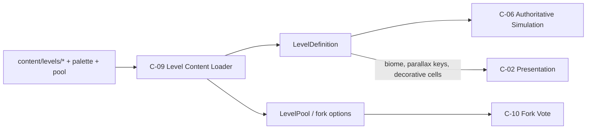

# C-09 — Level Content Loader Design

> **Component:** C-09 Level Content Loader  
> **Ownership:** SE-7  
> **Phase:** Documentation only (no application code in this package of work)  
> **Contracts:** [level-format.md](../../interfaces/level-format.md)  
> **Catalog:** [COMPONENTS.md](../../COMPONENTS.md) §C-09  
> **Architecture:** [ARCHITECTURE.md](../../ARCHITECTURE.md)  

---

## 1. Purpose

The Level Content Loader turns **authorable pixel-map packages** into deterministic runtime `LevelDefinition` objects for the Authoritative Simulation (C-06), plus metadata used by Presentation (C-02) and the Fork Vote Subsystem (C-10).

Canonical design source: design doc §3.0–3.3 (path diagram, level format, features, decorative layers). Product decisions: Q4-A (random unplayed pair pool) and Q8-A (`levelsAfterHoard` configurable; MVP default **2**, full **7**) in [ARCHITECT-OPEN-QUESTIONS.md](../../decisions/ARCHITECT-OPEN-QUESTIONS.md).

---

## 2. Goals

| ID | Goal |
|---|---|
| G1 | **1 pixel = 1 block** authoring: humans paint maps; CI and runtime parse identically |
| G2 | Deterministic parse → `LevelDefinition` (same bytes → same grid/slots every time) |
| G3 | Biome selected by header pixel + `meta.json`, driving tileset/music/parallax keys |
| G4 | Encode near-bg, midground (collision/gameplay), and foreground decorative rows |
| G5 | Color → semantic block/trap/treasure-slot mapping via shared palette table |
| G6 | Treasure **slots** only in content; identity rolled by sim at session seed |
| G7 | Content pack layout under `content/` with CI validation (fail closed) |
| G8 | Fork progression via **small pool + random unplayed pair** (Q4-A), not a fixed 19-path graph |

### Non-goals

| Out of scope | Owner |
|---|---|
| Runtime trap AI, physics, crumbling timers | C-06 Simulation |
| Parallax draw / sprite atlases | C-02 Presentation |
| Treasure identity rolls, rarity weights | C-06 + C-07 (catalog) |
| Fork UI / button-mash tally | C-10 |
| Generative map tools / AI art pipelines | Deferred art/ops tracks |
| Live content hot-reload in production | Stretch |

---

## 3. Placement in system



**Independence rule:** Loader code lives in a shared pure(ish) content package usable by **Node server** (authoritative) and optional **tooling**. No Phaser imports. Image decode is allowed on server/tools (`pngjs` or equivalent); client may receive already-parsed definitions or hashed level payloads from the server.

---

## 4. Biomes

Design themes (design §3.1 colors) map to stable biome ids used in `meta.biome`, header palette, music, and tilesets:

| Display / design name | `biome` id | Design color cue | Notes |
|---|---|---|---|
| **Hoard** (Treasure Hoard / Level 0) | `gold` | Gold | Always start after Instructions; not drawn from fork pool |
| **Outside** | `outside` | Green | Fork-eligible |
| **Dungeon** | `dungeon` | Grey | Fork-eligible |
| **Lava** | `lava` | Red | Fork-eligible |
| **Ice** | `ice` | Blue | Fork-eligible |
| **Cavern** | `cavern` | Brown | Fork-eligible |
| **Mist** | `mist` | Purple | Fork-eligible |

Wire/protocol and content files use the `biome` id column (`gold | outside | dungeon | lava | ice | cavern | mist`) per [level-format.md](../../interfaces/level-format.md). UI may show “Hoard” when `biome === "gold"`.

Each biome implies:

- Default far-background key  
- Tileset / block skin key  
- Default `musicId` (overridable in `meta.json`)  
- Optional trap affinity (content guidance only; not enforced by loader)

---

## 5. Content pack layout

Repository content root (runtime and CI share the same tree):

```text
content/
  palette.json                 # RGB → CellSemantic (fail closed on unknown)
  biomes.json                  # biome id → header RGB, tilesetKey, farBgKey, defaultMusicId
  level-pool.json              # Q4-A fork pool + run config
  levels/
    <levelId>/
      map.png                  # required pixel map (RGBA)
      meta.json                # required sidecar
      preview.png              # optional authoring aid (not required at runtime)
  fixtures/                    # optional golden maps for unit tests only
    box_level/
    hoard_01/
```

### 5.1 Per-level `meta.json`

```json
{
  "id": "hoard_01",
  "displayName": "The Treasure Hoard",
  "biome": "gold",
  "blockSizePx": 32,
  "pathTags": ["hoard", "start"],
  "musicId": "hoard",
  "forkTheme": null,
  "treasureSlotDefaultRarity": "world",
  "poolEligible": false,
  "switchLinks": [],
  "version": 1
}
```

| Field | Required | Meaning |
|---|---|---|
| `id` | yes | Must equal folder name |
| `displayName` | yes | UI / debug |
| `biome` | yes | One of seven biome ids |
| `blockSizePx` | yes | World scale; default **32** |
| `pathTags` | no | Authoring tags (`hoard`, biome name, difficulty) |
| `musicId` | no | Overrides biome default |
| `forkTheme` | no | Hint for fork exit art; usually biome of this level |
| `treasureSlotDefaultRarity` | no | Default filter when slot pixel has no override |
| `poolEligible` | no | If `false`, excluded from Q4-A random pool (Hoard, tutorial box) |
| `switchLinks` | no | Explicit `{ switchId, targetIds[] }` when convention insufficient |
| `version` | yes | Content schema version |

### 5.2 Shared `palette.json`

Maps exact `RRGGBB` (or `RRGGBBAA` with alpha 255 required for gameplay body) → semantic cell type string. Decorative near-bg / fore colors use `near_bg_*` and `fore_*` prefixes. Unmapped colors → **parse error**.

### 5.3 Shared `biomes.json`

Maps biome id →:

- `headerRgb` — expected pixel (0,0) color  
- `tilesetKey`, `farBgKey`, `defaultMusicId`  
- optional scroll rates override (else LevelDefinition defaults)

---

## 6. Pixel-map format (1 px = 1 block)

### 6.1 Spatial contract

- Image is a **PNG**, 8-bit RGBA, no palette-index surprises (authors export flat RGB).  
- **Each pixel corresponds to exactly one cell** on its layer’s grid.  
- World placement: `(cellX * blockSizePx, cellY * blockSizePx)`, **y-down** (Phaser-consistent), origin top-left of body grid.

### 6.2 Row classification (design §3.2 + decorative layers §3.3)

```text
Row index (top → bottom)
────────────────────────
0          Header / far-bg control row
           · Pixel (0,0) = tileset & biome key
           · Remaining row-0 pixels reserved (far-bg variant or ignore — document in tests)
1          Optional spacer row (ignored)
2 .. H-3   BODY: midground solid / interact / traps / slots / spawns / exit
H-2        Optional spacer row (ignored)
H-1        Foreground decorative row (fore_*)
```

**Near-background decorative:** the first **body-adjacent** decorative row is row **0 residual** / design “top near-bg” practice: treat **row 1** as near-bg decorative when it is *not* a pure spacer convention, OR use the top body-adjacent decorative strip as specified below.

**Resolved parser policy (binding for C-09):**

| Row | Role |
|---|---|
| `0` | Header: only `(0,0)` required for biome/tileset; other columns ignored in MVP (may carry far-bg variant later) |
| `1` | **Near-background** decorative strip (`near_bg_*` palette); not collidable. If entire row is spacer color, treat as empty near-bg |
| `2 .. H-3` inclusive | **Midground body** — collision + gameplay only |
| `H-2` | Spacer row — **always ignored** (readability gutter) |
| `H-1` | **Foreground** decorative strip (`fore_*`); not collidable |

**Column policy:**

| Column | Role |
|---|---|
| `0` | Spacer gutter on all rows except header `(0,0)` which is biome key — **ignored for gameplay grids** |
| `1 .. W-1` | Active cells |

Emitted body width = `imageWidth - 1`  
Emitted body height = `imageHeight - 4` (rows 0,1,H-2,H-1 removed)  
Require `imageHeight >= 5` and `imageWidth >= 3` after gutters (at least one playable cell).

These dimensions are golden-tested; if design art uses a different spacer convention, tests + this section are updated together (single source of truth).

### 6.3 Header biome check

1. Sample `map.png` pixel `(0,0)` RGB.  
2. Look up RGB in `biomes.json` → `headerBiome`.  
3. Require `headerBiome === meta.biome` **or** explicit `meta.allowHeaderMismatch: true` (debug only; CI forbids).  
4. Fail closed with path + expected vs actual RGB on mismatch.

### 6.4 Layer extraction summary

| Layer | Source | Consumed by | Collides? |
|---|---|---|---|
| Far background | biome `farBgKey` (+ optional row-0 variant later) | C-02 | no |
| Near background | row 1 active columns | C-02 decorative list | no |
| Midground / body | rows `2..H-3` | C-06 grid + entities | yes (per cell type) |
| Foreground | row `H-1` | C-02 decorative list | no |
| Interface | not in map | C-01/C-02 UI | n/a |

Default parallax factors on `LevelDefinition.parallax` (design §3.3):

| Layer | Scroll vs camera |
|---|---|
| far | `0.5` |
| near | `1.0` (same as mid) |
| mid | `1.0` |
| fore | `1.25` |

---

## 7. Color → block mapping

### 7.1 Pipeline

```text
RGBA pixel → normalize to #RRGGBB (alpha must be 255 on body; else error)
          → palette.json lookup
          → CellSemantic
          → cell-type table (solid, trap, marker, decorative)
```

Unmapped color → **parse error** (CI and runtime). No silent `empty` fallback.

### 7.2 Semantic categories

| Category | Examples | Loader emits |
|---|---|---|
| Empty | air | `empty` in body grid |
| Solid surfaces | `brick`, `ice`, `sand` | body cell + material flags for sim |
| Switches | `switch`, `heavy_switch` | body cell + switch id assignment |
| Traps | `spikes`, `crumbling`, `receding`, lightning/gas/rock variants | body cell; behavior is sim |
| Enemy spawners | `golem_spawn`, `phantom_spawn` | body markers |
| Treasure | `treasure_slot` (+ optional rarity-tint variants) | `treasureSlots[]` + usually `empty` underfoot |
| Spawns | `player_spawn_0..3` | `spawns[4]` |
| Exit | `exit` | union AABB in world px |
| Decorative | `near_bg_*`, `fore_*` | layer arrays only |

### 7.3 Material flags (pass-through to sim)

Loader does **not** simulate friction; it tags cells so C-06 can apply rules:

| Cell | Suggested flags |
|---|---|
| `brick` | `{ solid: true }` |
| `ice` | `{ solid: true, friction: "low" }` |
| `sand` | `{ solid: true, friction: "high" }` |
| `crumbling` | `{ solid: true, trap: "crumbling" }` |
| `receding` | `{ solid: true, trap: "receding" }` |
| `spikes` | `{ solid: true, trap: "spikes" }` or hazard AABB policy per sim |

MVP may stub unknown trap semantics as solid + `trap: "stub"` with one-time log; **palette must still list them** so maps parse.

### 7.4 Switch linking

MVP conventions (choose one, document in code comments + tests):

1. **Meta explicit** — `switchLinks` in `meta.json` preferred for non-local targets.  
2. **Proximity** — each switch activates trap cells within N blocks (stretch).  

Loader assigns stable `switchId` = `sw_${cellX}_${cellY}` when not provided.

---

## 8. Treasure spawn slots

Design §3.3: **positions predetermined; type random at runtime**.

### 8.1 Emission

For each body pixel mapped to `treasure_slot` (or rarity-specific palette colors):

```text
treasureSlots.push({
  x: cellX,           // body coordinates
  y: cellY,
  filter?: RarityFilter  // optional; else meta.treasureSlotDefaultRarity / world table
})
```

Body cell under the slot becomes `empty` (or non-solid marker) so sim can spawn a pickup entity without double-solid.

### 8.2 Filters

| Filter | Intent |
|---|---|
| `world` | Use global 65/20/5/10 common/rare/unique/set mix (design §2.2) |
| `common` / `rare` / `unique` / `set` | Force band for authored set-pieces |
| `chest_*` | Stretch: chest spawner markers |

Loader **never** picks treasure catalog ids. Session seed + C-06/C-07 own rolls; unique/set non-duplication is sim inventory policy.

### 8.3 Validation

- Slots ≥ 0 (Hoard should have many; BoxLevel may have zero).  
- Slots must not coincide with solid-only-required exit cells in a way that blocks egress (soft CI warning stretch; hard fail if slot == mandatory single exit cell).

---

## 9. Output: `LevelDefinition`

Matches [level-format.md](../../interfaces/level-format.md); expanded fields for decorative layers:

```text
LevelDefinition {
  id: string
  displayName: string
  biome: Biome
  blockSizePx: number
  width: number                 // body cells
  height: number                // body cells
  cells: CellType[][]           // [y][x] body only
  nearBg: DecorativeId[]        // length = width; row 1
  fore: DecorativeId[]          // length = width; row H-1
  spawns: Vec2[4]               // body cell coords; default left ledge if missing
  exit: AABB                    // world px, y-down
  treasureSlots: TreasureSlot[]
  switchLinks: SwitchLink[]
  parallax: { farScroll, nearScroll, foreScroll }
  musicId: string
  tilesetKey: string
  farBgKey: string
  contentHash: string           // sha256 of map+meta+palette slice for net cache
  version: number
}
```

### 9.1 Spawn defaults

If fewer than 4 explicit `player_spawn_*` markers:

1. Find left-most solid top surface in first 25% of width.  
2. Place seats 0..3 stacked or spaced by 2 cells.  
3. CI **warns** on Hoard/playable pool levels missing explicit spawns; **fails** if no safe solid found.

### 9.2 Exit

Union of all `exit` cells expanded to world AABB. Require ≥ 1 exit cell (except pure unit fixtures flagged `meta.skipExitValidation`).

### 9.3 Collision grid

`cells` is the authoritative static grid for C-06. Dynamic trap state is sim-owned; loader only places initial types.

---

## 10. Level pool & forks (Q4-A)

### 10.1 Decision

**Q4-A — Small pool + random unplayed pair each fork.**

Do **not** require the full design §3.1 fixed path diagram (19 levels with one ruled-out per leg) for MVP. That diagram remains a content-expansion aspiration; runtime selection uses a **pool**.

### 10.2 `content/level-pool.json`

```json
{
  "version": 1,
  "startLevelId": "hoard_01",
  "levelsAfterHoard": 2,
  "levelsAfterHoardFull": 7,
  "pool": [
    "outside_01",
    "dungeon_01",
    "lava_01",
    "ice_01",
    "cavern_01",
    "mist_01"
  ],
  "minPairBiomesDistinct": true,
  "repeatPolicy": "when_exhausted"
}
```

| Field | Meaning |
|---|---|
| `startLevelId` | Always Level 0 Hoard after Instructions |
| `levelsAfterHoard` | Active cap (config; MVP playtest **2**, ship target **7** per Q8-A) |
| `pool` | Eligible `levelId`s (`meta.poolEligible !== false`) |
| `minPairBiomesDistinct` | Prefer two different biomes when possible |
| `repeatPolicy` | `when_exhausted`: if unplayed &lt; 2, allow repeats of least-recent |

### 10.3 Runtime API (loader-owned pure functions)

```text
createRunPlan(poolConfig, sessionSeed) → RunPlan
  // does not pre-roll all forks if lazy; may expose:

pickForkOptions(state: {
  pool: string[]
  played: Set<string>
  sessionSeed: number
  forkIndex: number
}) → { optionA: string, optionB: string }
```

Algorithm (normative sketch):

1. `candidates = pool.filter(id => !played.has(id))`.  
2. If `candidates.length >= 2`, sample two **without replacement** using deterministic RNG from `(sessionSeed, forkIndex, "fork")`.  
3. If `minPairBiomesDistinct` and multiple pairs exist, bias toward distinct biomes.  
4. If `candidates.length === 1`, pair it with a deterministic pick from played (or pool) per `repeatPolicy`.  
5. If `candidates.length === 0`, sample two from full pool (repeats).  
6. C-10 presents options; on vote resolve, winner → next `levelId`; append to `played`.

Hoard is **not** in `played` filter as a fork option (`poolEligible: false`).

### 10.4 Interaction with C-06 / C-10

| Step | Owner |
|---|---|
| Load `level-pool.json` at process start | C-09 |
| After Hoard exit → request fork options | C-06 phase machine |
| Generate pair | C-09 pure `pickForkOptions` |
| UI + mash tally | C-10 |
| Load winner `LevelDefinition` | C-09 `loadLevel(levelId)` |
| Increment `levelsCompleted`; end when ≥ cap | C-06 |

### 10.5 Stretch: design path diagram

Optional later `content/level-graph.json` (already sketched in level-format) can replace random pairs without changing `LevelDefinition`. Flag `selectionMode: "pool" | "graph"`.

---

## 11. Loader module architecture

Suggested package (implementation later): `packages/content` or `packages/level-loader`.

```text
packages/level-loader/
  src/
    types.ts              # LevelDefinition, Biome, CellType (or re-export protocol)
    palette.ts            # load + validate palette.json
    parseMap.ts           # PNG → layers + cells
    loadLevel.ts          # folder → LevelDefinition
    loadPool.ts           # level-pool.json
    pickFork.ts           # Q4-A
    validate.ts           # shared rules for CI + runtime
    hash.ts               # contentHash
  bin/
    validate-levels.ts    # CLI used by CI
  fixtures/               # tiny PNGs checked in for unit tests
```

### 11.1 Public API (conceptual)

| Function | Description |
|---|---|
| `loadContentRoot(path) → ContentIndex` | Discover levels, palette, pool |
| `loadLevel(index, levelId) → LevelDefinition` | Parse + validate one level |
| `loadLevelFromDir(dir) → LevelDefinition` | Tooling entry |
| `pickForkOptions(args) → ForkPair` | Q4-A |
| `validateAll(index) → ValidationReport` | CI |

Caching: server may memoize `LevelDefinition` by `levelId` + `contentHash` for process lifetime.

### 11.2 Error model

All errors include `{ code, levelId?, path, message, pixel?: {x,y,rgb} }`.

| Code | Example |
|---|---|
| `UNKNOWN_COLOR` | Body pixel not in palette |
| `BIOME_MISMATCH` | Header vs meta |
| `MISSING_EXIT` | No exit cells |
| `BAD_DIMENSIONS` | Height/width below minimum |
| `META_ID_MISMATCH` | Folder ≠ meta.id |
| `POOL_UNKNOWN_LEVEL` | Pool references missing id |

---

## 12. CI validation

GitHub Actions (and local `pnpm content:validate`) run the CLI over `content/`:

### 12.1 Hard fails

- [ ] Every `content/levels/*/meta.json` parses; `id` matches folder  
- [ ] `map.png` present, decodable PNG, dimensions within max (e.g. **512×64** cells including gutters)  
- [ ] No unknown colors on any non-ignored pixel  
- [ ] Header biome matches `meta.biome`  
- [ ] Body has ≥ 1 `exit` (unless fixture flag)  
- [ ] Spawns: 4 logical positions resolvable  
- [ ] `level-pool.json`: every pool id exists and `poolEligible !== false`  
- [ ] `startLevelId` exists and is not required to be in pool  
- [ ] Palette covers all semantics used by checked-in maps  
- [ ] `contentHash` stable across two consecutive loads  

### 12.2 Soft warnings (non-zero exit optional via `--strict`)

- [ ] Zero treasure slots on pool-eligible levels  
- [ ] Missing explicit player spawns  
- [ ] Biome under-represented in pool  
- [ ] `switch` without any link target  

### 12.3 Unit tests (P1)

- Golden **BoxLevel** (empty net-test box)  
- Golden **hoard_01** minimal  
- Unknown color fails  
- Spacer column/rows ignored  
- Fork picker: deterministic for fixed seed; no duplicate options when pool allows; exhaust behavior  

---

## 13. Consumers & data flow

| Consumer | Needs from C-09 |
|---|---|
| C-06 Simulation | `cells`, spawns, exit, treasureSlots, switchLinks, blockSizePx |
| C-10 Fork | `pickForkOptions`, level displayName/biome for exit theming |
| C-02 Presentation | biome, tilesetKey, farBgKey, nearBg[], fore[], parallax, musicId |
| C-04 Netcode | optional `contentHash` / `levelId` in snapshots so clients load matching pack |
| C-08 AI | same grid as sim (no special loader path) |

Client **should not** re-parse untrusted PNGs for authority; server sends `levelId` + hash; client loads matching cached definition for prediction geometry.

---

## 14. Phasing (align IMPLEMENTATION-PLAN)

| Phase | C-09 deliverable |
|---|---|
| **P1** | Parser + palette + BoxLevel + Hoard fixture; validate CLI skeleton |
| **P2** | BoxLevel only in net slice; hash in room snapshot |
| **P3** | Treasure slots wired; trap cell types for spikes + one timed |
| **P4** | `level-pool.json` + `pickForkOptions`; Hoard → Fork → Level loop |
| **P6** | Expand pool toward ~14 maps (2×7), biomes completeness; optional graph mode |

---

## 15. Risks & mitigations

| Risk | Mitigation |
|---|---|
| Author color drift (near-black variants) | Exact RGB only; provide palette swatch PNG + editor doc |
| PNG tools rewrite alpha/color profile | CI rejects non-255 alpha on body; sRGB flat export checklist |
| Header vs meta drift | Hard fail; forbid mismatch in CI |
| Pool too small for 7 levels without repeats | `repeatPolicy`; content expansion in P6 |
| Design path diagram vs Q4-A confusion | This doc + level-format “MVP may use random unplayed pair” |
| Server/client parse skew | Prefer server-sent hash + shared package; single parser |

---

## 16. Open implementation notes (non-blocking)

1. Exact RGB values for palette — owned by art/SE-7 when first fixtures land; until then fixtures use documented test colors in `palette.json`.  
2. Whether treasure_slot rarity variants are separate palette entries or meta overlays — prefer palette entries for paintability.  
3. Max map size may be tuned after memory profiling of 4-client snapshots.  
4. Column-0 spacer on **header** row: `(0,0)` is data; remaining of col0 still ignored.

---

## 17. References

- Design doc §3.1 Path Diagram, §3.2 Level Format, §3.3 Level Features (blocks, treasure, traps, decorative layers)  
- [docs/interfaces/level-format.md](../../interfaces/level-format.md)  
- [docs/COMPONENTS.md](../../COMPONENTS.md) C-09, C-10  
- [docs/decisions/ARCHITECT-OPEN-QUESTIONS.md](../../decisions/ARCHITECT-OPEN-QUESTIONS.md) Q4-A, Q8-A  
- [docs/IMPLEMENTATION-PLAN.md](../../IMPLEMENTATION-PLAN.md) P1 / P4 / P6  
- [docs/ARCHITECTURE.md](../../ARCHITECTURE.md) component boundary table  
