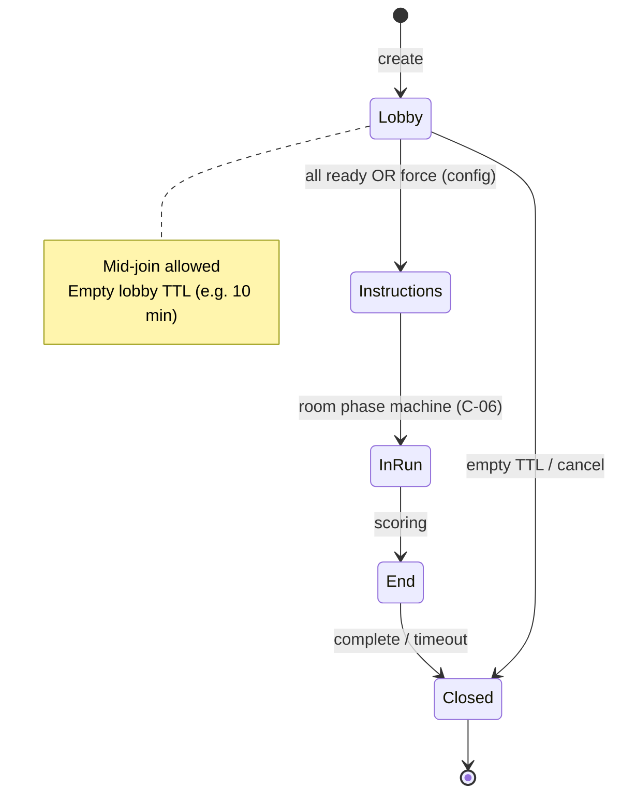

# C-05 — Lobby & Session Service — Design

| Field | Value |
|---|---|
| Component | **C-05 Lobby & Session Service** |
| Ownership | **SE-4** |
| Status | **Implemented P2** — `server/src/lobby/` REST + room seat tokens |
| Contract | [lobby-and-scores.md](../../interfaces/lobby-and-scores.md), [netcode-messages.md](../../interfaces/netcode-messages.md) |
| ADRs | [ADR-001](../../decisions/ADR-001-tech-stack.md), [ADR-002](../../decisions/ADR-002-multiplayer-netcode.md) |
| Frozen decisions | Q2 private codes only; Q6 Fly.io; Q7 no accounts; Q9 soft-unique characters |

---

## 1. Purpose

C-05 is the **HTTP-facing session front door** for online play. It creates private rooms, issues join codes and seat credentials, registers Colyseus `HaulSession` rooms, and exposes public lobby status. It does **not** tick simulation, score runs, or render UI.

**Product outcome:** A player can create or join a private room by short code, receive `seatToken` + `reconnectToken` + `wsUrl`, claim a character (soft-unique), ready up, and reconnect within grace — with no user accounts.

---

## 2. Scope

### In scope (MVP)

| Area | Behavior |
|---|---|
| Create session | `POST /api/v1/sessions` → spawn room, auto-claim first free seat for creator |
| Join by code | `POST /api/v1/sessions/join` → allocate free seat or reject |
| Lobby status | `GET /api/v1/sessions/:sessionId` public view (no tokens) |
| Seat credentials | Opaque `seatToken` + `reconnectToken` per human seat |
| Character claim | Prefer distinct; **allow clash** (soft-unique, Q9) |
| Ready-up | Via WS primarily (`C2S_Ready`); REST optional if needed for tools |
| Room registry | Create/find Colyseus room; return sticky-friendly `wsUrl` |
| Lifecycle | Empty-lobby TTL, closed phase rejection, mid-join while phase allows |
| Display names | Ephemeral string at create/join (not accounts) |
| Health | Cooperate with C-14 `GET /health` (room count if available) |

### Out of scope

- Authoritative sim ticks, treasure, traps (C-06)
- High-score ranking UI and DB leaderboard (C-12)
- Public matchmaking / quick play (stretch, Q2)
- User accounts, OAuth, persistent profiles (Q7)
- Local multi-gamepad seat multiplex (stretch, Q3)
- Region-aware multi-cluster matchmaking beyond optional `region` field stub
- Cross-node room migration after process death (MVP: room lost)

---

## 3. Frozen product constraints

| ID | Decision | Design implication |
|---|---|---|
| Q2 | Private room codes only | No public queue; only create + join-by-code |
| Q7 | No accounts | Identity = `displayName` ephemeral + tokens; high-score initials live in C-12 |
| Q9 | Soft-unique characters | Claim always allowed if seat owns token; duplicates permitted; UI prefers free chars |
| Q6 | Fly.io hosting | Sticky process / room affinity; `wsUrl` must target room host correctly |
| Q3 | Online seats first | One human seat per WebSocket connection for MVP |

**Interface note:** [lobby-and-scores.md](../../interfaces/lobby-and-scores.md) mentioned `409 CONFLICT` on unique claim as an *assumption*. **Q9 supersedes that:** soft-unique is frozen. REST claim returns **200** with seat status (including possible character collisions). Optional advisory field `characterClash: boolean` may be returned for client toast — not a hard error.

---

## 4. Architecture placement

```text
Client Shell (C-01)
    │  HTTPS REST
    ▼
┌─────────────────────────────┐
│  C-05 Lobby HTTP (Hono)     │
│  - create / join / status   │
│  - seat + reconnect tokens  │
│  - join-code index          │
└───────────┬─────────────────┘
            │ spawn / lookup
            ▼
┌─────────────────────────────┐
│  Colyseus Room Registry     │
│  HaulSession (C-06 host)    │
└───────────┬─────────────────┘
            │ WS (seatToken)
            ▼
      Netcode Client (C-04)

Optional: Redis for multi-instance join-code → room routing
Optional: PG session audit rows (not required for MVP play)
```

**Process model (MVP):** Lobby REST and Colyseus run in the **same Node process** on Fly.io (simplest sticky affinity). Stretch: split API sidecar with Redis room map.

---

## 5. Domain model

### Session (lobby view)

```text
LobbySession {
  sessionId: string            // UUID
  joinCode: string             // 6-char human code (see §6)
  phase: SessionPhase          // mirrored from room; default "lobby"
  levelsCompleted: number
  seats: SeatRecord[4]
  createdAt: timestamp
  emptySince?: timestamp       // for idle TTL
  roomId: string               // Colyseus room id
  wsPath: string               // path or full wsUrl construction helper
  completionIssued: bool       // set when End produces ScoreReport (for C-12)
}
```

### SeatRecord

```text
SeatRecord {
  seatId: 0|1|2|3
  occupied: bool
  control: "human" | "ai" | "empty"
  character?: CharacterId      // Gnome | Sprite | Halfling | Dwarf
  ready: bool
  displayName?: string
  seatTokenHash?: string       // store hash only; never log raw
  reconnectTokenHash?: string
  humanClientId?: string       // ephemeral uuid from create/join
  connected: bool
  lastInputAt?: timestamp      // room owns runtime; lobby may cache for status
  disconnectGraceUntil?: timestamp
}
```

### Credentials (issued once, client-held)

```text
SeatCredentials {
  seatToken: string            // Authorization: Seat <token>
  reconnectToken: string       // sessionStorage; bound sessionId+seatId
  seatId: number
  sessionId: string
  expiresWithRoom: true        // MVP: tokens die when room closes
}
```

**Security:** Tokens are high-entropy random (e.g. 32 bytes base64url). Persist only **hashes** (SHA-256) server-side. Compare with constant-time equality.

---

## 6. Join codes

| Property | MVP choice |
|---|---|
| Length | **6** characters |
| Alphabet | `ABCDEFGHJKLMNPQRSTUVWXYZ23456789` (no `0/O/1/I` ambiguity) |
| Generation | Crypto-random; retry on collision |
| Lookup | Case-insensitive normalize to uppercase |
| Uniqueness | Active sessions only; recycle after room closed + short hold (e.g. 5 min) |
| Rate limit | Per-IP join attempts (see §11) |

No vanity codes, no user-chosen codes for MVP.

---

## 7. REST API behavior

Full wire shapes: [lobby-and-scores.md](../../interfaces/lobby-and-scores.md). Behavioral detail:

### `POST /api/v1/sessions`

1. Allocate `sessionId`, unique `joinCode`.
2. Create Colyseus `HaulSession` room with config (`levelsAfterHoard` from server env; default 2 playtest / 7 full — Q8 is sim config, lobby only passes through if present).
3. Auto-claim **seat 0** (or first free) for creator.
4. Issue `hostSeatToken` + `reconnectToken`.
5. Apply optional `displayName` (trim, 1–16 chars, allowlist; default `"Hauler"`).
6. Return `201` with `wsUrl`, seats snapshot.

**Errors:** `VALIDATION`, `INTERNAL` (room spawn failure).

### `POST /api/v1/sessions/join`

1. Normalize `joinCode`; lookup active session.
2. If missing / expired → `NOT_FOUND`.
3. If phase ∈ `{ end_*, closed }` → `CLOSED` (MVP: no join as fighter on End).
4. If phase allows mid-join (`lobby`, `instructions`, `level`, `fork`) continue.
5. Find seat: prefer `empty`; else human-disconnect-expired AI-held free seat; else if 4 humans → `FULL`.
6. Bind human to seat; issue tokens; set `displayName`.
7. Notify room of seat bind (internal API).
8. Return `200` with `seatId`, tokens, `phase`, seats.

**AI seats:** In lobby phase, unoccupied seats are `"empty"` (no AI). From Hoard onward sim fills AI — that is C-06; lobby status should reflect room-reported control.

### `GET /api/v1/sessions/:sessionId`

- No auth.
- Returns public fields only (no tokens).
- Used by lobby poll / share-link status (code still primary for join).

### `POST /api/v1/sessions/:id/claim` (optional REST)

- Header `Authorization: Seat <seatToken>`.
- Body `{ character }`.
- Soft-unique: set character even if another seat has it.
- Response includes updated `seats` and optional `characterClash`.

Primary path remains WS `C2S_ClaimCharacter` handled by room; lobby REST is for pre-WS tools and consistency. **Single writer:** room is source of truth for character once connected; lobby mirrors via room hooks.

### Error envelope

```text
{ "error": { "code": string, "message": string } }
```

Codes used by C-05: `NOT_FOUND`, `FULL`, `CLOSED`, `UNAUTHORIZED`, `VALIDATION`, `INTERNAL`, `RATE_LIMITED`.

---

## 8. Session lifecycle & TTLs



| Timer | Default (config) | Action |
|---|---|---|
| Empty lobby TTL | 10 minutes with zero connected humans | Dispose room; free join code after hold |
| Disconnect grace | 30 seconds | Room holds seat; AI pilots in-run; reconnect token valid |
| Reconnect token | Valid while seat held + grace | After grace, token invalid; seat free/AI |
| Join code hold | 5 minutes after close | Avoid immediate reissue confusion |
| All humans leave (in-run) | Short TTL (e.g. 60s) or AI-only continue | Config; MVP may end room |

C-05 owns **lobby empty TTL** and **join-code index cleanup**. Disconnect grace is enforced primarily by the **room (C-06)**; C-05 must not re-issue a live seat to a new joiner until room releases it.

---

## 9. Integration with Colyseus / room

### Create path

1. Lobby generates ids/codes and credentials.
2. `matchMaker.createRoom("haul_session", { sessionId, joinCode, seatBootstrap })`.
3. Room registers internal map `sessionId → roomId`.
4. Lobby stores reverse index `joinCode → sessionId` (memory; Redis multi-instance).

### Join path

1. Lobby validates capacity/phase via room query or shared registry state.
2. Lobby reserves seat **atomically** (mutex per session) before returning tokens.
3. Client opens WS with `C2S_Join { sessionId, seatToken }`.
4. Room validates token hash, binds connection to seat, sends `S2C_Welcome`.

### Token validation ownership

| Check | Owner |
|---|---|
| Issue seat/reconnect tokens | C-05 |
| Store token hashes | Shared store readable by room (in-process map MVP) |
| Validate on WS join | Room (C-06 host), using shared token verifier module |
| Reconnect within grace | Room |

**Shared module (same package):** `server/session/tokens.ts` style — pure hash/verify helpers used by lobby HTTP and room. Avoid circular imports: lobby → registry; room → token store interface.

### `wsUrl` construction (Fly.io)

- Same-origin preferred: `wss://<host>` + Colyseus path.
- If multi-machine later: room sticky via Fly `fly-replay` / connection affinity; Redis maps join code to instance.
- MVP single-process: relative or absolute URL from `PUBLIC_WS_URL` env.

---

## 10. Character claim (soft-unique)

```text
onClaim(seatId, character):
  seat.character = character
  clash = any other occupied seat with same character
  broadcast S2C_SeatUpdate
  return { ok: true, characterClash: clash }
```

- No 409 on clash.
- Client Shell (C-01) should default-select unclaimed characters when available.
- All four seats may be Gnome in a chaos lobby; presentation must tolerate tint/name differentiation via `displayName`.

---

## 11. Security & abuse (MVP)

| Threat | Mitigation |
|---|---|
| Guess join codes | 6-char alphabet ~1e9 space; rate-limit join; short-lived codes |
| Token theft | HTTPS only; no tokens in GET query; sessionStorage not localStorage (C-04) |
| Score spoofing | Out of C-05; completion tokens are C-06→C-12 |
| Spam room create | Rate-limit create per IP |
| Oversized names | Length + charset allowlist (letters, digits, space, limited punctuation) |
| Replay old tokens | Tokens bound to session; invalid after close/grace |

No CAPTCHA for MVP.

---

## 12. Data storage

| Store | MVP | Notes |
|---|---|---|
| In-process maps | **Required** | sessions, join codes, token hashes |
| Redis | Optional | Multi-instance join routing on Fly scale-out |
| PostgreSQL | Optional for C-05 | Session audit only; **not** required for play |
| Client | sessionStorage | `reconnectToken`, `sessionId`, `seatId` (C-04) |

C-12 owns durable high-score rows. C-05 must not write leaderboard data.

---

## 13. Client collaboration

| Peer | Interaction |
|---|---|
| C-01 Shell | Calls create/join; shows code, seats, ready; navigates on phase |
| C-04 Netcode | Receives `wsUrl` + tokens; handles reconnect |
| C-06 Sim/Room | Validates tokens; owns phase after lobby start; AI fill |
| C-12 Scores | Consumes `completionToken` from `ScoreReport` (room), not lobby create |
| C-14 Health | Room count / process OK |

**Ready gate:** Room decides when lobby → instructions (all human seats ready, or minimum 1 human ready + timeout config). C-05 does not force phase transitions except cancel/dispose.

---

## 14. Configuration knobs

```text
LOBBY_EMPTY_TTL_MS=600000
JOIN_CODE_HOLD_MS=300000
DISCONNECT_GRACE_MS=30000          // documented here; enforced in room
MAX_CREATE_PER_IP_PER_MIN=10
MAX_JOIN_ATTEMPTS_PER_IP_PER_MIN=30
PUBLIC_WS_URL=wss://...
DISPLAY_NAME_MAX=16
```

---

## 15. Testing strategy (C-05)

| Layer | Cases |
|---|---|
| Unit | Join code alphabet/normalize; token hash verify; name validation; soft-unique clash flag |
| Unit | Seat allocation: 4 fills → 5th FULL; rejoin after leave frees seat |
| Integration | Create → join ×3 → fourth OK → fifth FULL (contract test) |
| Integration | Bad code → NOT_FOUND; closed phase → CLOSED |
| Integration | Token issued by lobby accepted by room join |
| Integration | Empty lobby TTL disposes room |
| Load smoke | N concurrent creates (CI light) |

Contract tests from [lobby-and-scores.md](../../interfaces/lobby-and-scores.md) §Test contract (lobby half).

---

## 16. Failure modes

| Failure | Behavior |
|---|---|
| Room create fails | `500 INTERNAL`; no join code published |
| Process crash | All in-memory sessions lost (MVP accepted) |
| Client loses tokens | Cannot reconnect; must re-join if seat free (new seat) |
| Split brain multi-instance without Redis | Avoid: pin single machine or require Redis before scale-out |
| Clock skew | TTLs use server monotonic/process time |

---

## 17. Stretch (explicitly deferred)

- Public matchmaking / quick play
- Region selection with multi-region Fly apps
- Spectator join on End
- Host migration / Redis room snapshots
- REST-only ready without WS
- Invite deep links with signed short-lived tokens
- Couch multi-seat on one connection

---

## 18. File layout (planned, not created yet)

```text
server/
  lobby/
    routes.ts          # Hono routes /api/v1/sessions*
    service.ts         # create/join/status
    joinCodes.ts
    seatAllocator.ts
  session/
    tokens.ts          # issue/hash/verify
    types.ts
  rooms/
    haulSession.ts     # Colyseus room (C-06 primary; hooks tokens)
packages/protocol/
  session.ts           # DTOs shared with client
```

---

## 19. Acceptance criteria (design-level)

1. Private codes only; no public matchmaking endpoints.
2. No account system; ephemeral `displayName` only.
3. Soft-unique character claims never hard-fail on clash.
4. Create + 4 joins + 5th FULL behavior matches contract.
5. Credentials enable WS welcome; reconnect token documented with 30s grace (room-enforced).
6. Deploy path assumes Fly.io sticky process; `wsUrl` env-driven.
7. Clear boundary: no sim ticks, no high-score DB writes inside C-05.
