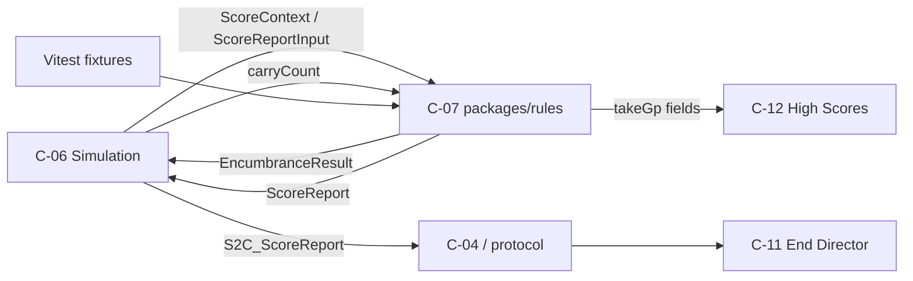

# C-07 — Rules Engine Design

> **Component:** C-07 Rules Engine  
> **Package:** `packages/rules`  
> **Ownership:** SE-6  
> **Status:** **Implemented P1** — `packages/rules` (catalog, modifiers, payout, encumbrance).  

> **Contract:** [share-modifier-api.md](../../interfaces/share-modifier-api.md)  
> **Sources:** design doc §0.0, §1.5, §2.2, §2.3; [ARCHITECTURE.md](../../ARCHITECTURE.md) §4/§8; [COMPONENTS.md](../../COMPONENTS.md) C-07

---

## 1. Purpose

The Rules Engine is the **single pure TypeScript source of truth** for:

1. Treasure catalog values, rarity tables, chest rolls, and set completion value  
2. Encumbrance (weight → speed/jump multipliers)  
3. Share modifier catalog evaluation (all rewards + penalties from design §2.3)  
4. Take payout: `take_i = TotalTreasureGp × (shares_i / Σ shares)` with **minimum 1 share**  
5. Authoritative `ScoreReport` assembly for End Screen, high-score submit, and audit

It has **zero runtime dependencies** on Phaser, Colyseus, Node `fs`, network, or DOM. All functions are deterministic given the same inputs + RNG stream. Simulation (C-06) and unit tests are the only producers of `ScoreContext`; End Screen Director (C-11) and High Scores (C-12) only **consume** outputs.

---

## 2. Non-goals

| Out of scope | Owner instead |
|---|---|
| When the run ends / when to call scoring | C-06 Simulation |
| Tracking live `PlayerStats` counters during play | C-06 |
| Cinematic order of coin tosses / title animations | C-11 End Director |
| Persisting high scores / DB | C-12 |
| Pixel-map parsing, spawn placement | C-09 |
| Network wire encoding of `ScoreReport` | `packages/protocol` + C-04/C-06 |
| Physics resolution of weight/knockback forces | C-06 (uses multipliers from rules) |

---

## 3. Package layout (planned)

```text
packages/rules/
  package.json                 # name: @dhaul/rules; no runtime deps
  tsconfig.json                # strict; no DOM/Node libs
  src/
    index.ts                   # public re-exports only
    version.ts                 # rulesetVersion constant
    types.ts                   # ScoreContext, PlayerStats, ScoreReport, …
    treasure/
      catalog.ts               # TreasureDef[] static data (in-module, not fs)
      sets.ts                  # SetDef[]
      value.ts                 # computeInventoryValue, set completion
      roll.ts                  # rollTreasureDef + chest tables
      rarity.ts                # world spawn weights 65/20/5/10
    encumbrance/
      config.ts                # ENCUMBRANCE parameter block
      compute.ts               # computeEncumbrance
    modifiers/
      catalog.ts               # ShareModifierDef[] — exhaustive §2.3
      evaluate.ts              # evaluateModifiers
      rankings.ts              # derive ranking seats from stats
      unremarkable.ts          # depends on other unique awards
    payout/
      takes.ts                 # computeTakes, remainder policy
      report.ts                # buildScoreReport
    rng/
      types.ts                 # Rng interface (injectable)
  test/
    fixtures/                  # hand-built ScoreContext / inventories
    treasure-value.test.ts
    encumbrance.test.ts
    modifiers-rewards.test.ts
    modifiers-penalties.test.ts
    takes.test.ts
    score-report.test.ts
    golden-haul.test.ts        # end-to-end fixture payouts
```

**Purity rules (CI-enforced later):**

- No `import` from `phaser`, `colyseus`, `fs`, `path`, `node:*`, or client packages  
- Catalog data is TypeScript modules (or importable JSON via bundler), never runtime file reads  
- No `Date.now()`, `Math.random()` — callers inject `Rng` / fixed seeds  
- Integer GP arithmetic only in payout path (no float share math drift)

---

## 4. Public API surface

Canonical contract lives in [share-modifier-api.md](../../interfaces/share-modifier-api.md). This design **extends** it with `buildScoreReport` and explicit ranking helpers so C-06 has one call site for end-of-run.

```text
// --- Version ---
rulesetVersion: string          // e.g. "1.0.0" — embedded in ScoreReport

// --- Catalog introspection ---
listTreasureDefs(): readonly TreasureDef[]
listSetDefs(): readonly SetDef[]
listModifierDefs(): readonly ShareModifierDef[]
getTreasureDef(defId: string): TreasureDef | undefined

// --- Treasure valuation & rolls ---
rollTreasureDef(
  rng: Rng,
  table: LootTableId,
  ctx: RollContext
): TreasureDef

computeInventoryValue(
  items: TreasureInstance[],
  setCatalog?: readonly SetDef[]   // default = built-in sets
): InventoryValueResult

// --- Encumbrance ---
computeEncumbrance(
  carryCount: number,
  carryWeight: number,
  config?: EncumbranceConfig
): EncumbranceResult

// --- Share modifiers & payout ---
buildRankings(seats: ScoreSeat[]): RankingBuckets
evaluateModifiers(ctx: ScoreContext): PlayerModifierResult[]
computeTakes(
  totalTreasureGp: number,
  results: PlayerModifierResult[]
): TakeBreakdown

// --- End-of-run assembly ---
buildScoreReport(input: ScoreReportInput): ScoreReport
```

All functions **pure** and **deterministic**. `buildScoreReport` is the preferred single entry for C-06:

```text
ScoreReportInput {
  sessionId: string
  seats: ScoreSeat[]              // 4 seats
  levelsCompleted: number
  completionToken: string         // opaque, minted by lobby/sim — rules does not validate crypto
  // optional overrides:
  setCatalog?: SetDef[]
  encumbranceConfig?: never       // not needed at end; scoring does not recompute weight
}
```

Internally: value inventories → rankings → modifiers → takes → `ScoreReport`.

---

## 5. Core types

### 5.1 Identifiers & enums

```text
CharacterId = "gnome" | "sprite" | "halfling" | "dwarf"
Rarity = "common" | "rare" | "unique" | "set"
LootTableId =
  | "world"
  | "wooden_chest"
  | "silver_chest"
  | "gold_chest"
  | "magic_chest"
ModifierKind = "reward" | "penalty"
Uniqueness = "unique" | "common"
SeatId = 0 | 1 | 2 | 3
```

### 5.2 Treasure

```text
TreasureDef {
  id: string                      // stable slug, e.g. "stone_icon"
  name: string                    // display, e.g. "Stone Icon"
  rarity: Rarity
  baseValueGp: number             // integer GP
  setId?: string                  // if piece of a set
  setPieceIndex?: number          // optional order within set
  stackableVisual: boolean        // false for coin sacks (no stack height)
  unique: boolean                 // true for Unique rarity (and set pieces as non-duplicate)
  isChest: boolean                // wooden/silver/gold/magic chest shells
  chestTable?: LootTableId        // which table opens into
  flags?: {
    goatOnPole?: boolean          // Jammy item (see §7.1 jammy)
  }
}

TreasureInstance {
  instanceId: string
  defId: string
  valueOverrideGp?: number        // after chest open, revealed value
  // position/owner are sim concerns; not required for pure valuation
}

SetDef {
  id: string
  name: string
  pieceDefIds: string[]           // length 2..5 per design
  pieceBaseValueGp: number        // design “Value” column (per piece)
  setBonusPercent: number         // e.g. 10, 200, 2000
}
```

### 5.3 Encumbrance

```text
EncumbranceConfig {
  freeItems: number               // design: 3
  speedPenaltyPerExtra: number    // playtest-tunable; default placeholder 0.12
  jumpPenaltyPerExtra: number     // default placeholder 0.12
  minSpeedMultiplier: number      // 0 allows Greed Overwhelming
  minJumpMultiplier: number
  // optional weight-based term (sim may pass total weight units):
  weightSpeedFactor?: number      // 0 = count-only MVP
}

EncumbranceResult {
  freeItems: number
  extraItems: number              // max(0, carryCount - freeItems)
  speedMultiplier: number         // clamped [min, 1]
  jumpMultiplier: number
  isSpeedZero: boolean            // speedMultiplier === 0
}
```

**Formula (MVP, count-based — design: “after the first three treasures, cumulative decrease”):**

```text
extra = max(0, carryCount - freeItems)
speedMultiplier = max(minSpeedMultiplier, 1 - extra * speedPenaltyPerExtra)
jumpMultiplier  = max(minJumpMultiplier,  1 - extra * jumpPenaltyPerExtra)
```

Weight units affect knockback/switches in **sim**; rules only exposes multipliers. If `weightSpeedFactor` is set later, multiply after the item curve (document in tests when introduced).

### 5.4 Stats & score context

```text
PlayerStats {
  // Exit order (session aggregate)
  exitsFirstCount: number         // levels exited first
  exitsLastCount: number
  alwaysFirstExit: boolean        // true iff first on EVERY completed level (Leader of the Pack)
  alwaysLastExit: boolean         // true iff last on EVERY completed stage (Slowpoke)

  // Treasure economy
  treasureRecoveredValueGp: number  // optional pre-agg; rules prefers inventory recompute
  treasureLostCount: number
  itemsHauledCount: number          // final recovered item count (or session haul count)
  setPiecesInCompletedSets: number  // pieces this seat holds in sets that party completed
  lostSetItemDuringEscape: boolean  // Remedial Archaeology

  // Motion
  airTimeTicks: number
  groundTimeTicks: number

  // Combat / traps
  trapsHit: number
  hitsDealt: number                 // trip/push hits on other players
  hitsTaken: number
  playersHitSeatIds: SeatId[]       // distinct seats this player hit (Disciplinarian)
  stunnedOrHurtCount: number

  // Control / AI
  humanControlTicks: number
  aiControlTicks: number
  controlSwaps: number              // human↔AI transitions
  onlyHumanForWholeGame: boolean    // Antisocial: sole human entire session
  // Note: "only human" is a session-level fact; sim sets this per seat or on context

  // Inventory shape at end
  hoardExitItemCount: number        // items when leaving Level 0 Hoard
  finalItemCount: number            // items at dungeon exit
  onlyChestsRecovered: boolean      // Gambler (final haul is only chest-origin items)
  onlyCommonRecovered: boolean      // Undiscerning
  speedZeroFromWeight: boolean      // Greed Overwhelming ever true
  goatOnPole: boolean               // Jammy
  successfullyExited: boolean       // Success! — completed exit (not stuck/quit mid-run)
}

ScoreSeat {
  seatId: SeatId
  character: CharacterId
  human: boolean                    // final control affinity for high-score eligibility
  stats: PlayerStats
  finalInventory: TreasureInstance[]
  hoardExitInventoryCount: number   // mirrors stats.hoardExitItemCount for convenience
}

RankingBuckets {
  mostTreasureValue: SeatId[]
  mostTrapsHit: SeatId[]
  mostHitsDealt: SeatId[]
  mostHitsTaken: SeatId[]
  mostTreasureLost: SeatId[]
  mostAirTime: SeatId[]
  leastAirTime: SeatId[]
  alwaysFirstExit: SeatId[]
  alwaysLastExit: SeatId[]
}

ScoreContext {
  seats: ScoreSeat[]                // length 4
  levelsCompleted: number           // 0..7 design path
  ranking: RankingBuckets           // precomputed or filled by buildRankings
  sessionHadExactlyOneHuman: boolean  // for Antisocial
}
```

### 5.5 Modifier results & payout

```text
ShareModifierDef {
  id: string
  title: string
  kind: ModifierKind
  uniqueness: Uniqueness
  // fixed delta, or variable:
  deltaMode: "fixed" | "per_item" | "per_set_piece"
  deltaShares: number               // base; for per_* multiplied by count
  // evaluation:
  // predicate returns false | true | number (variable count for per_*)
}

AppliedModifier {
  id: string
  title: string
  kind: ModifierKind
  uniqueness: Uniqueness
  deltaShares: number               // signed int; already scaled for haul/collector
}

PlayerModifierResult {
  seatId: SeatId
  modifiers: AppliedModifier[]
  rawShares: number                 // sum of deltaShares (may be ≤ 0)
  shares: number                    // max(1, rawShares)
}

TakeBreakdown {
  totalTreasureGp: number
  totalShares: number
  players: {
    seatId: SeatId
    shares: number
    sharePercent: number            // (shares / totalShares) * 100 — display float ok
    takeGp: number                  // integer GP after remainder policy
  }[]
}

ScoreReport {
  rulesetVersion: string
  sessionId: string
  totalTreasureGp: number
  players: {
    seatId: SeatId
    character: CharacterId
    human: boolean
    modifiers: AppliedModifier[]    // display-sorted (see §9)
    shares: number
    sharePercent: number
    takeGp: number
    inventoryValueGp: number
    eligibleForHighScore: boolean   // human && successfullyExited
  }[]
  setCompletions: SetCompletion[]
  percentageRevealOrder: SeatId[]   // 3rd, 2nd, 4th, 1st by takeGp
  tossOrder: SeatId[]               // slowest→fastest exit (for End Director count phase)
  completionToken: string
}
```

---

## 6. Treasure catalog (design §2.2)

Data is **static in-module tables**. Values are canonical integers from the design document.

### 6.1 World spawn weights

| Rarity | Weight |
|---|---|
| Common | 65% |
| Rare | 20% |
| Unique | 5% |
| Set | 10% |

Within a rarity band, pieces are chosen **uniformly** among eligible defs (subject to uniqueness constraints).

### 6.2 Common treasures

| id | name | baseValueGp | stackableVisual | notes |
|---|---|---:|---|---|
| `stone_icon` | Stone Icon | 5 | true | |
| `coin_sack` | Coin Sack | 20 | **false** | no stack height |
| `brass_watch` | Brass Watch | 20 | true | |
| `bronze_icon` | Bronze Icon | 50 | true | |
| *(gap)* | *(unnamed 50 gp in PDF table)* | 50 | true | id `common_50_b` — **assumption:** second 50 gp common line without name in PDF; treat as `bronze_charm` placeholder until art names it |
| `gold_watch` | Gold Watch | 75 | true | |
| `big_coin_sack` | Big Coin Sack | 100 | **false** | |
| `silver_icon` | Silver Icon | 100 | true | |
| `sculpture` | Sculpture | 150 | true | |
| `giant_coin_sack` | Giant Coin Sack | 200 | **false** | |
| `wooden_chest` | Wooden Chest | — | true | shell; opens → wooden table |
| `silver_chest` | Silver Chest | — | true | shell; opens → silver table |

> **PDF note:** The common list shows two “50 gp” rows; one is Bronze Icon, the next has value only. Design locks `bronze_charm` as the second 50 gp common until product renames.

### 6.3 Rare treasures

| id | name | baseValueGp | notes |
|---|---|---:|---|
| `gold_icon` | Gold Icon | 250 | |
| *(gap)* | *(350 gp unnamed)* | 350 | id `rare_350` / `opal_icon` placeholder |
| `gemstone` | Gemstone | 500 | |
| `crown` | Crown | 750 | |
| `marble_icon` | Marble Icon | 800 | |
| `gold_chest` | Gold Chest | — | shell → gold table |
| `magic_chest` | Magic Chest | — | shell → magic table |

### 6.4 Unique treasures

| id | name | baseValueGp | special |
|---|---|---:|---|
| `goat_icon` | Goat Icon | 800 | **Jammy** if recovered — see §7.1 (`flags.goatOnPole` / sim sets `goatOnPole`) |
| `supply_crate` | Supply Crate | 800 | |
| `giants_ring` | Giant's Ring | 900 | |
| `nes_cartridge` | NES Cartridge | 1000 | |
| `magic_scepter` | Magic Scepter | 1000 | |
| `question_block` | ? Block | 1000 | |
| `ruby_crown` | Ruby Crown | 1200 | |
| `e_tank` | E-Tank | 1200 | |
| `crystal_skull` | Crystal Skull | 1500 | |
| `magic_hourglass` | Magic Hourglass | 1500 | |

**Jammy mapping:** Design reward text is “Brought back the **Goat on a Pole**”; unique list has **Goat Icon**. **Decision:** `goat_icon` is the Jammy item (`flags.goatOnPole: true`). Display title remains “Jammy”; no separate def required.

### 6.5 Treasure sets

When a set is **incomplete**, each held piece contributes `pieceBaseValueGp` to its carrier.  
When a set is **complete** (all `pieceDefIds` present in the **party-wide** recovered inventory), piece values are **superseded** by set valuation:

```text
setGrossGp = pieceBaseValueGp * pieceCount * (100 + setBonusPercent) / 100
// integer: floor after multiply
setGrossGp = floor(pieceBaseValueGp * pieceCount * (100 + setBonusPercent) / 100)
```

Each contributor seat receives:

```text
contributorGp = floor(setGrossGp * piecesHeldBySeat / pieceCount)
```

Remainder GP from integer division is assigned to the contributor with the **most pieces** in that set; further ties → **lowest seatId**.

| id | name | pieces | pieceBaseValueGp | setBonusPercent |
|---|---|---:|---:|---:|
| `suit_of_armor` | Suit of Armor | 4 | 150 | 10 |
| `haul_icons` | HAUL Icons | 4 | 300 | 200 |
| `celestial_markers` | Celestial Markers | 3 | 300 | 150 |
| `divine_suits` | Divine Suits | 4 | 250 | 50 |
| `song_of_fire_and_ice` | Song of Fire and Ice | 2 | 500 | 50 |
| `the_box` | The "Box" set | 5 | 300 | 500 |
| `vegetables` | Vegetables | 4 | 50 | 2000 |

**Piece def ids (stable slugs):**

| setId | pieceDefIds |
|---|---|
| `suit_of_armor` | `armor_helmet`, `armor_breastplate`, `armor_greaves`, `armor_gauntlets` |
| `haul_icons` | `haul_h`, `haul_a`, `haul_u`, `haul_l` |
| `celestial_markers` | `sun_sculpture`, `moon_sculpture`, `star_sculpture` |
| `divine_suits` | `suit_spade`, `suit_club`, `suit_heart`, `suit_diamond` |
| `song_of_fire_and_ice` | `flame_guitar`, `ice_bass` |
| `the_box` | `box_andrew`, `box_greg`, `box_lindsey`, `box_megan`, `box_darius` |
| `vegetables` | `veg_turnip`, `veg_green_pepper`, `veg_pumpkin`, `veg_onion` |

Piece rarity is `set`. Set pieces never duplicate while “in play”; lost pieces may reappear later or via chests (sim + roll constraints).

### 6.6 Chest open tables

| Table | Eligible pool |
|---|---|
| `wooden_chest` | Common ∪ Rare (**non-chest** defs only) |
| `silver_chest` | Common ∪ Rare ∪ Unique (non-chest) |
| `gold_chest` | Rare ∪ Unique ∪ Set pieces (non-chest) |
| `magic_chest` | Prefer **last missing piece** of any set that is one piece away from complete given `RollContext.partyHeldDefIds`; else Unique (non-chest) |
| `world` | weighted Common/Rare/Unique/Set as §6.1 |

**`RollContext`:**

```text
RollContext {
  partyHeldDefIds: string[]       // currently recovered unique/set ids in play
  excludedDefIds: string[]        // cannot roll (live uniques/set pieces)
  almostCompleteSets?: { setId: string, missingDefId: string }[]  // for magic
}
```

**Constraints:**

1. Never roll a Unique or Set piece whose `defId` is in `excludedDefIds` / live in play.  
2. Lost uniques (not in party inventory, not excluded) **may** reappear.  
3. Chests do not open into other chests.  
4. After roll, revealed item uses `baseValueGp` (no separate chest GP).

### 6.7 `computeInventoryValue`

```text
InventoryValueResult {
  totalGp: number                 // party total after set supersession
  perSeatGp: { seatId: SeatId, gp: number }[]
  setCompletions: SetCompletion[]
}

SetCompletion {
  setId: string
  name: string
  bonusGp: number                 // setGrossGp - sum(piece bases)  OR full setGross for display
  setGrossGp: number
  contributors: { seatId: SeatId, pieces: number, awardedGp: number }[]
}
```

**Algorithm:**

1. Resolve each instance → def (and `valueOverrideGp` if any, for non-set).  
2. Partition items into set-piece vs non-set.  
3. For each set, if all pieces present party-wide → complete; else incomplete.  
4. Incomplete set pieces: award `pieceBaseValueGp` (or override) to owner seat.  
5. Complete sets: supersede pieces; split `setGrossGp` per §6.5.  
6. Non-set items: sum to owner seats.  
7. `totalGp = sum(perSeatGp)`.

**Breadwinner** uses `perSeatGp` (or recomputed seat inventory value), not raw item counts.

---

## 7. Share modifier catalog (exhaustive §2.3)

### 7.1 Evaluation pipeline

```text
1. computeInventoryValue(all final inventories) → perSeatGp, setCompletions
2. buildRankings(seats, perSeatGp) → RankingBuckets
3. For each ShareModifierDef in catalog order:
     - Evaluate predicate for each seat (or globally for ranking awards)
     - Apply tie policy (§8)
     - Append AppliedModifier with concrete deltaShares
4. Unremarkable is evaluated LAST among penalties that depend on unique awards
5. rawShares = sum(deltas); shares = max(1, rawShares)
6. computeTakes → TakeBreakdown
7. buildScoreReport → sort modifiers for display, reveal order, eligibility
```

**Catalog evaluation order** does not affect totals (sums commute) except:

- **`unremarkable`** must run after all other modifiers that can apply `uniqueness: "unique"`.  
- Variable awards (`haul`, `collector`) scale from seat-local counts.

### 7.2 Uniqueness classification (display)

Design tags Unique (gold/red) vs Common (white/blue). **Locked for MVP:**

| uniqueness | Meaning |
|---|---|
| `unique` | Superlative / named special title (gold rewards, red penalties) |
| `common` | Personal condition or per-item scale (white rewards, blue penalties) |

### 7.3 Rewards — rule definitions

| id | title | Δ | uniqueness | kind | Predicate / scaling |
|---|---|---:|---|---|---|
| `leader_pack` | Leader of the Pack | **+10** | unique | reward | `stats.alwaysFirstExit === true` (first exit on **every** completed level). If no levels completed, **false**. |
| `breadwinner` | Breadwinner | **+5** | unique | reward | seatId ∈ `ranking.mostTreasureValue` (max `perSeatGp`) |
| `airhead` | Airhead | **+3** | unique | reward | seatId ∈ `ranking.mostAirTime` (max `airTimeTicks`) |
| `landshark` | Landshark | **+3** | unique | reward | seatId ∈ `ranking.leastAirTime` (min `airTimeTicks`) |
| `jammy` | Jammy | **+1** | unique | reward | `stats.goatOnPole === true` **or** final inventory contains def with `flags.goatOnPole` |
| `haul` | Haul | **+1 / item** | common | reward | `delta = finalItemCount` (each treasure recovered at exit). Chests that were opened count as the revealed item, not the shell. Empty haul → 0 (modifier omitted if 0). |
| `collector` | Collector | **+1 / set piece** | common | reward | `delta =` number of set pieces **this seat holds** that belong to **completed** party sets (`setCompletions`). |
| `my_precious` | My Precious | **+5** | unique | reward | `hoardExitItemCount === 1` **and** player successfully exited with that single-item discipline for the whole escape — **MVP lock:** `hoardExitItemCount === 1 && finalItemCount === 1 && successfullyExited`. (Design: “Carried exactly one treasure from the Hoard to the Exit”.) |
| `success` | Success! | **+5** | common | reward | `stats.successfullyExited === true` |
| `flawless` | Flawless | **+5** | unique | reward | `stunnedOrHurtCount === 0` **and** `trapsHit === 0` **and** `hitsTaken === 0` — design: “never stunned or injured”. **MVP:** `stunnedOrHurtCount === 0`. |
| `gambler` | Gambler | **+5** | unique | reward | `onlyChestsRecovered === true` **and** `finalItemCount ≥ 1` (only recovered chests / chest contents; empty not Gambler) |
| `disciplinarian` | Disciplinarian | **+3** | unique | reward | Hit **each other player**: `playersHitSeatIds` contains all other seatIds among the 4. |
| `opportunist` | Opportunist | **+2** | common | reward | `finalItemCount >= hoardExitItemCount + 2` |
| `softie` | Softie | **+1** | common | reward | `hitsDealt === 0` |
| `precision` | Precision | **+1** | common | reward | `finalItemCount === hoardExitItemCount` (and successfully exited). **Note:** can co-apply with Opportunist? No — mutually exclusive by inequality. Can co-apply with My Precious when both counts are 1. |

**Premise §0.0 vs §2.3:** Where early premise numbers differ (e.g. Opportunist +4 vs +2, Empty Handed −1 vs −3), **§2.3 tables win** per interface contract.

### 7.4 Penalties — rule definitions

| id | title | Δ | uniqueness | kind | Predicate |
|---|---|---:|---|---|---|
| `slowpoke` | Slowpoke | **−1** | unique | penalty | `stats.alwaysLastExit === true` |
| `butterfingers` | Butterfingers | **−3** | unique | penalty | seatId ∈ `ranking.mostTreasureLost` (max `treasureLostCount`); if all zeros, **no award** |
| `klutz` | Klutz | **−3** | unique | penalty | seatId ∈ `ranking.mostTrapsHit`; if all zeros, **no award** |
| `whipping_boy` | Whipping Boy | **−3** | unique | penalty | seatId ∈ `ranking.mostHitsTaken`; if all zeros, **no award** |
| `big_jerk` | Big Jerk | **−5** | unique | penalty | seatId ∈ `ranking.mostHitsDealt`; if all zeros, **no award** |
| `antisocial` | Antisocial | **−7** | unique | penalty | `sessionHadExactlyOneHuman === true` **and** this seat `human === true` (the sole human). AI seats never get Antisocial. |
| `unremarkable` | Unremarkable | **−1** | common | penalty | Seat earned **zero** modifiers with `uniqueness === "unique"` (rewards or penalties) in this evaluation. Evaluated after all unique-capable modifiers. |
| `remedial` | Remedial Archaeology | **−1** | common | penalty | `lostSetItemDuringEscape === true` |
| `attention_deficit` | Attention Deficit | **−2** | common | penalty | `controlSwaps > 5` (strictly greater than 5) |
| `greed` | Greed Overwhelming | **−2** | common | penalty | `speedZeroFromWeight === true` |
| `empty_handed` | Empty Handed | **−3** | common | penalty | `finalItemCount === 0` && successfullyExited |
| `undiscerning` | Undiscerning | **−5** | common | penalty | `onlyCommonRecovered === true` && `finalItemCount ≥ 1` (exited with only common treasures) |
| `autopilot` | Autopilot | **−5** | common | penalty | `aiControlTicks > humanControlTicks + aiControlTicks` wait — design: “more than half the game”. **Lock:** `aiControlTicks * 2 > (humanControlTicks + aiControlTicks)` i.e. **strictly greater than 50%**. Exactly 50% does **not** fire. If total ticks is 0, false. |

### 7.5 Predicate edge cases (test-locked)

| Case | Rule |
|---|---|
| Min shares | After all deltas, `shares = max(1, rawShares)` even if raw is −100 |
| Haul with 0 items | Omit `haul` (or delta 0 — omit from `modifiers[]`) |
| Collector with 0 completed pieces | Omit |
| Softie + Disciplinarian | Mutually exclusive in practice; if hitsDealt=0 cannot be Disciplinarian |
| Softie + Big Jerk | Same |
| Opportunist + Precision | Mutually exclusive |
| Empty Handed + Haul | Haul omitted; Empty Handed applies |
| Empty Handed + Undiscerning | Undiscerning requires ≥1 item — exclusive |
| Gambler + Undiscerning | Chest contents may be non-common → Undiscerning false if any non-common |
| Leader fails any level | `alwaysFirstExit` false if lost first on **any** level |
| Slowpoke fails any stage | `alwaysLastExit` false if not last on any stage |
| Antisocial multi-human | Never; only exactly one human seat whole session |
| Antisocial AI seats | Never |
| Autopilot at 50% | **Does not fire** |
| Autopilot at 50%+ε | Fires |
| Flawless with only stun | `stunnedOrHurtCount > 0` → no Flawless |
| Unremarkable after unique penalty | Unique penalty **blocks** Unremarkable |
| Four-way airtime tie | All four get Airhead **and** Landshark only if same ticks for max=min (all equal) — both apply |

### 7.6 Variable delta formalization

```text
haul:       deltaShares = finalItemCount           // +1 each
collector:  deltaShares = count(set pieces held by seat in completed sets)
fixed:      deltaShares = catalog.deltaShares      // may be negative
```

`AppliedModifier.deltaShares` is always a concrete signed integer.

---

## 8. Rankings & tie-breaks

### 8.1 Ranking construction

```text
buildRankings(seats, perSeatGp):
  mostTreasureValue = all seats with max(perSeatGp)
  mostTrapsHit      = all seats with max(trapsHit)     if max > 0 else []
  mostHitsDealt     = all seats with max(hitsDealt)    if max > 0 else []
  mostHitsTaken     = all seats with max(hitsTaken)    if max > 0 else []
  mostTreasureLost  = all seats with max(treasureLostCount) if max > 0 else []
  mostAirTime       = all seats with max(airTimeTicks)
  leastAirTime      = all seats with min(airTimeTicks)
  alwaysFirstExit   = seats where alwaysFirstExit
  alwaysLastExit    = seats where alwaysLastExit
```

Airtime: if all seats have 0 air and 0 ground, max=min=0 → all get both Airhead and Landshark (degenerate; still deterministic).

### 8.2 Tie policy (MVP)

**All tied seats receive the modifier** (multi-award). Design does not forbid multi-award; interface locks this for MVP.

Documented alternative (not MVP): lowest `seatId` wins — switch only after playtest via `rulesetVersion` bump.

### 8.3 Zero-suppression for “most X” penalties/rewards

For **Butterfingers, Klutz, Whipping Boy, Big Jerk**: if the max metric is **0**, **no one** receives the modifier (everyone “tied at zero” is not a meaningful most).

For **Breadwinner**: max treasure value of 0 still awards all seats with 0 (everyone empty) — rare; accept multi-award of +5.

For **Airhead / Landshark**: zeros allowed (always someone has max/min).

---

## 9. Payout: `computeTakes`

### 9.1 Formula

```text
shares_i = max(1, rawShares_i)
totalShares = sum(shares_i)
rawTake_i = totalTreasureGp * shares_i / totalShares
take_i = floor(rawTake_i)     // integer GP
```

### 9.2 Remainder distribution

```text
remainder = totalTreasureGp - sum(take_i)
```

Assign **+1 GP** to seats in order:

1. Highest `shares` first  
2. Tie → highest `rawTake` fractional part (or highest pre-floor raw)  
3. Tie → lowest `seatId`

Until remainder is 0. Guarantees `sum(takeGp) === totalTreasureGp`.

### 9.3 Share percent

```text
sharePercent_i = (shares_i / totalShares) * 100
```

Display may round to integer percent on client; rules stores full number (e.g. 2 decimal places optional). **Do not** recompute takes from rounded percents.

### 9.4 Degenerate total treasure 0

All takes 0; shares still computed for display titles; share percents still sum to 100.

---

## 10. `ScoreReport` assembly

### 10.1 Modifier display order (per player)

Stable sort of `modifiers[]`:

1. Unique rewards (`kind=reward`, `uniqueness=unique`) — catalog order  
2. Common rewards  
3. Common penalties  
4. Unique penalties  

Within a bucket, preserve catalog definition order. **Values (Δ) are not shown on End Screen** (presentation only uses titles).

### 10.2 Percentage reveal order

Design: show percentages in order **3rd, 2nd, 4th, 1st** place.

**Rank by `takeGp` descending** (tie → higher shares → lower seatId for stable place assignment).

```text
places = seats sorted by takeGp desc, shares desc, seatId asc
// places[0] = 1st, [1] = 2nd, [2] = 3rd, [3] = 4th
percentageRevealOrder = [places[2], places[1], places[3], places[0]]
```

### 10.3 Toss order (count haul phase)

Design: toss treasure slowest → fastest (exit order).  
`tossOrder` = seats sorted by exit rank last level / session finish order provided by sim:

```text
// Prefer stats field if added:
exitOrderRank: number  // 0 = fastest … 3 = slowest  OR firstExitLastLevel flag
```

**MVP input:** `ScoreSeat.stats` may include `finalExitRank` (0 = first out, 3 = last out).  
`tossOrder` = sort by `finalExitRank` **descending** (slowest first). Missing ranks → seatId order.

### 10.4 High-score eligibility

```text
eligibleForHighScore = seat.human && seat.stats.successfullyExited
```

AI never eligible. Rules does not mint `completionToken`; it passes through from input.

### 10.5 Report integrity (for C-12)

Optional pure helper (same package):

```text
hashScoreReport(report: ScoreReport): string
```

Canonical JSON stringify of scoring fields (exclude token) + rulesetVersion — used later for submit validation. Algorithm TBD in implementation (e.g. simple stable serialization); not cryptographic secrecy, just tamper-evidence between server mint and submit.

---

## 11. Encumbrance API details

Consumed **during** the run by C-06 each time carry stack changes:

```text
const { speedMultiplier, jumpMultiplier, isSpeedZero } =
  computeEncumbrance(stack.length, totalWeight, ENCUMBRANCE_DEFAULT)
```

Sim ORs `isSpeedZero` into `stats.speedZeroFromWeight` for Greed Overwhelming.

**Default parameters (playtest placeholders):**

```text
ENCUMBRANCE_DEFAULT = {
  freeItems: 3,
  speedPenaltyPerExtra: 0.12,
  jumpPenaltyPerExtra: 0.12,
  minSpeedMultiplier: 0,
  minJumpMultiplier: 0.25,   // assumption: jump never fully zero unless tuned
}
```

Exact numbers are **not** design-doc-locked; API must accept config for tests.

**Carry count:** only items with `stackableVisual !== false` **may** still count toward encumbrance item count — **MVP lock:** **all** carried instances count toward `carryCount`, including coin sacks (weight tax is real; only **visual** stack height ignores sacks). Design: “Doesn’t get added to the stack” = presentation only.

---

## 12. RNG interface

```text
Rng {
  // returns float in [0, 1)
  next(): number
  // integer in [0, max) 
  nextInt(max: number): number
}
```

Rules never seeds globally. Server provides mulberry32/xorshift from `session.rngSeed` + roll counter. Tests use fixed sequence stubs.

---

## 13. Integration with other components



| Caller | API used |
|---|---|
| C-06 mid-run | `computeEncumbrance`, `rollTreasureDef`, `getTreasureDef` |
| C-06 end-run | `buildScoreReport` (preferred) |
| C-11 | Display only — no rules import required if report fully hydrated |
| C-12 | Validate take vs report; optional hash |
| Unit tests | Full surface |

---

## 14. Determinism & numeric policy

1. All GP integers.  
2. Set math uses `floor` after rational multiply.  
3. Share percents may be float; takes never derived from rounded percents.  
4. No `Math.random`.  
5. Catalog order is stable (array order in `catalog.ts`).  
6. `rulesetVersion` bumps on any predicate/Δ/table change.

---

## 15. Test strategy (design-level)

See [TASKS.md](TASKS.md) for task IDs. Minimum matrix (also in share-modifier-api):

| Area | Cases |
|---|---|
| Min share | Huge penalties → still 1 share |
| Equal split | Four equal shares → 25% each; takes partition total GP |
| Sets | Incomplete sum bases; complete supersedes with bonus; multi-contributor split |
| Haul | +N equals item count |
| Autopilot | `>` 50% fires; `===` 50% does not |
| Antisocial | Single human only; AI exempt |
| Leader of the Pack | Fails if not first on any one level |
| Remainder | Stable seat preference |
| Every modifier | Positive fixture (fires) + negative fixture (does not) |
| Ties | Multi-award for max metrics |
| Encumbrance | 0–3 free; 4+ penalty; floor at min; greed flag at 0 speed |
| Chests | Table pools; no live unique dupes; magic prefers almost-complete set |

Golden haul fixtures: 2–3 full `ScoreContext` JSON files with expected `ScoreReport` snapshots versioned by `rulesetVersion`.

---

## 16. Assumptions register

| ID | Assumption | Impact if wrong |
|---|---|---|
| A1 | §2.3 wins over premise §0.0 for Δ values | Payout balance |
| A2 | Ties multi-award all seats | End screen can show duplicate titles |
| A3 | Goat Icon ≡ Goat on a Pole for Jammy | Jammy never awards if art renames without flag |
| A4 | PDF unnamed 50/350 gp commons/rares get placeholder ids | Catalog rename later |
| A5 | Set complete valued party-wide; split by piece count | Affects Breadwinner & Collector |
| A6 | Coin sacks count for encumbrance item count, not visual stack | Weight feel |
| A7 | Autopilot strict `>` half of control ticks | Edge at exactly 50% |
| A8 | Flawless uses `stunnedOrHurtCount === 0` only (MVP) | May need trapsHit later |
| A9 | My Precious = start and end with exactly 1 item | Stricter than “only ever one” mid-run |
| A10 | Unremarkable ignores common-only titles | Softie alone still Unremarkable |
| A11 | Zero “most X” metrics suppress penalty awards | No mass Butterfingers at 0 losses |
| A12 | Jump min multiplier 0.25 default | Playtest |

---

## 17. Open follow-ups (non-blocking)

1. Exact encumbrance curve vs weight units for switches/crumble (sim co-design).  
2. Whether mid-run set piece loss after party completion re-breaks set (valuation is end-only).  
3. Cryptographic vs simple hash for `completionToken` / report integrity.  
4. Rename placeholder treasure defs when art bible lands.

---

## 18. Document history

| Version | Date | Notes |
|---|---|---|
| 0.1 | 2026-07-20 | Initial C-07 design; exhaustive §2.3 mapping; pure API |
| | | Author: SE-6 design track |

**Related:**

- [share-modifier-api.md](../../interfaces/share-modifier-api.md)  
- [netcode-messages.md](../../interfaces/netcode-messages.md) (`ScoreReport`)  
- [ARCHITECTURE.md](../../ARCHITECTURE.md)  
- [COMPONENTS.md](../../COMPONENTS.md)  
- [IMPLEMENTATION-PLAN.md](../../IMPLEMENTATION-PLAN.md) P0–P1  
- Design PDF §2.2–§2.3  
