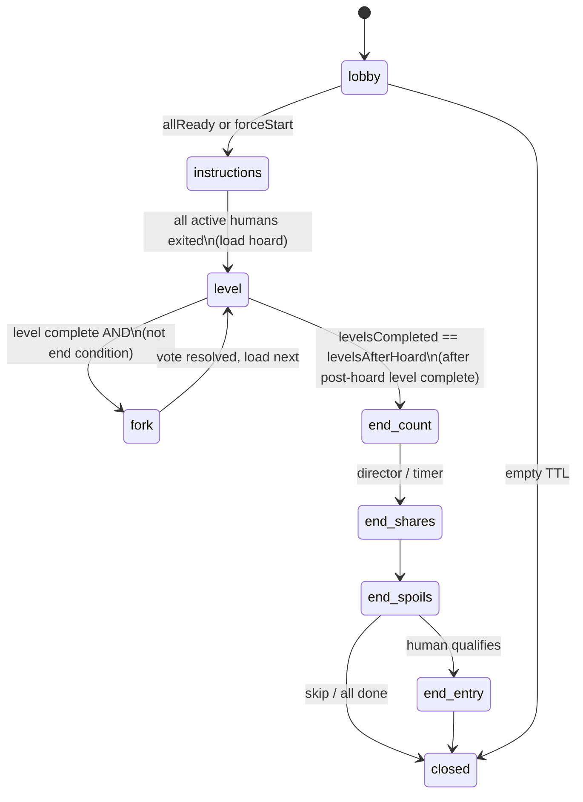

# C-06 — Authoritative Simulation — Design

| Field | Value |
|---|---|
| Component | **C-06 Authoritative Simulation** |
| Ownership | **SE-5** (primary); integrates SE-6 Rules, SE-8 AI, SE-7 Levels, C-10 Fork |
| Status | **Implemented P2–P3** (`server/src/sim/`); P4 phase machine / end scoring still open |
| Related | [ARCHITECTURE.md](../../ARCHITECTURE.md) §6–8, [COMPONENTS.md](../../COMPONENTS.md) C-06, [ADR-002](../../decisions/ADR-002-multiplayer-netcode.md) |
| Contracts | [netcode-messages.md](../../interfaces/netcode-messages.md), [input-commands.md](../../interfaces/input-commands.md), [share-modifier-api.md](../../interfaces/share-modifier-api.md), [level-format.md](../../interfaces/level-format.md) |
| Product locks | [ARCHITECT-OPEN-QUESTIONS.md](../../decisions/ARCHITECT-OPEN-QUESTIONS.md) Q4-A, Q8-A, Q10-A |

---

## 1. Purpose

Own the **server-side truth** for a single `HaulSession` playthrough:

- Fixed-timestep world update (movement, gravity, collisions, surface friction)
- Treasure lifecycle (seeded spawn, pickup/drop/throw, spill on stun)
- Traps, switches, gates, and MVP hazard subset
- Always **exactly 4 hauler seats**, human or AI-controlled
- Session **phase machine** (Lobby → Instructions → Level/Hoard → Fork → Level… → End → Closed)
- Emit `WorldSnapshot` + `GameEvent` streams for netcode
- Track `PlayerStats` for Rules Engine share modifiers
- Invoke pure Rules only at end-of-run for `ScoreReport`

Clients never mutate inventory, scores, trap state, or positions authoritatively. Inputs only.

---

## 2. Non-goals

| Out of scope | Owner |
|---|---|
| Share title presentation / end cinematics | C-11 |
| HTTP lobby, seat tokens, join codes | C-05 |
| High-score DB writes | C-12 (sim only produces `ScoreReport` + completion token) |
| Drawing, camera, parallax | C-02 |
| Pixel-map parse | C-09 (sim consumes `LevelDefinition`) |
| AI decision policy internals | C-08 (sim provides read-only view; applies AI `InputCommand` same as human) |
| Fork argue UI presentation | C-01/C-02; **tally resolution is C-10**, driven by sim phase |
| Global pause that freezes the room | **Forbidden in MVP** (Q10-A) |

---

## 3. Placement in the system

```text
Colyseus HaulSession Room
  ├── seat auth / reconnect tokens
  ├── inbound C2S_Input / Ready / Leave
  └── AuthoritativeSimulation  ← this component
        ├── PhysicsWorld (AABB, fixed dt)
        ├── HaulerSystem (4 seats)
        ├── TreasureSystem
        ├── TrapSystem
        ├── StatsTracker
        ├── PhaseMachine
        ├── ForkVote (C-10) when phase=fork
        ├── AI view adapter → C-08
        └── Rules hooks (C-07) at end only
```

Sim is a **pure-ish module** invoked by the room each tick. Prefer no Phaser, no HTTP, no DB inside sim. Room owns transport; sim owns gameplay state.

---

## 4. Fixed tick model

### 4.1 Parameters

| Parameter | MVP value | Notes |
|---|---|---|
| `tickRate` | **30 Hz** | Published in `S2C_Welcome` |
| `dt` | `1/30` s | **Never** use wall-clock dt for physics; no spiral of death |
| Input buffer | 2–3 ticks | Late inputs applied on next tick if within window; else drop |
| Snapshot | Full `WorldSnapshot` each tick (MVP) | 4 haulers → small payload |
| Background clients | Do not drive sim | Server clock only |

### 4.2 Tick loop (order)

Each tick `t`:

1. **Ingest inputs** — drain per-seat queues; reject invalid/wrong-phase; update idle timers  
2. **AI fill** — for seats with `control == AI`, request `InputCommand` from C-08 (or cached)  
3. **Phase gate** — if phase is non-gameplay (Fork/End/Lobby), skip free-run physics; route to phase handlers  
4. **Interpret chords** — drop / throw / trip-push from axes+action (server-side edge detect)  
5. **Integrate forces** — gravity, jump impulse, run accel, encumbrance multipliers, surface friction  
6. **Resolve collisions** — AABB vs solid grid + dynamic entities  
7. **Interactions** — pickup, throw projectiles, trip/push, switch press, trap triggers  
8. **Hazard outcomes** — stun, spill, lockout, destroy-in-pit  
9. **Exit / phase transitions** — level complete, fork entry, end scoring  
10. **Stats** — increment counters (airtime, hits, etc.)  
11. **Emit** — build snapshot + events; room broadcasts  

### 4.3 Determinism policy

- **Rules / scoring:** bit-stable integers given seed + ordered inputs (C-07).  
- **Physics:** best-effort deterministic on **one server process** (fixed tick, seeded RNG for rolls). Do **not** require cross-architecture bitwise parity. Tests use input tapes + invariants (ownership, no soft-lock), not multi-machine hash equality.  
- Session `rngSeed` from welcome; all treasure rolls and fork pair picks use a single stream (document sub-stream splits if needed).

### 4.4 No global pause (Q10-A)

- `start` on a client may open a **local** menu only.  
- Server **never** freezes ticks for pause.  
- No vote-pause in MVP (stretch per ADR-002).  
- Fork/End phases slow *gameplay meaning* of inputs without stopping the tick clock (`endsAtTick` still advances).

---

## 5. World & physics

### 5.1 Coordinate space

- World units: pixels; **blockSizePx = 32** (assumption until art locks).  
- Origin and **y-down** consistent with Phaser and [level-format.md](../../interfaces/level-format.md).  
- Hauler AABB and treasure AABBs in world space; grid cells map `cell * blockSizePx`.

### 5.2 Hauler kinematics (conceptual)

```text
HaulerBody {
  x, y, vx, vy
  halfW, halfH          // duck shortens halfH
  grounded: bool
  facing: 1 | -1
  jumpBufferedUntilTick?
  coyoteUntilTick?      // optional feel polish; document if used
}
```

**MVP movement set**

| Action | Behavior |
|---|---|
| Run | Accelerate toward `axes.x * maxSpeed * speedMultiplier` |
| Jump | On grounded + jump edge → set `vy` to jump velocity × `jumpMultiplier` |
| Air steer | Reduced accel vs ground |
| Duck | `axes.y == +1` (down); enables pickup; shrinks hitbox |
| Gravity | Constant acceleration while airborne |
| Surfaces | Ice: low friction; Sand: high friction / lower max speed; Brick: default |

Exact constants live in a **tunable config object** (not magic numbers scattered), shared with client prediction helpers where possible (`packages/rules` or `packages/sim-core` kinematics pure helpers — implementation choice for SE-5; pure helpers preferred for prediction parity).

### 5.3 Collision

- Static: solid cells from `LevelDefinition.cells` (brick, ice, sand, closed gates, etc.).  
- Dynamic: other haulers (push/trip), free treasures, projectiles (thrown items, falling rocks).  
- Resolution: discrete sweep or iterative AABB separation; prefer **no tunneling** for hauler-sized bodies at 30 Hz.  
- One-way platforms: stretch unless level content requires them for Hoard/BoxLevel.

### 5.4 Encumbrance / weight

Integrates C-07 `computeEncumbrance(carryCount, carryWeight)`:

| Rule | Detail |
|---|---|
| Free items | First **3** carried treasures: no speed/jump penalty |
| Extra items | Cumulative decrease per extra item (and/or weight) |
| Floor | `minSpeedMultiplier` may reach **0** (enables Greed Overwhelming) |
| Side effects | Weight increases knockback taken, helps heavy switches, can trigger crumbling blocks |

Carry stack order: **first element = top** (drop/throw acts on top). Coin sacks may flag `affectsStackVisual: false` but still count for value/weight unless catalog says otherwise — sim follows TreasureDef flags from rules/catalog.

---

## 6. Four seats + AI

### 6.1 Seat model

Always `seats[0..3]`:

```text
HaulerSlot {
  seatId: 0..3
  character: Gnome | Sprite | Halfling | Dwarf
  control: "human" | "ai"
  humanId?: string
  body: HaulerBody
  anim: AnimState
  carryStack: TreasureInstance[]
  weight: number
  stunnedUntilTick?: number
  pickupLockoutUntilTick?: number
  stats: PlayerStats
  lastHumanInputTick?: number
  lastProcessedSeq: number
}
```

Character soft-unique (Q9-A): prefer distinct; allow clash.

### 6.2 Control transitions

| Event | Behavior |
|---|---|
| Human joins empty/AI seat | Soft-takeover: keep position + inventory; `control → human` |
| No human packets **20s** | `control → AI` |
| No human packets **5s** + camera-edge / exit-stuck pressure | `control → AI` |
| Human packet on owned seat while AI | `control → human` |
| Disconnect | Grace (e.g. 30s): AI pilots; reconnect restores seat |
| Permanent leave | Slot remains AI for rest of run |
| Mid-join | Allowed in Lobby, Instructions, Level, Fork; spawn safe (level spawn or near human-average) |
| End phase | No new fighters (MVP) |

Emit `ai_takeover` / `human_takeover` events; broadcast `S2C_SeatUpdate`.

### 6.3 AI integration

- C-08 produces synthetic `InputCommand` each tick for AI seats.  
- **Identical** apply path as human commands (no teleport, no direct inventory mutate).  
- Instructions phase: **AI absent** — empty seats do not receive AI controllers (design fidelity). AI active from **Hoard onward**.  
- Sim exposes read-only view: positions, carry counts, max human load, nearby treasure, switches, exit direction.

### 6.4 Input application

Internal API (from [input-commands.md](../../interfaces/input-commands.md)):

```text
applyInput(seatId, cmd, tick): void
```

- Validate axes ∈ {-1,0,1}; seq monotonic (dup ignore, gaps OK).  
- Stunned: movement/actions no-op until `stunnedUntilTick`.  
- Phase-disallowed free-run: ignore locomotion (Fork/End).  
- Rate limit at room edge; sim assumes pre-validated seat ownership.

---

## 7. Treasure system

### 7.1 Spawn

- On level load: for each `treasureSlots[]`, roll via C-07 `rollTreasureDef(rng, table, ctx)`.  
- World mix target: **65% Common, 20% Rare, 5% Unique, 10% Set** (design).  
- Unique/Set: no duplicate **in play**; lost uniques may re-roll later or appear in chests.  
- Chests: open interaction rolls secondary table (`wooden_chest` … `magic_chest`).

### 7.2 Ownership

| Action | Rules |
|---|---|
| Pickup | Duck near free instance; grant only if not lockout and free; server sole grantor |
| Drop | Chord action+down: detach top stack item near feet |
| Throw | Chord action+up: detach top with velocity (facing); becomes projectile then free |
| Steal | Only via free world instances (after spill/drop/throw), never client claim |
| Pit | May **destroy** instance; increment `treasureLostCount` for last owner if tracked |

### 7.3 Spill (Sonic-style)

On **stun** (trap, severe hit):

1. All (or policy subset) carried items detach with outward velocities.  
2. Owner gets `pickupLockoutUntilTick` so others can steal.  
3. Emit `spill` + `stun` events.  
4. Stats: `stunnedOrHurtCount`, `treasureLostCount` as items leave ownership.

### 7.4 Conservation invariant

- Every `instanceId` is either: carried by one seat, free in world, or destroyed (logged).  
- Never two owners. Tests assert this under racey multi-seat pickup tapes.

---

## 8. Traps, switches, hazards

### 8.1 Runtime behaviors (from level cells)

| Type | Sim behavior |
|---|---|
| Spikes | Contact → stun + spill |
| Crumbling | Break under mass/time; becomes empty |
| Receding | Vanish after step delay |
| Lightning cycle / switch | Timed or switched stun zone |
| Gas switch | Area stun |
| Falling rock spawner | Spawn projectile hazard |
| Switch | Pressed while overlapping + grounded → activate linked devices |
| Heavy switch | Requires mass ≥ threshold (design: ~3 unloaded players **or** fewer with treasure) |
| Golem / Phantom | MVP subset OK; stubs log once if deferred |
| Ice / sand | Friction modifiers (not traps) |

MVP priority (Implementation Plan P3): **spikes + one timed trap**; switches optional then expand.

### 8.2 Trip / push

- Action pressed, empty hands, near other hauler → trip/push impulse.  
- Emit `trip`; update `hitsDealt` / `hitsTaken`.  
- May cause fall into trap → secondary stun/spill.

---

## 9. Level load & exit

### 9.1 Load pipeline

1. Room/sim requests `LevelDefinition` from C-09 by `levelId`.  
2. Build collision grid, place spawns, roll treasure, reset trap state.  
3. Place haulers at `spawns[seatId]` (or mid-join safe point).  
4. Preserve inventories across levels (haul continues); reset transient stun/lockout.  
5. Set `phase = level`, publish `S2C_PhaseChange` + full snapshot.

### 9.2 Exit detection

- Hauler AABB overlaps `exit` AABB → mark seat exited; emit `level_exit` with order.  
- Track first/last exit for Leader of the Pack / Slowpoke stats.  
- **Level complete when all active haulers have exited** (AI included when present).  
- Instructions: all **active humans** exit right; AI not spawned.  
- Hoard: same exit rule as levels.

### 9.3 Progression config

```text
SessionConfig {
  levelsAfterHoard: number   // default 2 (Q8-A); full product 7
  // ...
}
```

| Counter | Meaning |
|---|---|
| `levelsCompleted` | Count of completed **post-Hoard** levels (0 after Hoard exit, before first fork resolution) |
| Path after Hoard | Enter Fork; winner chooses next level |
| After each post-Hoard level | If `levelsCompleted < levelsAfterHoard` → Fork; else → End |

**Hoard** is Level 0 / special; not counted toward `levelsAfterHoard`. Flow:

```text
Instructions → Hoard → Fork → Level → (Fork → Level)×(levelsAfterHoard-1) → End
```

With default `levelsAfterHoard = 2`: Hoard → Fork → L1 → Fork → L2 → End.

Level pick strategy for forks: **C-10 / Q4-A** — random unplayed pair from pool (see fork-vote DESIGN).

---

## 10. Phase machine

### 10.1 Phases (`SessionPhase`)

Aligned with [netcode-messages.md](../../interfaces/netcode-messages.md):

```text
lobby | instructions | level | fork
| end_count | end_shares | end_spoils | end_entry | closed
```

Note: In-level content includes Hoard; use `levelId` + tags (`pathTags: ["hoard"]`) rather than a separate wire phase if snapshots already carry `levelId`. Architecture state diagram’s `Level0_Hoard` maps to `phase=level` + hoard id.

### 10.2 Transitions



**End condition detail:** After completing a **post-Hoard** level, if `levelsCompleted >= levelsAfterHoard`, go to `end_count` (not Fork). Hoard completion always goes to Fork (unless config short-circuits for tests).

### 10.3 Phase-specific sim behavior

| Phase | Physics free-run | Inputs used for |
|---|---|---|
| lobby | No | Ready, claim character (room may handle claim) |
| instructions | Yes (limited level) | Movement; no AI |
| level | Yes | Full platforming |
| fork | **No** free-roam (design) | Path select + argue → **C-10** |
| end_* | No | Skip / name entry |
| closed | No | None |

### 10.4 End scoring handoff

On entering `end_count`:

1. Freeze inventories (final).  
2. Build `ScoreContext` from `PlayerStats` + inventories.  
3. Call C-07 `evaluateModifiers` + `computeTakes`.  
4. Emit `S2C_ScoreReport` with `completionToken`.  
5. Advance end sub-phases on timers or client skip (`C2S_EndSkip`) without re-running rules.

---

## 11. PlayerStats tracking

Sim increments counters continuously (ARCHITECTURE §8). Minimum set for modifiers:

- Exit order per level → `exitsFirstCount`, `exitsLastCount`, Leader/Slowpoke flags  
- `treasureRecoveredValue`, `treasureLostCount`, `itemsHauledCount`, `setPiecesRecovered`  
- `airTimeTicks`, `groundTimeTicks`  
- `trapsHit`, `hitsDealt`, `hitsTaken`, `stunnedOrHurtCount`  
- `humanControlTicks`, `aiControlTicks`, `controlSwaps`  
- `hoardExitItemCount`, `finalItemCount`  
- Booleans: `onlyChestsRecovered`, `onlyCommonRecovered`, `speedZeroFromWeight`, `goatOnPole`  

Snapshot may omit full stats; end path uses internal full state.

---

## 12. Outputs to netcode

### 12.1 Per-tick

- `WorldSnapshot` — tick, phase, levelId, levelsCompleted, haulers, treasures, dynamic traps/switches, `lastProcessedInputSeq`  
- Zero or more `GameEvent`s (pickup, drop, throw, spill, stun, trip, trap_trigger, level_exit, switch, takeovers…)

### 12.2 Phase / fork / end

- `S2C_PhaseChange`  
- `S2C_ForkState` (produced with C-10)  
- `S2C_ScoreReport`  
- `S2C_SeatUpdate`

### 12.3 Anti-cheat

Ignore client position/inventory/score claims. Inputs only. Documented in netcode contract.

---

## 13. Public internal interfaces (conceptual)

```text
// Constructed per room
createSimulation(config: SessionConfig, deps: {
  loadLevel: (id) => LevelDefinition
  rules: RulesApi
  ai: AiController
  fork: ForkVoteModule   // C-10
  nowTick: () => number  // or sim owns tick counter
}): Simulation

Simulation {
  tick(): { snapshot: WorldSnapshot, events: GameEvent[] }
  applyInput(seatId, cmd): void
  setReady(seatId, ready): void
  bindHuman(seatId, humanId): void
  releaseHuman(seatId, reason): void
  getPhase(): SessionPhase
  getScoreReport(): ScoreReport | null
  getReadOnlyView(): SimView   // for AI
}
```

Exact TypeScript shapes live in `packages/protocol` / server modules at implementation time — this design freezes **behavior**, not file paths.

---

## 14. Configuration surface

```text
SessionConfig {
  tickRate: 30
  levelsAfterHoard: 2              // Q8-A default; 7 for full
  rngSeed: number
  rulesetVersion: string
  humanIdleAiMs: 20_000
  humanIdleEdgeAiMs: 5_000
  reconnectGraceMs: 30_000         // room-owned; sim gets control flip events
  encumbrance: EncumbranceConfig   // from rules defaults
  stunTicks: number
  pickupLockoutTicks: number
  allowGlobalPause: false          // Q10-A locked
  levelPool: string[]              // ids for Q4-A unplayed selection (via C-10)
  startLevelId: "hoard_01"
}
```

---

## 15. Dependencies

| Depends on | Usage |
|---|---|
| C-07 Rules | Encumbrance helpers; end `evaluateModifiers` / `computeTakes`; treasure roll tables |
| C-08 AI | Synthetic inputs for AI seats |
| C-09 Levels | `LevelDefinition` load |
| C-10 Fork | Vote window, tally, next `levelId` |
| `packages/protocol` | Wire snapshot/event types |

| Depended on by | Usage |
|---|---|
| Room / C-05 | Hosts sim; seats |
| C-04 clients | Snapshots |
| C-12 | Completion token from report |
| C-14 | Tick budget metrics |

---

## 16. Testing strategy (sim-owned)

| Layer | Cases |
|---|---|
| Headless tick driver | Input tapes → assert positions, ground, no NaN |
| Ownership | Dual-seat simultaneous pickup → single owner |
| Spill | Stun empties stack + lockout allows peer pickup |
| Weight | 4th item reduces speed; 0 speed flag for stats |
| Phase | Hoard complete → fork; after N levels → end |
| AI seat | AI commands move hauler; instructions have no AI |
| Idle takeover | 20s silence → AI; human packet returns control |
| Pause | `start` does not stop tick counter / peer motion |
| Config | `levelsAfterHoard=2` ends after second post-hoard level |
| Conservation | Instance IDs accounted for every tick |

Golden paths feed Implementation Plan gates G3–G5.

---

## 17. Risks & mitigations

| Risk | Mitigation |
|---|---|
| Platforming feel over net | Shared kinematics helpers for prediction; generous stun windows |
| Treasure races | Server-only grants + lockout |
| Scope of traps | MVP subset; stubs for rest |
| Physics non-determinism | Single authority; invariant tests |
| Phase edge cases (mid-join at exit) | Explicit join spawn + exit set membership rules |
| Pause confusion | Docs + no server pause path |

---

## 18. Implementation notes for SE-5

1. Build **headless first** (P2 movement box level) before treasure.  
2. Keep phase machine explicit (table/state object), not scattered `if` soup.  
3. Delegate fork resolution entirely to C-10; sim only switches phase and loads level.  
4. Never import Phaser on server.  
5. Default `levelsAfterHoard = 2`; read from room/session create options.  
6. Coordinate with SE-6 on encumbrance config object identity.  
7. Coordinate with SE-8 on `SimView` minimal surface to avoid AI cheating APIs.

---

## 19. Traceability

| Requirement | Section |
|---|---|
| Fixed 30 Hz tick | §4 |
| Physics / surfaces | §5 |
| Weight after 3 items | §5.4 |
| Traps | §8 |
| Treasure spill | §7.3 |
| 4 seats + AI | §6 |
| Phase machine | §10 |
| levelsAfterHoard default 2 | §9.3, §14 |
| No global pause | §4.4 |
| Q4-A level pairs | §9.3 → C-10 |
| Snapshots / events | §12 |
| PlayerStats | §11 |
