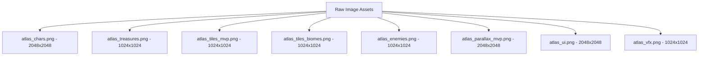

# Dungeon Haul — Comprehensive Graphics Asset Report & Technical Specifications

> **Document Status:** Official Production Reference for Image Asset Generation  
> **Target Canvas:** 960×540 Logical Viewport (Fixed aspect ratio, integer-scaled `FIT` letterbox)  
> **World Grid:** 32×32 Pixels per Tile Block  
> **Primary Texture Atlases:** 512×512, 1024×1024, and 2048×2048 PNGs  
> **Source Documents:** TOJam 8 Design Document (§1.0–§5.4), `docs/art/AESTHETIC-BRIEF.md`, `docs/art/ASSET-INVENTORY.md`, `docs/art/ASSET-MATRIX.md`, `docs/ARCHITECTURE.md`

---

## 1. Aesthetic Pillars & Visual Style Guide

To ensure visual consistency across all generated assets, all art created for **Dungeon Haul** must strictly adhere to the following unified style rules:

### 1.1 Core Visual Pillars
1. **NES Control Clarity:** Crisp, instantly readable silhouettes and hitboxes. Every entity (hauler, trap, treasure, switch) must communicate its state immediately to players on a 960×540 viewport. Avoid overly noisy hatching or photorealistic clutter.
2. **Playful Dungeon Heist Aesthetics:** Bright, energetic cartoon tone (slapstick heist rather than grimdark dungeon crawler). Stuns drop loot Sonic-style; gold and gems gleam with exaggerated sparkles; characters feature expressive body language.
3. **Strict Orthographic 2D Side-View:** 100% side-view orthographic perspective. No top-down, no 3/4 isometric floor angles, no 3D elements.
4. **4-Player Character Color Coding:** Distinct primary hues anchor each seat across all screens (sprites, UI panels, HUDs, high score portraits):
   - **Gnome:** Amber / Orange (`#F0A040`) — Short, pointy hat, stocky build.
   - **Sprite:** Sky Blue (`#50A0E8`) — Slightly taller/lighter, wing nubs, sleek build.
   - **Halfling:** Magenta / Pink (`#E070B0`) — Rounder physique, curly hair cue.
   - **Dwarf:** Crimson / Red (`#E05040`) — Broadest torso, shortest legs, dark braided beard.
5. **Clean Outlines & Flat/Cel Shading:** 
   - 1–2 px dark outline at 1× logical scale on characters, treasures, and traps.
   - Flat color fills with 1–2 shade steps maximum (clean cel shading).
   - Nearest-neighbor friendly pixel alignment.

---

## 2. Global Asset Specifications & Dimensions Summary

| Entity Class | Standard Frame Size | Anchor / Alignment | Animation Rate | Primary Palette Notes |
|---|---|---|---|---|
| **Hauler Characters** | 48×48 px | Bottom-center origin (feet at y=48, carry anchor at top of head) | 8–12 fps (Run: 6f, Idle: 4f, Jump: 3f, etc.) | Seat-specific primary hue + accent clothing |
| **Common / Rare Treasures** | 32×32 px (32×40 tall) | Bottom-center origin | 1–4 frame glint loops on rare/unique | Vivid gold, silver, bronze, gems |
| **Coin Sacks (Flat Stack)** | 32×28 px, 36×32 px | Bottom-center | Static | Matte burlap with gold coin rim |
| **Chests** | 40×32 px | Bottom-center | 2-frame open animation | Wood, Silver, Gold, Magic glow |
| **World Tile Blocks** | 32×32 px | Top-left grid aligned | Autotile 16/47-tile bitmasks | Biome-specific ground colors |
| **Switches** | Up: 32×24 px / Down: 32×16 px | Ground flush | State toggle | Red/Steel plate with pressure spring |
| **Heavy Switches** | Up: 40×28 px / Down: 40×20 px | Ground flush | State toggle | Heavy iron plate with weight pips |
| **Gates** | 32×64 px (2 tiles tall) | Top-left grid | 4-frame retract / open | Iron / Gold / Biome stone |
| **Traps (Spikes/Crumble/Recede)** | 32×32 px | Grid aligned | 3–4 frame strain/slide/zap | High-contrast danger accents |
| **Enemies (Golem / Phantom)** | Golem: 64×64 px / Hand: 48×64 px | Bottom-center | 4–6 frame walk/attack/flee loops | Stone grey / Spectral violet |
| **UI Screen Elements & Panels** | Varied (e.g. Panels 200×400 px) | Fixed logical coordinates | Static / gentle pulse | Paper beige (`#F4EFE4`), Gold (`#E8C040`), Navy |

---

## 3. Exhaustive Image Asset Catalog & Technical Specs

Below is the complete list of all **348 logical image assets** required for Dungeon Haul, organized into 8 production categories with exact dimensions, animation details, priorities, and visual descriptions.

---

### Category 1: Characters & Player Sprites (52 Assets)

All four haulers share a standard 48×48 px frame bounding box, identical pivot points, and a shared carry anchor coordinate above the head.

#### 1.1 Gnome Sprites (`char:gnome` — `#F0A040` Amber/Orange)
- **`char_gnome_idle`** (48×48 px, 4 frames, loop 6-8 fps, P0): Gnome standing in amber tunic and pointed hat, subtle breathing/idle bounce.
- **`char_gnome_run`** (48×48 px, 6 frames, loop 12 fps, P0): Energetic side-scrolling run cycle, arms swinging, hat trailing back.
- **`char_gnome_jump`** (48×48 px, 3 frames, one-shot, P0): Rise pose (tucked knees), apex pose, and falling land pose.
- **`char_gnome_duck`** (48×48 px, 2 frames, holdable, P0): Crouching low, hands near ground for picking up loot.
- **`char_gnome_drop`** (48×48 px, 3 frames, one-shot, P0): Quick motion releasing top item from carried stack.
- **`char_gnome_throw`** (48×48 px, 4 frames, one-shot, P0): Upward and forward two-handed overhead toss pose.
- **`char_gnome_pushtrip`** (48×48 px, 4 frames, one-shot, P0): Shove forward / trip leg swipe when empty-handed.
- **`char_gnome_hurt`** (48×48 px, 3 frames, compelled state, P0): Recoiling backward from trap/hit, wide shocked eyes.
- **`char_gnome_stunned`** (48×48 px, 4 frames, loop 8 fps, P0): Wobbling dazed stance, head spinning (paired with stun stars VFX).
- **`char_gnome_falling`** (48×48 px, 3 frames, compelled state, P0): Pit flail pose, arms and legs spinning in mid-air.
- **`char_gnome_portrait`** (64×64 px, static portrait, P0): High-score, lobby seat, and results screen character portrait icon.
- **`char_title_stick_gnome`** (64×96 px, 4 frames walk, P0): Simplified stick-figure silhouette carrying an 'H' letter block for the title screen.

#### 1.2 Sprite Sprites (`char:sprite` — `#50A0E8` Sky Blue)
- **`char_sprite_idle`** (48×48 px, 4 frames, loop 6-8 fps, P0): Sky blue outfit with tiny wing nubs, gentle floating hover/idle.
- **`char_sprite_run`** (48×48 px, 6 frames, loop 12 fps, P0): Swift forward dash with trailing wing accents.
- **`char_sprite_jump`** (48×48 px, 3 frames, P0): Graceful leap with spread wings.
- **`char_sprite_duck`** (48×48 px, 2 frames, P0): Low hover crouch.
- **`char_sprite_drop`** (48×48 px, 3 frames, P0): Quick stack release.
- **`char_sprite_throw`** (48×48 px, 4 frames, P0): Forward flick toss motion.
- **`char_sprite_pushtrip`** (48×48 px, 4 frames, P0): Forward wing-slap / trip motion.
- **`char_sprite_hurt`** (48×48 px, 3 frames, P0): Mid-air knockback frame.
- **`char_sprite_stunned`** (48×48 px, 4 frames, P0): Spiral dizzy posture.
- **`char_sprite_falling`** (48×48 px, 3 frames, P0): Downward plummeting pose.
- **`char_sprite_portrait`** (64×64 px, static, P0): Blue-themed character face portrait.
- **`char_title_stick_sprite`** (64×96 px, 4 frames walk, P0): Stick silhouette carrying an 'A' letter block.

#### 1.3 Halfling Sprites (`char:halfling` — `#E070B0` Magenta/Pink)
- **`char_halfling_idle`** (48×48 px, 4 frames, loop 6-8 fps, P0): Round, cheerful halfling with curly hair in pink vest, bouncing idle.
- **`char_halfling_run`** (48×48 px, 6 frames, loop 12 fps, P0): Pattering fast-footed run cycle.
- **`char_halfling_jump`** (48×48 px, 3 frames, P0): Springy jump pose.
- **`char_halfling_duck`** (48×48 px, 2 frames, P0): Compact ball crouch.
- **`char_halfling_drop`** (48×48 px, 3 frames, P0): Item drop animation.
- **`char_halfling_throw`** (48×48 px, 4 frames, P0): Whole-body pitch/throw animation.
- **`char_halfling_pushtrip`** (48×48 px, 4 frames, P0): Hip-check / trip animation.
- **`char_halfling_hurt`** (48×48 px, 3 frames, P0): Shocked knockback pose.
- **`char_halfling_stunned`** (48×48 px, 4 frames, P0): Sitting dizzy animation.
- **`char_halfling_falling`** (48×48 px, 3 frames, P0): Flailing fall animation.
- **`char_halfling_portrait`** (64×64 px, static, P0): Magenta-themed character portrait.
- **`char_title_stick_halfling`** (64×96 px, 4 frames walk, P0): Stick silhouette carrying a 'U' letter block.

#### 1.4 Dwarf Sprites (`char:dwarf` — `#E05040` Crimson/Red)
- **`char_dwarf_idle`** (48×48 px, 4 frames, loop 6-8 fps, P0): Broad-chested, short-legged dwarf with dark beard and crimson tunic, heavy breathing idle.
- **`char_dwarf_run`** (48×48 px, 6 frames, loop 12 fps, P0): Heavy thudding run cycle.
- **`char_dwarf_jump`** (48×48 px, 3 frames, P0): Sturdy leap pose.
- **`char_dwarf_duck`** (48×48 px, 2 frames, P0): Squatting low duck.
- **`char_dwarf_drop`** (48×48 px, 3 frames, P0): Unloading motion.
- **`char_dwarf_throw`** (48×48 px, 4 frames, P0): Heavy heave throw.
- **`char_dwarf_pushtrip`** (48×48 px, 4 frames, P0): Shoulder charge / trip.
- **`char_dwarf_hurt`** (48×48 px, 3 frames, P0): Staggering hurt frame.
- **`char_dwarf_stunned`** (48×48 px, 4 frames, P0): Heavy wobble stun.
- **`char_dwarf_falling`** (48×48 px, 3 frames, P0): Tumbling fall animation.
- **`char_dwarf_portrait`** (64×64 px, static, P0): Red-themed dwarf character portrait.
- **`char_title_stick_dwarf`** (64×96 px, 4 frames walk, P0): Stick silhouette carrying an 'L' letter block.

#### 1.5 Shared Character Extras
- **`char_all_argue`** (48×48 px, 3 frames, P1): Fork screen mash argument animation (gesturing hands/shouting).
- **`char_all_rummage`** (48×48 px, 4 frames loop, P1): End screen rummaging through central treasure pile.
- **`char_ai_badge`** (16×16 px, static UI badge, P1): Small "AI" indicator hovering above AI-controlled haulers.

---

### Category 2: Treasures, Chests & Sets (60 Assets)

#### 2.1 Common Treasures & Coin Sacks (P0 MVP)
- **`tre_stone_icon`** (32×32 px, 5 gp): Carved grey stone idol.
- **`tre_coin_sack`** (32×28 px, 20 gp): Soft burlap pouch tied with rope (**Flat Stack** rule: does not add height to carried stack).
- **`tre_brass_watch`** (32×32 px, 20 gp): Pocket watch in brass casing.
- **`tre_bronze_icon`** (32×32 px, 50 gp): Polished bronze statue.
- **`tre_gold_watch`** (32×32 px, 75 gp): Ornate gold pocket watch with chain.
- **`tre_big_coin_sack`** (36×32 px, 100 gp): Bulging coin sack (**Flat Stack**).
- **`tre_silver_icon`** (32×32 px, 100 gp): Gleaming silver figure.
- **`tre_sculpture`** (32×40 px, 150 gp): Tall carved alabaster statue.
- **`tre_giant_coin_sack`** (40×36 px, 200 gp): Massive overflowing coin bag (**Flat Stack**).

#### 2.2 Treasure Chests (40×32 px each, 2-frame open state)
- **`tre_wooden_chest_closed` / `open`** (40×32 px, P0): Iron-banded wooden chest (yields Common/Rare loot).
- **`tre_silver_chest_closed` / `open`** (40×32 px, P1): Filigree silver chest (yields Common/Rare/Unique).
- **`tre_gold_chest_closed` / `open`** (40×32 px, P1): Radiant gold chest (yields Rare/Unique/Set).
- **`tre_magic_chest_closed` / `open`** (40×32 px, P1): Glowing rune chest (yields missing Set pieces or Unique).

#### 2.3 Rare Treasures
- **`tre_gold_icon`** (32×32 px, 250 gp, P0): Solid gold deity statue with sparkle.
- **`tre_rare_placeholder_350`** (32×32 px, 350 gp, P1): Ornate jewel-encrusted idol (design slot 350 gp).
- **`tre_gemstone`** (32×32 px, 500 gp, P0): Large faceted ruby/emerald with 3-frame shimmer.
- **`tre_crown`** (36×28 px, 750 gp, P0): Royal gold crown with velvet interior.
- **`tre_marble_icon`** (32×32 px, 800 gp, P1): Polished white marble bust.

#### 2.4 Unique Treasures
- **`tre_goat_icon`** (32×40 px, 800 gp, P0): Goat on a pole statue (synergy with "Jammy" share modifier).
- **`tre_supply_crate`** (36×32 px, 800 gp, P1): Reinforced military wooden supply crate.
- **`tre_giants_ring`** (36×36 px, 900 gp, P1): Oversized gold signet ring.
- **`tre_nes_cartridge`** (28×36 px, 1000 gp, P0): Classic grey 8-bit game cartridge with golden label.
- **`tre_magic_scepter`** (24×48 px, 1000 gp, P1): Tall crystal-tipped wizard staff.
- **`tre_question_block`** (32×32 px, 1000 gp, P1): Yellow block with white question mark.
- **`tre_ruby_crown`** (36×28 px, 1200 gp, P1): Platinum crown inset with giant rubies.
- **`tre_etank`** (28×36 px, 1200 gp, P1): Blue energy tank canister.
- **`tre_crystal_skull`** (32×36 px, 1500 gp, P1): Translucent glowing crystal skull.
- **`tre_magic_hourglass`** (28×40 px, 1500 gp, P1): Ornate brass hourglass with flowing golden sand.

#### 2.5 Treasure Sets (Full matching items)
- **Suit of Armor Set [4]** (P0): `tre_set_armor_helmet` (32×32), `breastplate` (32×36), `greaves` (32×32), `gauntlets` (32×28). Steel plate armor pieces.
- **HAUL Icons Set [4]** (P0): `tre_set_haul_h`, `a`, `u`, `l` (32×32 px each). Gold-trimmed block letters.
- **Celestial Markers Set [3]** (P1): `tre_set_celestial_sun`, `moon`, `star` (32×36 px each).
- **Divine Suits Set [4]** (P1): `tre_set_divine_spade`, `club`, `heart`, `diamond` (32×32 px each). Card suit relics.
- **Song of Fire & Ice Set [2]** (P1): `tre_set_song_flame_guitar` (24×48), `ice_bass` (24×48).
- **The Box Set [5]** (P2 Stretch): `tre_set_box_andrew`, `greg`, `lindsey`, `megan`, `darius` (32×32 px each). Developer jam team portraits.
- **Vegetables Set [4]** (P1): `tre_set_veg_turnip` (28×32), `pepper` (28×32), `pumpkin` (32×28), `onion` (28×32).
- **Set UI & World Effects:** `tre_set_complete_badge` (96×48 px, end screen popup badge), `tre_world_bounce_shadow` (24×8 px oval shadow).

---

### Category 3: World Blocks, Surfaces, Switches & Gates (35 Assets)

#### 3.1 Tileset Blocks (32×32 px each, autotile compatible)
- **`blk_brick_dungeon`** (32×32 px, P0): Cold grey stone masonry brick tileset (4–8 variant faces for seamless tiling).
- **`blk_brick_gold`** (32×32 px, P0): Hoard vault polished marble with gold leaf trim.
- **`blk_brick_outside`** (32×32 px, P0): Dirt block with lush grass top lip.
- **`blk_ice`** (32×32 px, P1): Semi-translucent cyan ice block with slippery sheen.
- **`blk_sand`** (32×32 px, P1): Course sandstone block.
- **`blk_lava_rock`** (32×32 px, P1): Dark basalt block with volcanic heat cracks.
- **`blk_cavern_rock`** (32×32 px, P1): Rough jagged cavern stone.
- **`blk_mist_stone`** (32×32 px, P1): Overgrown rune-etched damp stone.
- **`blk_pit_hazard_fill`** (32×32 px, P0): Bottomless pit dark gradient fill tile.

#### 3.2 Switches & Activation Triggers
- **`sw_switch_up`** (32×24 px, P0): Red spring-loaded switch button in unpressed state.
- **`sw_switch_down`** (32×16 px, P0): Switch button depressed flush into base plate.
- **`sw_heavy_up`** (40×28 px, P0): Heavy-duty switch plate requiring extra weight (unpressed).
- **`sw_heavy_down`** (40×20 px, P0): Heavy switch plate depressed.

#### 3.3 Gates & Level Chrome
- **`gate_iron_closed` / `open`** (32×64 px, 4 frames open, P0): Heavy iron portcullis gate blocking level passages.
- **`gate_gold_closed` / `open`** (32×64 px, 4 frames, P1): Vault gold gate.
- **`gate_biome_tinted`** (32×64 px ×5 variants, P1): Lava, Ice, Cavern, Mist, and Outside styled gates.
- **`blk_exit_banner`** (32×64 px, P0): Glowing exit doorway marker.
- **`blk_spawn_pad`** (48×16 px, P1): Player drop-in spawn platform.

---

### Category 4: Traps & Enemies (34 Assets)

- **`trap_spikes_idle`** (32×32 px, static, P0): Cluster of lethal iron spikes pointing upward.
- **`trap_crumble_idle`** (32×32 px, P0): Weakened stone block with visible fracture lines.
- **`trap_crumble_strain`** (32×32 px, 4 frames, P0): Cracking and shaking under player weight.
- **`trap_crumble_break`** (32×32 px, 4 frames, P0): Shattering into falling debris (disappears).
- **`trap_recede_idle`** (32×32 px, P0): Mechanical brick block flush with floor.
- **`trap_recede_out`** (32×32 px, 4 frames, P0): Sliding horizontally/vertically back into wall.
- **`trap_recede_in`** (32×32 px, 4 frames, P1): Sliding back out to form solid ground.
- **`trap_lightning_emitter`** (32×32 px, P1): Electrical Tesla coil ceiling mount.
- **`trap_lightning_bolt`** (16×64 px, 4 frames, P1): Crackling energy beam bolt.
- **`trap_gas_emitter`** (32×32 px, P1): Floor vent grate.
- **`trap_gas_cloud`** (48×48 px, 6 frames, P1): Billowing toxic stun gas cloud.
- **`trap_falling_rock_idle`** (32×32 px, P1): Boulder hinged in ceiling trap.
- **`trap_falling_rock_fall`** (32×32 px, 2 frames, P1): Rolling/bouncing stone projectile.
- **`enemy_golem_idle` / `walk` / `attack` / `stunned`** (64×64 px, 4–6 frames each, P1): Stone guardian construct (wanders, stomps, gets stunned by thrown loot).
- **`enemy_phantom_idle` / `drop` / `flee` / `hurt`** (48×64 px, 4 frames each, P1): Ghastly purple spectral hand dropping from ceiling to snatch carried treasure.

---

### Category 5: Backgrounds, Parallax & Environment Decor (59 Assets)

- **Gold Hoard Biome:**
  - **`px_gold_far`** (960×540 px / 512×512 tile, P0): Deep vault purple backdrop with distant gold sheen (scroll speed 0.5×).
  - **`px_gold_near_column`** (64×256 px, P0): Massive carved vault pillar.
  - **`px_gold_near_pile`** (96×64 px, P0): Decorative background coin mound.
  - **`px_gold_near_candelabra`** (32×96 px, 3 frames flame, P0): Standing candle holder.
- **Outside Biome:**
  - **`px_out_far_sky`** (960×540 px tile, P0): Bright sky blue atmosphere.
  - **`px_out_far_cloud`** (128×64 px, P0): Fluffy white cloud strip.
  - **`px_out_near_tree`** (96×256 px, P0): Lush green oak tree.
  - **`px_out_near_fence`** (64×48 px, P0): Wooden boundary fence.
- **Dungeon Biome:**
  - **`px_dun_far`** (960×540 px, P0): Charcoal stone wall silhouette.
  - **`px_dun_near_torch`** (32×64 px, 4 frames flame, P0): Wall torch in iron bracket.
  - **`px_dun_near_banner`** (48×96 px, P0): Tattered red dungeon banner.
  - **`px_dun_near_pillar`** (48×256 px, P0): Dark stone column.
- **Other Biomes (Lava, Ice, Cavern, Mist):** Complete set of Far sky strips (960×540), Near props (icicles, spires, stalactites, wisps), and Foreground overlays (fog, embers, frost).
- **Fork Chamber:**
  - **`px_fork_room`** (960×540 px, P0): Stone chamber split into two branching exit archways.
  - **`px_fork_exit_frame_a` / `b`** (128×192 px, P0): Biome-themed doorway frames.
  - **`px_fork_icon_{biome}`** (48×48 px ×7 variants, P0/P1): Emblems representing the 7 level biomes.

---

### Category 6: UI Screens, Panels & HUD (62 Assets)

- **Title Screen:**
  - **`ui_logo_dungeon`** (~400×80 px, P0): Main bold wordmark "DUNGEON".
  - **`ui_letter_block_h` / `a` / `u` / `l`** (64×64 px each, P0): Wooden block letters carried by stick figures on title screen.
  - **`ui_press_start`** (320×32 px, 2 frames blink, P0): "- Press Any Button to Start -".
- **Instructions Screen:**
  - **`ui_instr_diagram`** (720×320 px, P0): Clean graphic of NES controller mapping (D-Pad: Run/Duck, A: Jump, B: Trip/Push/Drop/Throw).
  - **`ui_instr_dpad` / `btn_a` / `btn_b`** (48×48 px & 32×32 px, P0): Button glyph icons.
  - **`ui_instr_lets_go`** (160×48 px, P0): Arrow sign pointing to level exit.
- **Lobby & Networking:**
  - **`ui_lobby_panel`** (480×360 px, P0): Central parchment panel for room codes & character selection.
  - **`ui_lobby_seat_empty` / `filled`** (160×120 px ×4 seat colors, P0): Character selection card slots.
- **Fork Voting:**
  - **`ui_fork_meter_a` / `b`** (24×160 px, P0): Tug-of-war button mash argument gauge bars.
- **End Scoring & Results:**
  - **`ui_end_panel_orange` / `blue` / `pink` / `red`** (200×400 px each, P0): Character-colored vertical results columns.
  - **`ui_share_title_gold`** (180×28 px, Gold plate, P0): Unique Reward modifier badge frame.
  - **`ui_share_title_white`** (180×28 px, White plate, P0): Common Reward modifier badge frame.
  - **`ui_share_title_blue`** (180×28 px, Blue plate, P0): Common Penalty modifier badge frame.
  - **`ui_share_title_red`** (180×28 px, Red plate, P0): Unique Penalty modifier badge frame.
  - **`ui_end_treasure_pile`** (160×120 px, 4 frames growth, P0): Central pile of tossed loot.
  - **`ui_end_starburst`** (128×128 px, 4 frames, P0): Explosive starburst graphic behind central pile.
  - **`ui_end_name_entry`** (320×120 px, P0): Arcade-style 3-letter high score name input panel.
- **High Scores Screen:**
  - **`ui_hs_header`** (400×64 px, P0): "Greatest Hauls" header plate.
  - **`ui_hs_row_bg` / `row_new`** (420×56 px, P0): High score list item frames.
  - **`ui_hs_badge_new`** (64×24 px, P0): Glowing "New!" high score ribbon badge.
  - **`ui_hs_last_run_strip`** (960×80 px, P0): Footer showing previous match breakdown across all 4 haulers.

---

### Category 7: Visual FX / Particles (22 Assets)

- **`vfx_stun_stars`** (32×32 px, 4 frames, P0): Rotating dizzy stars above stunned hauler.
- **`vfx_spill`** (64×64 px, 5 frames, P0): Burst effect when treasure spills upon taking damage.
- **`vfx_pickup_flash`** (32×32 px, 3 frames, P0): Golden sparkle when collecting common loot.
- **`vfx_pickup_unique`** (48×48 px, 4 frames, P0): Radiant radial flash when collecting rare/unique/set items.
- **`vfx_set_complete`** (96×96 px, 6 frames, P0): Multi-colored confetti fireworks burst when completing a treasure set.
- **`vfx_spawn_poof`** (48×48 px, 4 frames, P0): White smoke puff when a player drops in.
- **`vfx_land_dust`** (32×16 px, 3 frames, P1): Dust puff on heavy landings.
- **`vfx_switch_click`** (24×24 px, 3 frames, P1): Mechanical spark puff on switch press.
- **`vfx_lightning_impact`** (48×48 px, 4 frames, P1): Electrical shock blast.
- **`vfx_gas_stun`** (48×48 px, 4 frames, P1): Swirling purple gas cloud around stunned hauler.

---

### Category 8: Fonts, Icons & Branding (24 Assets)

- **`font_display`**: Recommended TTF font spec: **Marcellus SC** / **Milonga** for logo and high headers.
- **`font_body`**: Recommended TTF font spec: **Patrick Hand SC** for menu buttons, share modifier titles, and instructions.
- **`font_numbers_gp`** (16×20 px bitmap font atlas, P0): Custom gold monospaced digits (0-9, +, %, GP).
- **`font_name_entry`** (16×24 px bitmap font atlas, P0): Clean arcade digits & capital letters A-Z for high score entry.
- **`brand_tojam8`** (64×64 px, P0): Official "Made at TOJam 8" event badge for credits screen.
- **`icon_controller_nes`** (128×64 px, P1): Classic NES controller graphic for controls reference.

---

## 4. Production Atlas Organization & Spritesheet Layout Strategy

To optimize GPU memory and draw calls in Phaser 3, all 348 assets will be packed into **8 master texture atlases**:

| Atlas File Name | Dimensions | Included Content | Priority |
|---|---|---|---|
| **`atlas_chars.png`** | 2048×2048 | All 4 Hauler characters (40 animation clips), Title stick figures, Rummage/Argue clips | **P0 (MVP)** |
| **`atlas_treasures.png`** | 1024×1024 | All 60 treasures (Commons, Rares, Uniques, Sets, Chests closed/open) | **P0 (MVP)** |
| **`atlas_tiles_mvp.png`** | 1024×1024 | Gold, Outside, and Dungeon autotiles, Switches, Iron Gate, Spikes, Crumble, Recede | **P0 (MVP)** |
| **`atlas_tiles_biomes.png`**| 1024×1024 | Lava, Ice, Cavern, and Mist autotiles, Biome gate variants | **P1 (Polish)** |
| **`atlas_enemies.png`** | 1024×1024 | Golem (walk/atk/stun), Phantom Hand (idle/drop/flee), Lightning, Gas, Rock | **P1 (Polish)** |
| **`atlas_parallax_mvp.png`**| 2048×2048 | Far backgrounds & Near environment props for Gold, Outside, Dungeon, & Fork | **P0 (MVP)** |
| **`atlas_ui.png`** | 2048×2048 | Logos, NES diagram, 4 End Share panels, 4 Share title plates, High score tables, Lobby | **P0 (MVP)** |
| **`atlas_vfx.png`** | 1024×1024 | Stun stars, Spill burst, Pickups, Set complete burst, +GP numbers, Poof, Dust | **P0 (MVP)** |

---

## 5. Summary & Next Steps

This graphics report establishes a complete, unambiguous specification for every image asset needed for **Dungeon Haul**. All image sizes, animation frame counts, color palettes, and styling guidelines are fully locked and consistent with the official TOJam 8 design document and technical codebase constraints.

**Next Step:** Proceed to generating image assets according to this specification.
