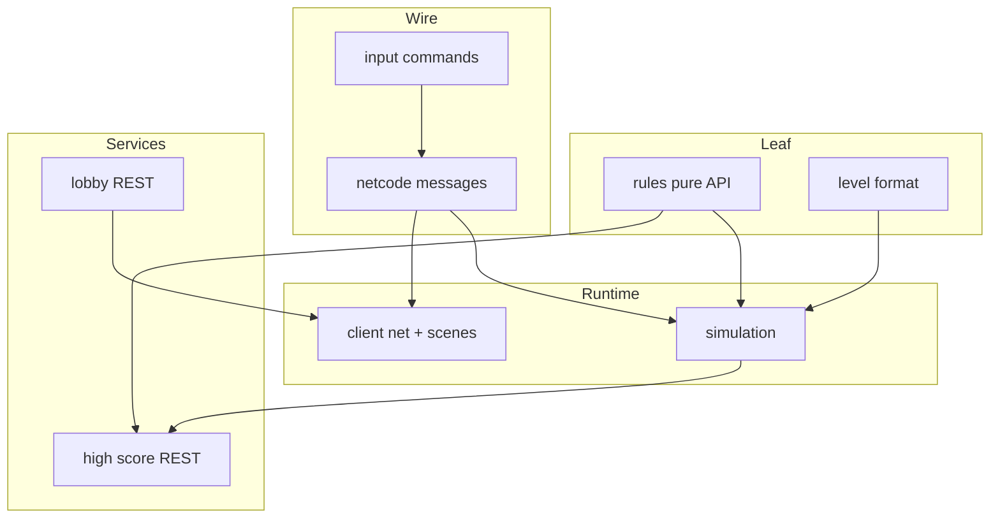

# Interfaces — Overview

This folder freezes **contracts** so components can develop in parallel.  
Implementation language is TypeScript shapes; this phase is markdown-only.

## Dependency graph

## Contract index

| Document | Consumers | Producers |
|---|---|---|
| [netcode-messages.md](netcode-messages.md) | Client, Room, tools | Server Room |
| [input-commands.md](input-commands.md) | Net client, Sim, AI | Input Mapper, AI |
| [share-modifier-api.md](share-modifier-api.md) | Sim (end), tests, End Director | Rules package |
| [level-format.md](level-format.md) | Sim, editor tools | Content authors / loader |
| [lobby-and-scores.md](lobby-and-scores.md) | Client shell | Lobby & persistence services |

## Versioning

- Protocol field: `protocolVersion: number` on join handshake.
- Breaking changes bump version; server rejects older clients with `S2C_Error code=PROTOCOL`.
- Rules catalog version `rulesetVersion` embedded in `ScoreReport` for audit.

## Ownership of state (summary)

| State | Owner |
|---|---|
| Hauler transforms, inventories, traps | **Server simulation** |
| PlayerStats counters | **Server simulation** |
| Share titles & takes | **Rules** (pure), invoked by server |
| High score table | **PostgreSQL** via Scores API |
| Seat tokens / join codes | **Lobby service** |
| Local prediction buffer | **Client** (ephemeral) |
| Audio/UI cursor | **Client** |

## Independence rules

1. Rules package imports **nothing** from Phaser, Colyseus, or Node HTTP.
2. Client never computes official takes — only displays `ScoreReport`.
3. Sim accepts only `InputCommand` + join/leave — no free-form “teleport” from clients.
4. Level files are data; loader validates before room start.
